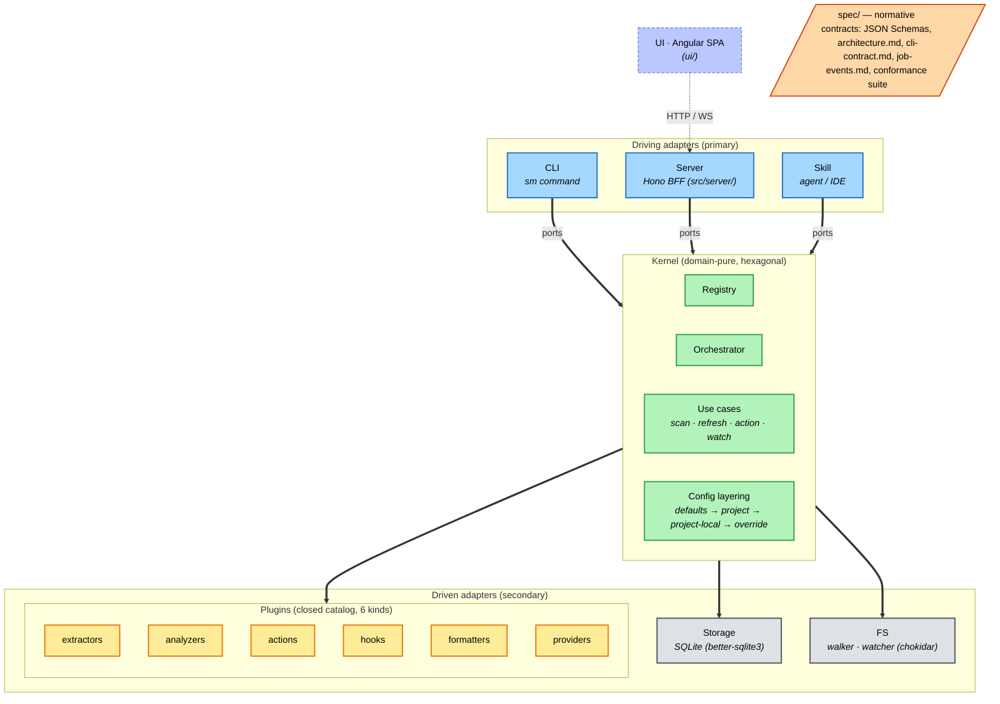

# Architecture diagram

High-level view of skill-map's hexagonal architecture. Companion to `spec/architecture.md` (the normative version).

Terminology follows `spec/architecture.md` verbatim: **driving adapters** call into the kernel, the **kernel** is domain-pure, **driven adapters** implement ports the kernel declares.

## Reading guide

**Three driving adapters, not four.** CLI, Server, and Skill are the primary actors the spec recognizes. The UI is *not* a driving adapter, it is an HTTP/WS client of the Server. A fourth driving adapter (VSCode extension, TUI) MAY be added by third parties without spec changes.

**The kernel is domain-pure.** It never imports a filesystem API, a database driver, or a subprocess spawner directly. Every IO call crosses a port. That is what makes the boundary hexagonal: the inside knows nothing about the outside's technology choices.

**Plugins are driven adapters of a special kind.** They are not "infrastructure" like Storage or FS, but the spec puts them on the same side because the kernel invokes them through ports just like the others. The six kinds are a *closed catalog*, the spec enumerates them and no others are allowed.

**Active provider lens is project-scope state.** Although `providers` is one of the six plugin kinds, exactly one provider is active per project at any time (see `spec/architecture.md#active-provider-lens`). The lens determines which extractors and classifiers apply during a scan.

**Config layering is per-project, never global.** The four layers (`defaults → project → project-local → override`) all live under `<cwd>/.skill-map/`. There is a narrow `$HOME` exception for `~/.skill-map/settings.json` (update-check toggle today, future locale/theme), validated against `spec/schemas/user-settings.schema.json` and *not* merged into the project layers.

