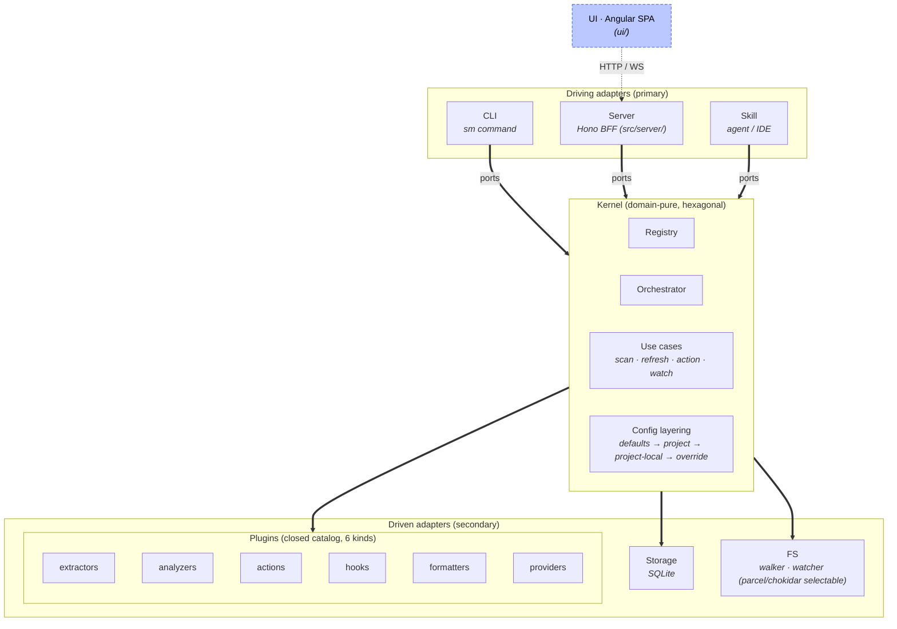

# Architecture

Normative description of skill-map's internal boundaries: the **kernel**, the **ports** it exposes, the **adapters** that drive and serve it, and the six **extension kinds** that live outside the kernel.

Any conforming implementation, reference or third-party, MUST respect these boundaries. The conformance suite under [`conformance/`](./conformance/README.md) enforces the kernel-agnostic invariants; per-Provider suites (e.g. `src/plugins/claude/providers/claude/conformance/`) enforce the kind-catalog cases. Both are driven via `sm conformance run`.

---

## Layering



The UI is **not** a driving adapter; it is an HTTP/WS client of the Server. Exactly one Provider is active per project (see §Active Provider Lens); config layering is always project-scoped (see §Config layering).

- **Driving adapters** call into the kernel. The spec defines three: `CLI`, `Server`, `Skill`. A fourth MAY be built by third parties (IDE extension, VSCode command palette, TUI) without spec changes.
- **Driven adapters** implement ports the kernel declares. An implementation MUST ship adapters for every port; no port may be left unimplemented at runtime.
- **Kernel** is domain-pure: never imports a filesystem API, database driver, or subprocess spawner directly. All IO crosses a port.

---

## Active Provider Lens

A skill-map project sees its filesystem through exactly one **active provider lens** at any time: the provider whose extractors, classifiers, and resolution rules apply to the whole project during a scan. All other enabled providers stay registered but their provider-specific extractors are skipped.

The lens is project-scope state, living in `.skill-map/settings.json` as the `activeProvider` key (see [`project-config.schema.json`](./schemas/project-config.schema.json#/properties/activeProvider)). When absent, the kernel auto-detects on first scan from filesystem markers and persists the result; if the heuristic is ambiguous (several VENDOR markers; the open `agent-skills` fallback never competes with a vendor, see Fallback precedence below), the CLI and UI prompt the user to pick one enabled provider. There is no unlensed state: when no vendor marker is present at all, the lens resolves to the open-standard `agent-skills` view, the universal default lens, which is NOT persisted, so a vendor marker added later still auto-detects on the next scan. The non-gated `core/markdown` base still classifies every unclaimed `.md` underneath, but it is not itself a selectable lens (see below). **The marker set is provider-owned**: each Provider declares its detection markers in its manifest `detect.markers` block (see [`provider.schema.json`](./schemas/extensions/provider.schema.json#/properties/detect)), e.g. `claude` → `.claude/`, `codex` → `.codex/`, `opencode` → `.opencode/`, `agent-skills` → `.agents/`, `antigravity` → `.agent/workflows/` (`AGENTS.md` is deliberately NOT an `codex` marker: it is the open agents.md standard, common in non-Codex repos and alongside `.claude/`, so keying detection off it would mis-route plain-markdown repos and force ambiguous prompts; a genuine Codex project is identified by `.codex/`). No central hardcoded detection table; the detectable set derives from registered Providers, so adding a Provider with a marker makes it auto-detectable without touching the resolver. When several markers match, the resolver returns the full candidate list in Provider iteration order, first match the default suggestion. **Fallback precedence**: the open default lens `agent-skills` declares `detect.fallback: true`, so its `.agents/` marker produces a candidate ONLY when no vendor marker is present; a project carrying a vendor marker alongside the shared `.agents/` home resolves to that vendor outright (the `.agents/skills/` directory is just where the vendor stores its skills, not a sign the project is a generic open-standard one). This is exactly what the scaffold `marker` field promises (`provider.schema.json#/properties/scaffold/properties/marker`): `sm tutorial --for codex` drops `.codex/` so the project resolves `codex`, never an ambiguous `codex` vs `agent-skills` pair. Several VENDOR markers together still surface a genuine ambiguous prompt, UNLESS one of them subsumes the other. **Compat subsumption**: a Provider may declare `detect.subsumes: [<providerId>...]` (`provider.schema.json#/properties/detect/properties/subsumes`), the candidate ids it absorbs when both matched, because it reads that runtime's territory itself. `opencode` is the only claimant today (`subsumes: ['claude']`): OpenCode's Claude-compat covers `.claude/skills/` and `CLAUDE.md`, so a `.claude/` directory is EXPECTED inside an OpenCode project and is not evidence Claude Code is in use, while Claude Code never reads `.opencode/`. The asymmetry is real, so the pair is not a tie and resolves to `opencode`. The relation is one-way by construction (two Providers naming each other keep the ambiguity, no arbitrary tie-break) and runs after the fallback rule, so it can only collapse a would-be prompt into an unambiguous auto-detect, never create one. A Provider with no `detect` block is never auto-suggested but can be selected manually. Google's Antigravity CLI (which replaced the retired Gemini CLI on 2026-05-19) uses the open-standard `.agents/skills/` for skills but its OWN `.agent/workflows/` (singular `.agent`) for workflows; the latter is its `detect` marker. `antigravity` ships `beta` (enabled by default), so its `.agent/workflows/` marker auto-detects the antigravity lens; a project that ALSO carries `.agents/` still resolves to `antigravity` (its vendor marker outranks the `agent-skills` fallback, no ambiguous prompt). `agent-skills` is `stable` (the locked open default lens) and the sole `detect.fallback` Provider, so its shared `.agents/` marker auto-detects it only when no vendor marker is present (a project with no vendor marker falls back to it), and a Google project's `.agents/skills/` files are owned by `agent-skills` for auto-detect, not by antigravity.

**Not-ready Providers ship disabled.** A Provider that is registered but not yet ready for end users declares `stability: 'experimental'` (see [`base.schema.json`](./schemas/extensions/base.schema.json#/properties/stability)), which ships it **disabled by default**: it does not classify, does not register, is never auto-detected, and is absent from the `selectable` set served by `GET /api/active-provider` until the operator opts in (`sm plugins enable <id>`, the Settings toggle, or a config override). There is no separate `comingSoon` flag: enabled/disabled is the single availability axis. The INSTALLED DEFAULT of that axis derives from `stability` (`experimental` / `deprecated` ship off) unless the manifest declares the orthogonal `defaultEnabled` override ([`base.schema.json`](./schemas/extensions/base.schema.json#/properties/defaultEnabled), added 2026-07-21): a `stable` extension may ship `defaultEnabled: false` to be a deliberate opt-in without mislabeling its maturity (the sidecar writers `core/node-bump` and `core/node-set-stability` do exactly that). Today all five lenses ship enabled and selectable, `claude` (stable), `antigravity` (beta), `codex` (beta), `opencode` (beta), and `agent-skills` (stable, the locked open default); no built-in Provider currently ships `experimental` (the flag's live built-in examples are actions, e.g. `core/node-bump` and `github/enrichment`; no built-in analyzer ships experimental since `core/annotation-stale` graduated to stable on 2026-07-19). The non-gated `core/markdown` base is locked-enabled but is NOT a selectable lens, it is the substrate beneath whatever lens is active (see §Active-lens scope for providers). `stability: 'beta'` ships ENABLED like `stable` but renders a maturity badge (it is NOT a disabled state); this is distinct from `hideChip`, which only suppresses the per-card badge.

**Kernel agnosticism.** The kernel never names a plugin or extension identity: plugins load and execute dynamically, and every routing decision the kernel makes is STRUCTURAL (extension kind, schema namespace `$id` prefixes, reserved finding slugs, declared manifest fields), never id-based. Correspondingly, affordance visibility is never a kernel decision: an extension's own `project()` computes what it emits (including the payload `enabled` gate) and the UI renders that state; the kernel's contribution phase only validates the declared ref and the slot payload schema, then persists. Host-policy knowledge that needs concrete ids (the lock set, presentation order) lives in manifest flags or plugin-space helpers, outside `src/kernel/`.

**Locked extensions (`locked: true`, manifest-declared, built-in only).** A handful of built-ins are load-bearing enough that disabling them breaks the product's core guarantees; those declare `locked: true` on their manifest (2026-07-23, replacing the former hardcoded host lock-list so the kernel stays plugin-agnostic). Semantics: the enabled-resolver returns `true` for a locked qualified id BEFORE consulting any config layer (a hand-edited `settings.json` cannot disable it), the CLI / BFF toggle surfaces reject writes against it (403 `locked`; bulk operations skip it silently), it is never trust-gated (locked implies trusted), and `GET /api/plugins` stamps `locked: true` so the UI renders it non-toggleable. The flag is HOST-RESERVED: it is deliberately absent from `base.schema.json`, so an external plugin declaring it fails manifest validation at load (`invalid-manifest`); only built-ins, which are typed TypeScript compiled into the CLI, can carry it. Nothing experimental is lockable (the built-ins codegen rejects the combination). Current claimants and why, documented on each manifest: `core/markdown` (the universal fallback Provider), `agent-skills/agent-skills` (the floor lens), `core/schema-violation` (the spec-conformance guarantee), `core/ascii` (the `sm graph` DEFAULT format, resolved when the operator passes no `--format`, so disabling it would break the bare verb with no fallback; the sibling formatters are opt-in per invocation and stay toggle-able).

### Consequence: one graph per project at a time

The persisted scan graph (`scan_*` zone) reflects the project as the active lens sees it; no cross-provider merging at storage time. A repo with both `.claude/` and `.codex/` does NOT show "everyone's nodes at once"; it shows the active lens's view.

### Consequence: lens change is destructive of the scan zone

Switching the active provider drops the `scan_*` zone atomically (nodes, links, issues, scan-result meta) and triggers a fresh scan under the new lens. The `state_*` zone (jobs, executions, summaries, enrichments, plugin KV, favorites) and the `config_*` zone survive untouched. Annotations (`.sm` sidecars on disk) are filesystem state, also unaffected; the next scan re-derives the in-DB overlay from them.

A deliberate trade-off: keeping two scan graphs persisted (one per lens) would re-introduce the cross-provider coordination complexity the lens model exists to avoid. The drop+rescan UX is honest: changing lens means changing the world the graph represents, and the graph regenerates from the source of truth (the filesystem) under the new rules.

### Cross-provider read at the provider level

A provider plugin MAY declare it reads source files belonging to ANOTHER provider's territory. Canonical example: Cursor's runtime consumes `.claude/skills/` and `.codex/skills/` natively, so a Cursor provider can claim those paths from its own classifier; under the Cursor lens they appear as Cursor-managed nodes with Cursor's interpretation rules. This is provider-internal logic, not a kernel feature; the lens model neither encourages nor prevents it. The built-in `opencode` lens ships exactly this: OpenCode reads skills from its own `.opencode/skills/`, the Claude-compatible `.claude/skills/`, and the open-standard `.agents/skills/`, so its classifier claims all three under the opencode lens (gating keeps the `.claude/skills/` claim from colliding with the claude lens, which is inactive then). The compat is asymmetric: OpenCode reads Claude *skills* but not Claude *agents* / *commands* (those carry Claude's own frontmatter, not OpenCode's `mode` / `permission` shape), so `.claude/agents/` and `.claude/commands/` fall through to `core/markdown` under the opencode lens.

### Universal extractors and per-provider extractors

The lens does NOT gate the universal extractors under `core/` (markdown links, code-region file paths, external URLs, sidecar annotations); their semantics are provider-agnostic, so they run regardless of the active provider. Provider-specific extractors (Claude's `@`-directive and `/command` parsers, OpenAI Codex's `$skill` and `@`-file parsers, future Antigravity parsers) declare `precondition: { provider: '<id>' }` on their manifest; the orchestrator invokes them on every node visited during the scan as long as the **active lens** is in the declared provider list, regardless of which provider's `classify()` claimed the node. The declared list MAY name more than one lens ONLY when the runtimes genuinely share a grammar: the claude `/command` (slash) extractor runs under `claude` AND `antigravity` (`precondition: { provider: ['claude', 'antigravity'] }`), since both invoke by `/<name>` (Antigravity declares `invokes: ['skill', 'workflow']`, so a `/name` resolves to either a `.agents/skills/<name>/SKILL.md` skill or a `.agent/workflows/<name>.md` workflow). But a runtime whose grammar DIFFERS owns its OWN extractor rather than borrowing one: OpenAI Codex reserves `/` for its built-in commands and invokes a user skill with `$`, so it ships a codex-only `dollar-skill` extractor (`$name` → `invokes`, resolved via codex's `invokes: ['skill']` to a `.agents/skills/<name>/SKILL.md` skill) instead of the claude slash parser; and Codex's `@` is a file picker, not an agent-mention grammar, so it ships a codex-only `at-file` extractor (a path- or extension-shaped `@foo.md` → a path-resolved `references` link) instead of claude's `@`-directive (whose bare-`@handle` → `mentions` grammar does not apply to Codex). The claude `@`-directive, and its code-region sibling `claude/backtick-mention` (§Extractor · code-region triggers), thus stay `claude`-only; the slash grammar's code-region sibling `core/backtick-slash` mirrors the prose slash extractor's claude / antigravity / opencode gate, and codex's `$` grammar gets its own code-region sibling `codex/backtick-dollar`, the same way. A body-scoped extractor reads whatever the walker yielded as the node body: for most providers the text after the frontmatter fence, but for a provider declaring `read.bodyField` (see [`provider.schema.json`](./schemas/extensions/provider.schema.json#/properties/read)) the named frontmatter field instead, since Codex sub-agents are pure TOML whose markdown prompt is the `developer_instructions` field, the codex provider sets `bodyField: 'developer_instructions'` so that prompt flows through the same body pipeline (body hash, markdown-link / backtick-path / external-url, and the lens-gated grammar extractors: `@` / `/` under claude, `$` / `@`-file under codex).

The gate is the active lens, not the node's provider. A `@handle` token in `CLAUDE.md` or `notes/todo.md` (files the `claude` provider disclaims to `core/markdown`) still gets parsed by `claude/at-directive` under the `claude` lens, because the lens represents the runtime grammar and the runtime reads markdown across the whole project, not only files it owns. The earlier double-check ("node's provider matches AND the lens") silently dropped that surface; dropping the node side restores it. Cross-lens isolation holds via the lens half alone: under `codex`, claude extractors are silent on every node (including `.claude/*`) because lens authorisation is missing. Under the open-standard `agent-skills` default lens (a project with no vendor marker), the `claude` / `codex`-gated extractors stay silent because `agent-skills` is not in their declared provider allowlist; only the universal extractors run, alongside the open-standard `skill` classifier.

### Active-lens scope for providers (classification gate)

The active lens also gates **classification**. Each Provider declares `gatedByActiveLens` on its manifest (`extensions/provider.schema.json#/properties/gatedByActiveLens`, mirrored at `IProvider.gatedByActiveLens`). Vendor providers (`claude`, `codex`, `antigravity`) and the open-standard `agent-skills` provider set it `true`; their `classify()` only runs (and the walker only iterates their territory) when `provider.id === activeProvider`. The markdown fallback `core/markdown` (and any future format-based fallback) leaves the flag `false` (default) and runs on every scan as the single universal base. **A provider is a selectable lens iff it is gated** (`gatedByActiveLens: true`): the gated providers are exactly the lenses the operator can pick or auto-detect; the non-gated `core/markdown` base is never offered in the lens dropdown nor persisted as `activeProvider`, it is the substrate beneath whatever lens is active. So a project's `.agents/skills/*` is classified as `skill` under the `agent-skills` lens (the open default when no vendor marker is present, and the lens `antigravity` reuses by manifest composition); under a vendor lens (`claude`, `codex`) those files fall through to `core/markdown`.

Filtering happens in `walkAndExtract` (kernel, `src/kernel/orchestrator/walk.ts`) at the provider-iteration level: a gated-off Provider does NOT walk its territory at all (the cheap path). The predicate: include the Provider when `!gatedByActiveLens || provider.id === activeProvider`. There is no unlensed branch: the resolver always yields a concrete lens (a vendor id, or `agent-skills` as the open default when no vendor marker is present), so a gated vendor Provider participates only when it is the active lens; under the `agent-skills` default the open-standard classifier runs alongside the universal `core/markdown` base.

Consequence: under `activeProvider = 'claude'`, a `.codex/agents/foo.toml` is not classified by the `codex` Provider (gated off); whether it becomes a node depends on whether a universal Provider claims its extension. Today no universal claims `.toml`, so the file is silently absent, matching runtime reality (Claude Code never consumes `.codex/`). The same path under `activeProvider = 'codex'` becomes `codex/agent`. The `core/markdown` fallback claims every unclaimed `.md` regardless of lens, so a `.claude/agents/foo.md` under `codex` lens reverts to `markdown` (no claude territory under that lens).

This gate affects **classification only**. Extractors keep filtering through their own `precondition.provider` allowlist (previous section); a gated-off vendor Provider contributes no classified nodes, but its bundled extractors still skip uniformly under the wrong lens via the extractor-side rule. The two gates are independent and complementary.

### Active-lens drift detection

The lens is sticky once set: the operator chose `activeProvider` deliberately, and the runtime keeps it until the operator runs `sm config set activeProvider <id>`. But projects grow: a repo started under `claude` may later add `.codex/`, or a `.cursor/` directory disappears in cleanup. Without a hint, the operator would keep scanning under the original lens long after on-disk reality moved.

To surface this drift without noise, the runtime persists a snapshot of provider markers alongside `activeProvider`:

- **`activeProviderMarkers`** (`project-config.schema.json#/properties/activeProviderMarkers`): the set of provider ids whose filesystem markers were present when `activeProvider` was set. Written by the runtime in three places: (1) auto-detect on first scan when exactly one marker is found, (2) interactive prompt when multiple markers are found and the operator picks one, (3) `sm config set activeProvider <id>` (a manual switch refreshes the snapshot).

At every subsequent scan entry, the bootstrap re-detects markers, diffs against the snapshot, and emits ONE soft warning when the diff is non-empty:

- **New markers in current but not in snapshot** → "New: <added>" (e.g. operator added `.codex/` after the choice).
- **Markers in snapshot but no longer on disk** → "Removed: <removed>".
- **Both** → both lines, still ONE warn per scan.

The warn is informational and never blocks the scan; the run continues with the cached lens. The snapshot is NOT refreshed automatically on drift: the operator chooses whether to switch the lens (`sm config set activeProvider <id>` refreshes the snapshot and atomically drops `scan_*`) or accept the drift (deleting the `activeProvider` key re-runs auto-detect and resets the snapshot).

Legacy projects (an existing `activeProvider` without a snapshot) lazily backfill: the first scan after upgrade writes the current detected set as the snapshot and stays silent (nothing to compare against), so the warn only fires when markers drift relative to a known-good snapshot. The bookkeeping is internal-state, not normally hand-edited.

---

## Ports

An implementation MUST expose these five ports. Each is an interface (TypeScript, in the reference impl; equivalent in other languages).

### `StoragePort`

Persistence for all kernel tables in all three zones (`scan_*`, `state_*`, `config_*`). Exposes typed repositories, not raw SQL. Implementations MAY back this with SQLite, Postgres, in-memory, or anything else, provided:

- Transactional semantics for atomic claim (see [`job-lifecycle.md`](./job-lifecycle.md)).
- Migration application with `PRAGMA user_version`-equivalent tracking.
- Read isolation sufficient to avoid phantom reads across a single scan write.

The reference impl backs this with `node:sqlite` + Kysely + `CamelCasePlugin`. See [`db-schema.md`](./db-schema.md) for the full table catalog.

### `FilesystemPort`

Walks roots, reads node files, reports mtime/size. Abstracts platform-specific path handling and test fixtures.

Operations: `walk(roots, ignore)`, `readNode(path)`, `stat(path)`, `writeJobFile(path, content)`, `ensureDir(path)`.

Reference impl: real `node:fs` in production, an in-memory fixture in tests.

### `PluginLoaderPort`

Discovers plugin directories, reads `plugin.json`, checks `specCompat`, dynamically imports extension files, returns loaded extension descriptors ready to register.

Operations: `discover(scopes)`, `load(pluginPath)`, `validateManifest(json)`.

The loader enforces two id-uniqueness analyzers during discovery (see [`plugin-author-guide.md` §Plugin id uniqueness](./plugin-author-guide.md#plugin-id-uniqueness) for the author-facing summary):

1. **Directory name == manifest id.** A plugin lives at `<root>/<id>/plugin.json`. A mismatch surfaces as status `invalid-manifest`, eliminating same-root collisions by construction.
2. **Cross-root id collision blocks both sides.** Two plugins reachable from different roots (e.g. the project default `<cwd>/.skill-map/plugins/` and any `--plugin-dir` combination) that declare the same `id` BOTH receive status `id-collision`. No precedence analyzer applies, coherent with §Boot invariant ("no extension is privileged"). The user resolves by renaming one.

The loader also **qualifies every extension** with its owning plugin id before registering it, storing extensions under the qualified id `<plugin-id>/<extension-id>` (e.g. `core/slash-command`, `core/reference-broken`, `my-plugin/my-extractor`). Authors declare the short `id` in each extension manifest; the loader composes the qualified form from `manifest.id` at load time. Built-in extensions declare their `pluginId` directly in `built-ins.ts`: `core/` for kernel-internal primitives (every analyzer, the formatter, the cross-vendor extractors `annotations` / `slash` / `at-directive` / `markdown-link` / `backtick-path` / `external-url-counter` / `stability`) and vendor plugins such as `claude/` for platform-bound Provider integrations. A `pluginId` field on an extension that disagrees with `plugin.json`'s `id` yields `invalid-manifest` with a directed reason.

Every extension (built-in or drop-in) is independently toggle-able by its qualified id `<plugin>/<ext-id>`. The plugin row is a presentational grouping; the granular toggle target is the extension, while toggling a bare plugin id is the **bundle** (aggregate) macro fanning across every extension. The loader's pre-import `resolveEnabled(pluginId)` short-circuit only fires when EVERY extension of the plugin is disabled (the plugin "starts as disabled"); partial enables let imports proceed and the runtime composer (`composeScanExtensions` / `composeFormatters` in `src/core/runtime/plugin-runtime/composer.ts`) drops the per-extension disabled rows before they reach the orchestrator. The `core` plugin exercises the per-extension axis explicitly (every kernel built-in is removable, satisfying §Boot invariant); most operators leave every extension of the vendor Provider plugins (`claude`, `antigravity`, `codex`, `agent-skills`) enabled, but the same per-extension toggle surface applies. See [`plugin-author-guide.md` §Toggle model](./plugin-author-guide.md#toggle-model).

### Execution handover (there is NO runner port)

The kernel NEVER invokes an LLM or an agent binary itself. Probabilistic work leaves the kernel as DATA: `sm jobs submit` renders the prompt (canonical preamble + action template + `<user-content>`) into `state_job_contents` and parks a queued `state_jobs` row. An EXTERNAL agent, ANY agent runtime (a Claude Code session, Codex, opencode, a cron-driven CLI agent, an MCP client), processes the queue through two verbs: `sm jobs claim` (atomic claim, `--json` returns `{ id, nonce, content }`) and `sm record` (nonce-validated callback that closes the job). The agent executes the rendered content with its own model inside its own session, and MAY be interactive (pausing mid-job to consult its user); skill-map's whole execution surface is that claim/record protocol plus the opt-in TTL + reap safety net (jobs never expire unless the operator arms a TTL, see [`job-lifecycle.md`](./job-lifecycle.md) §TTL and auto-reap).

Decision (2026-07-13): the short-lived `sm jobs run` CLI-runner loop (which spawned `claude -p` from inside skill-map through a `RunnerPort`) was removed. Invoking the agent inverts the ownership: skill-map is the map and the queue; agents are the executors, whoever they are. Deterministic Actions are unaffected, they are code, not prompts, and keep running in-process.

### `ProgressEmitterPort`

Emits progress events during long operations (scans, job runs). Consumers: CLI pretty printer, `--json` ndjson, Server's WebSocket broadcaster.

Operations: `emit(event)`, `subscribe(listener)`. Events are defined in [`job-events.md`](./job-events.md).

### `LoggerPort`

Structured logging. The kernel MUST NOT write to stdout / stderr directly: anything that would otherwise be a `console.log` / `console.error` goes through this port, and the adapter (CLI, server, test harness) owns format, level filtering, and destination.

Operations: one method per level, `trace(message, context?)`, `debug(...)`, `info(...)`, `warn(...)`, `error(...)`, where `context` is an optional caller-owned `Record<string, unknown>`. Levels order lowest (most verbose) to highest: `trace < debug < info < warn < error < silent`; `silent` is a filtering sentinel only, it never labels an emitted record. A record carries `level`, an ISO 8601 `timestamp` produced at call time, `message`, and the optional `context`.

Reference impl: a module-level proxy the driving adapter swaps at boot (a level-filtered console logger in the CLI / server), defaulting to a silent logger so an unconfigured kernel prints nothing.

---

## Kernel

The kernel is the only component that:
- Maintains the extension registry.
- Runs the scan orchestrator.
- Validates scan output against [`scan-result.schema.json`](./schemas/scan-result.schema.json).
- Applies the canonical prompt preamble to job files ([`prompt-preamble.md`](./prompt-preamble.md)).
- Enforces duplicate-prevention and atomic-claim invariants for jobs.
- Persists execution records.

The kernel is the only component that MAY:
- Import schemas.
- Call `validate(data, schema)`.
- Dispatch extension hooks.

The kernel MUST NOT:
- Know which Provider produced an event.
- Know which platform a node belongs to (that is the `Provider` extension's job).
- Contain any platform-specific branching (e.g., `if (platform === 'claude')`).

### Boot invariant

**With all extensions removed, the kernel MUST boot and return an empty graph.** This is enforced by the conformance suite case `kernel-empty-boot`.

No extension is privileged. The Claude Provider ships bundled with the reference impl but is removable, same as any third-party plugin.

---

## Execution modes

Every analytical extension in skill-map is one of two **modes**:

- **`deterministic`**, pure code. Same input → same output, every run.
- **`probabilistic`**, executed by an LLM outside the kernel (rendered prompt processed by an external agent via claim/record, see §Execution handover). Output may vary across runs; cost and latency are non-trivial.

Mode is a property of the extension as a whole, not an individual call. **An extension is one mode or the other; it cannot switch at runtime.** If a plugin author needs both flavors of the same idea (regex-based AND LLM-based "find suspicious imports"), they ship two extensions with distinct ids.

### Which kinds support which modes

| Kind | Modes | How mode is set |
|---|---|---|
| **Extractor** | deterministic-only | implicit; `mode` field MUST NOT appear |
| **Analyzer** | deterministic / probabilistic | declared in manifest (`mode` field, optional; defaults to `deterministic`) |
| **Action** | deterministic / probabilistic | declared in manifest (`mode` field, optional; defaults to `deterministic`, the same rule as Analyzer). The default is safe in both directions: a probabilistic Action that forgets `mode` loads as deterministic WITH a `prompt.md` in its folder, which is `load-error` (config inconsistent, see [`schemas/extensions/action.schema.json`](./schemas/extensions/action.schema.json)), so the omission surfaces at load time instead of mis-routing the dispatch. |
| **Hook** | deterministic-only | implicit; `mode` field MUST NOT appear (deterministic-only since the structure-as-truth refactor; an LLM-dependent reaction is a deterministic Hook enqueuing a probabilistic extension via `ctx.queue`) |
| **Provider** | deterministic-only | implicit; `mode` field MUST NOT appear |
| **Formatter** | deterministic-only | implicit; `mode` field MUST NOT appear |

Provider, Extractor, and Formatter are locked to deterministic because they sit on the **deterministic scan path**. A Provider resolves `path → kind` during boot; probabilistic classification would make boot slow, costly, and non-reproducible. An Extractor consumes a parsed node body inside `sm scan`'s synchronous loop; LLM-driven enrichment is an Action concern (queued as a job, observed via the enrichment layer or sidecar writes), not an Extractor concern, because `sm scan` MUST be fast, free, and reproducible. A Formatter must produce diffable output (`sm scan` snapshots round-trip in CI). Probabilistic graph narrators are a valid product but live in jobs and emit Findings or write to the enrichment layer through Actions, not through Extractors or Formatters.

> **Naming note, `Provider` vs hexagonal `adapter`.** A `Provider` is an **extension** authored by plugins (recognises a platform, declares its kind catalog). The hexagonal term `adapter` refers to **port implementations** internal to the kernel package (`StoragePort.adapter`, `FilesystemPort.adapter`, `PluginLoaderPort.adapter`, under `kernel/adapters/`). Both bridge two worlds but live in deliberately disjoint namespaces so plugin authors and impl maintainers never confuse them.

### When each mode runs

- **Deterministic extensions** run synchronously inside the standard kernel pipelines (`sm scan`, `sm check`, `sm list`). Fast, free, reproducible. CI-safe.
- **Probabilistic extensions** never run during `sm scan`. They are dispatched as **jobs** via `sm jobs submit <extension>` (bare or qualified id; the queue is kind-agnostic across probabilistic Actions and Analyzers, and the `<kind>:<id>` prefixed form disambiguates the rare plugin that ships both kinds under one extension id). Jobs are async, queued, persisted under `state_jobs`, and resume on next boot. The same scan snapshot can be re-analyzed by probabilistic extensions on demand without re-walking the filesystem.

This separation is normative: a probabilistic extension cannot register a hook that fires from `sm scan`. The kernel rejects it at load time.

### How probabilistic extensions reach the LLM

They do not call one: a probabilistic extension's contribution is its PROMPT (`prompt.md`) plus its report contract (`report.schema.json`). The kernel renders the prompt into a queued job, inlining the report contract verbatim into the rendered content (the job is self-contained: the processing agent learns the exact output shape, enums included, without disk access; [`job-lifecycle.md` §Submit](./job-lifecycle.md#submit) step 9), and validates whatever report the processing agent records; no invocation context ever carries an LLM handle (there is no `ctx.runner`), and the extension never imports an LLM SDK. Which model executes the prompt is entirely the agent's business (see §Execution handover). Where the validated report LANDS is decided by what the extension is: an **Analyzer**'s report is findings by definition (its `report.schema.json` MUST extend [`schemas/findings/report.schema.json`](./schemas/findings/report.schema.json); `sm record` writes the rows to `state_findings`), while an **Action**'s report routes by schema namespace (`summaries/` → `state_summaries`; otherwise it lives on `state_executions.report_json` only). The kind carries the semantics, the schema namespace carries the destination; the queue mechanics are identical.

---

## Extension kinds

Six kinds, all first-class, all loaded through the same registry. Each has a JSON Schema for its manifest shape under [`schemas/extensions/`](./schemas/extensions/). Implementations MUST validate every extension manifest against the schema for its declared kind at load time; validation failure → the extension is skipped with status `invalid-manifest`.

**Every extension is split across two files, and the split is a security boundary.** The declarative half is `<plugin>/<kind>s/<name>/extension.json` ([`extension-manifest.schema.json`](./schemas/extensions/extension-manifest.schema.json)): `version` and `description` required, `stability` and `defaultEnabled` optional. The behavioural half is the module's default export, carrying the kind-specific metadata and the runtime method. Implementations MUST read and validate `extension.json` BEFORE importing the module, and MUST NOT import an extension that resolves to disabled (see [§Plugin enable vs import trust](#locality)); the four declarative fields are what that decision needs, so keeping them in the module would require executing the code to discover it was not allowed to execute. Implementations MUST reject a module that re-declares any of the four (`invalid-manifest`), and MUST merge them onto the runtime instance after import so consumers see one flat shape. Built-in extensions compiled into an implementation never reach the disk loader and are exempt.

| Kind | Role | Input | Output |
|---|---|---|---|
| **Provider** | Recognizes a platform. The kind catalog lives on disk under `<plugin>/kinds/<kindName>/{schema.json, kind.json}` (structure-as-truth); the loader projects it onto the runtime descriptor. The walker hardcodes the paths it scans within the project (e.g. `.claude/`, `.codex/`); it does NOT extend into the user's HOME. `Provider.roots` is enforcement-grade: a Provider with declared roots only sees matching files; one without `roots` is the fallback. Deterministic-only. | Filesystem walk results, candidate path. | `{ kind, provider } \| null`. |
| **Extractor** | Extracts signals from a node body. Deterministic-only: runs synchronously inside `sm scan`. Output flows through context callbacks (no return value): `ctx.emitLink(link)` for the kernel's `links` table (validated against the global closed enum of link kinds; per-extractor allowlist retired with the structure-as-truth refactor), `ctx.enrichNode(partial)` for the enrichment layer (separate from author frontmatter), `ctx.emitContribution(id, payload)` for view contributions, `ctx.store` for the plugin's own KV rows (mode `kv`). | Parsed node (frontmatter + body) + callbacks. | `void` (output via callbacks). |
| **Analyzer** | Evaluates. Dual-mode with distinct outputs per mode: a `deterministic` analyzer implements `evaluate(ctx)` over the full graph and emits `Issue[]` inside `sm check` / `sm scan`; a `probabilistic` analyzer (a **finder**) has NO `evaluate()` and ships `prompt.md` + `report.schema.json` extending [`schemas/findings/report.schema.json`](./schemas/findings/report.schema.json), runs only as a queued job processed by an external agent, and its validated findings land in `state_findings` (read via `sm findings`; never `Issue[]`, never exit-code-bearing). The analyzer↔action relationship is declared from the Action side via `precondition.analyzerIds` (Modelo B), covering both modes: a fixer Action names the finders whose findings it resolves. | `deterministic`: full graph (nodes + links). `probabilistic`: the rendered per-node job content. | `deterministic`: `Issue[]`. `probabilistic`: findings report → `state_findings`. |
| **Action** | Operates on one or more nodes. Two independent surfaces: **`invoke(input, ctx)`** is the on-demand executor (deterministic in-process code, or a probabilistic rendered prompt the runner executes); **`project(ctx)`** is an OPTIONAL, deterministic, side-effect-free scan-time method running in the contribution phase with read-only graph access (`ctx.nodes` / `ctx.links`), emitting the Action's OWN view contributions via `ctx.emitContribution(...)` (e.g. its `inspector.action.button`). `project()` is always deterministic even when `invoke` is probabilistic. Files-by-convention: every Action carries `<action-dir>/report.schema.json`; probabilistic Actions also carry `<action-dir>/prompt.md`. The retired `reportSchemaRef` / `promptTemplateRef` / `expectedTools` / `fanOutPolicy` fields were replaced by these conventions and the simplified `precondition` block. | `project`: full graph. `invoke`: node(s) + optional args. | `project`: `void` (contributions via callback). `invoke`: deterministic report JSON or probabilistic rendered prompt. |
| **Formatter** | Serializes the graph. Deterministic-only. The `formatId` consumed by `sm graph --format <name>` comes from the formatter's folder name. | Graph + optional filter. | String (ASCII / Mermaid / DOT / JSON / user-defined). |
| **Hook** | Reacts declaratively to one of nine curated lifecycle events, seven pipeline-driven (`scan.started`, `scan.completed`, `extractor.completed`, `analyzer.completed`, `action.completed`, `job.completed`, `job.failed`) plus two CLI-process-driven (`boot` before verb routing, `shutdown` after the verb's exit code resolves). **Deterministic-only** since the structure-as-truth refactor: LLM-dependent reactions are a deterministic Hook enqueuing a probabilistic Action via `ctx.queue('<plugin>/<action>', payload)`. Hooks REACT to events; they cannot block, mutate, or steer the pipeline. | A curated event payload (run-, scan-, job-, or process-scoped) plus an optional declarative `filter` map. | `void` (reactions are side effects). |

### IO discipline, extensions never write to the filesystem

Extensions (Provider / Extractor / Analyzer / Action / Formatter / Hook) are **pure**: they consume kernel-supplied context and emit data through return values or `ctx.*` callbacks. They MUST NOT perform filesystem writes directly, not via `fs.writeFile`, not via shell, not via a third-party library. Implementations MUST NOT expose any port that hands an extension a writable filesystem handle. The same posture covers the NETWORK: no extension reaches it, with ONE declared carve-out: an Action whose manifest declares `io: ['network']` receives an injected `ctx.fetch` inside `invoke()` (implementations MUST route remote calls through it, never a global), executes only via `sm enrich` (never inside `sm scan`, never as a queued job), and is refused at execution time while the project-local policy `allowNetworkActions` (default `false`, see §Per-key locality) is off.

Materialising any kernel-managed artefact (the SQLite DB at `.skill-map/skill-map.db`, the `.sm` sidecars, the `scan_extractor_runs` cache, the enrichment overlay rows) is the **kernel's** responsibility, gated through the relevant Port:

- Extractors persist via `ctx.emitLink` / `ctx.enrichNode` / `ctx.store`, never by writing files. `ctx.store` is plugin-scoped persistence routed through `StoragePort`; it cannot reach the project filesystem.
- Actions return a deterministic report (JSON), a rendered prompt (probabilistic), or, for the subset that legitimately mutate persisted state, an explicit `TActionWrite` discriminated union the kernel interprets. The built-in `core/node-bump`, `core/node-set-tags`, and `core/node-set-stability` return `{ kind: 'sidecar' }`; each declares the capability via `writes: ['sidecar']` on its manifest ([`schemas/extensions/action.schema.json`](./schemas/extensions/action.schema.json)), so consumers gate on the declaration without invoking the action. The kernel routes those writes through `SidecarStore.applyPatch`, the single gated chokepoint for all `.sm` writes (see §Annotation system · Write consent).
- Providers, Formatters, Hooks have no write surface at all.
- Analyzers have no FILESYSTEM write surface. They emit `Issue[]` and (via `ctx.emitContribution`) view contributions, both kernel-persisted. The single exception is the `score` phase (see §Analyzer phases): a `score`-phase analyzer MAY adjust `link.confidence` via `ctx.adjustConfidence(link, op)`. That writes a DB-persisted GRAPH value the kernel folds and clamps; not a filesystem write, it does not touch `.sm` sidecars, the project tree, or any `.skill-map/` path directly. The no-filesystem-write invariant holds unchanged for every kind.

This invariant makes the consent gate at the kernel boundary sufficient: no extension can bypass it, none having the means to write to the filesystem. Conformance: a third-party extension importing `node:fs` write APIs (or equivalent) is non-conforming.

### Analyzer phases

An Analyzer declares an optional `phase` in its manifest (`analyzer.schema.json#/properties/phase`, default `detect`). The orchestrator schedules analyzers by phase, so a filesystem-sorted built-ins registry keeps its alphabetical output while the kernel applies phase order at run time. The three phases run in this strict order:

1. **`score`** runs FIRST, before any read-only analyzer. It is the ONE phase permitted to WRITE: it adjusts link confidence through the `ctx.adjustConfidence(link, op)` callback (present ONLY in this phase). `op` is a `TConfidenceOp` discriminated union with four kinds:
   - `{ kind: 'set', value }`, a hard override.
   - `{ kind: 'delta', value }`, additive (may be negative).
   - `{ kind: 'ceil', value }`, an upper cap (lowers only).
   - `{ kind: 'floor', value }`, a lower bound (raises only).

   The orchestrator buffers every op (attributed to the calling `pluginId` / `extensionId`, like `emitContribution`) and folds all ops for a link into the final `link.confidence` BEFORE the `detect` phase, so the read-only `detect` analyzers and the persisted `scan_links.confidence` see the final value. The kernel seeds a **1.0 baseline on every link** (the per-extractor emit value discarded; see §Provider · resolution rules); the fold layers score-phase ops on top. The fold is **deterministic and order-independent across the four buckets**: from that baseline, `set` overrides (last in canonical order wins), `delta` sums, `floor` raises, then `ceil` caps, with a single clamp to `[0,1]` at the end (opposing deltas round-trip without mid-fold clipping). Ops are sorted canonically by `(pluginId, extensionId)` so the `set` winner and float sum are reproducible. The kernel dogfoods this phase through TWO built-in score-phase detectors, each co-locating its penalty `delta` with the finding it reports: `core/name-reserved` (reserved → `delta -0.9` → 0.1, alongside its warns) and `core/reference-broken` (broken → `delta -0.75` → 0.25, alongside its errors); disabling a detector removes both report and score effect, so the link falls back to the 1.0 baseline. A clean-resolved or untouched link keeps the 1.0 baseline (no built-in op). A third-party scorer composes on top via the same callback (may RAISE confidence with a positive `delta` / `floor`, or lower it). Every applied op is persisted to `scan_link_scores` (see [`db-schema.md`](./db-schema.md#scan_link_scores)) as a per-op attribution audit trail. Adjusting confidence is a DB-persisted GRAPH write, NOT a filesystem write: §IO discipline's invariant holds.

2. **`detect`** (default) is the main read-only pass: it walks `ctx.nodes` / `ctx.links` and emits `Issue[]`. Most analyzers live here.

3. **`aggregate`** runs LAST, after every `detect` analyzer. The orchestrator threads the full issue accumulator on `ctx.accumulatedIssues` so an aggregator (e.g. `core/issue-counter`) can compute cross-analyzer summaries (per-node severity totals) without re-reading the DB. Read-only.

Probabilistic analyzers (`mode: 'probabilistic'`) never participate in any scan-time phase; phases describe the deterministic `sm scan` / `sm check` pipeline only.

### Provider · `kinds` catalog

Every `Provider` declares its kind catalog via the filesystem (structure-as-truth): each kind lives under `<plugin>/kinds/<kindName>/` and ships exactly two files:

- **`schema.json`**, the kind's frontmatter JSON Schema. MUST extend [`frontmatter/base.schema.json`](./schemas/frontmatter/base.schema.json) via `allOf` + `$ref` to base's `$id`. The kernel reads it once at boot, registers it with AJV, and validates every node's frontmatter against the entry matching its classified kind.
- **`kind.json`**, the per-kind metadata: the required `{ ui: { label, color, colorDark?, emoji?, icon? } }` block (see §Provider · `ui` presentation) plus the optional name-resolution keys `identifiers` (see §Provider · kind identifiers) and `identifierMismatch` (see §Identifier agreement). Validated against [`schemas/extensions/provider-kind.schema.json`](./schemas/extensions/provider-kind.schema.json) at load time.

The loader's discovery (`discoverProviderKinds`) projects every `kinds/<kindName>/` directory into the runtime descriptor `instance.kinds[<kindName>] = { schema, schemaJson, ui, identifiers?, identifierMismatch? }`. The `IProvider` runtime contract derives the kind set from `Object.keys(kinds)`; authors no longer write the map by hand.

The retired manifest field `defaultRefreshAction` (the qualified action id the UI's `🧠 prob` button dispatched) was removed with the button. The kernel surfaces no Provider-declared "default refresh" path.

### Provider · `ui` presentation

Each `kinds[*].ui` entry declares how the UI renders nodes of that kind:

- **`label`**, short human name (e.g. `'Skill'`, `'Agent'`). Used in palette chips, list view, inspector header.
- **`color`**, base color (any CSS color string) for the kind. The UI derives bg / fg tints per theme via a deterministic helper, so the Provider declares one base color per theme, not four hex values.
- **`colorDark?`**, optional dark-theme override. Defaults to `color` when omitted.
- **`emoji?`**, optional single-glyph emoji rendered alongside the label.
- **`icon?`**, optional discriminated union: either `{ kind: 'pi'; id: 'pi-…' }` (a PrimeIcons class id) or `{ kind: 'svg'; path: '…' }` (raw SVG path data wrapped by the UI in `viewBox="0 0 24 24"`, tinted with `currentColor`). The discriminator keeps UI dispatch exhaustive without string-sniffing; AJV validates each variant cleanly.

The `ui` block is required (not optional) by design: making it optional would force the UI to invent visuals for missing entries, silently collapsing unknown kinds to a default rendering and hiding manifest gaps. Declaring presentation up-front means the UI never guesses.

The kernel ships every Provider's per-kind `ui` block to the BFF at boot; the BFF aggregates them into a `kindRegistry` map embedded in every payload-bearing REST envelope (see [`cli-contract.md` §Server](./cli-contract.md#server)). The UI consumes `kindRegistry` directly; built-in and user-plugin kinds render identically.

Each Provider ALSO declares a top-level `presentation` block (`provider.schema.json#/properties/presentation`: `label`, `color`, optional `colorDark` / `icon` / `emoji` / `hideChip` / `invocationSigil`) describing the Provider's own identity, distinct from its kinds' visuals. (Named `presentation`, not `ui`, because the shared extension `ui` key is the view-contributions map declared only by extractor / analyzer kinds.) The BFF aggregates these into a sibling `providerRegistry` map (keyed by Provider id) on the same envelopes. The UI consumes `providerRegistry` to render the active-lens dropdown, topbar lens chip, and per-node provider chip on cards from the real registered-Provider set, never a hardcoded list. Each entry carries an `isLens` flag projected from the Provider's `gatedByActiveLens`: the dropdown lists only lens entries (gated Providers), so the non-gated `core/markdown` base never appears there even though it keeps a registry entry for chip lookups. `hideChip: true` (set by the universal `markdown` base) suppresses the per-card chip; combined with `isLens: false` the base shows on no lens surface at all. Unlike kind colors (normalised across Providers so every `agent` paints the same), Provider colors are deliberately distinct so the chip tells the user which platform a node came from. The optional `invocationSigil` is the single glyph the lens's runtime uses to invoke a skill / command (`/` for the slash-invoking `claude` / `antigravity` / `opencode`, `$` for `codex`); the UI's link-kind palette joins it against the active lens to paint the `invokes` edge-kind glyph (and its tooltip example) so the toggle mirrors the lens's source syntax instead of a hardcoded `/`. Omitted for lenses with no `/`/`$` invocation channel (`agent-skills`, `core/markdown`), under which no `invokes` edge arises, so the glyph is never painted.

### Provider · dispatch order and the universal markdown fallback

`sm scan` iterates Providers in **registration order**, vendor-specific Providers first (built-in: `claude` → `antigravity` → `codex` → `opencode` → `agent-skills`; user-installed plugins follow in load order), then the built-in `core/markdown` Provider LAST. Each Provider's walker enumerates the full project tree for its declared `read.extensions` (a Provider with a multi-rule `read` array runs one pass per rule, e.g. `codex` walks `.toml` sub-agents then `.md` open-standard skills); for every emitted file the orchestrator calls `provider.classify(path, frontmatter)`. The kernel maintains a per-scan `Set<path>` of already-classified files so each path is offered to AT MOST one Provider's `classify`: the first Provider whose `classify` returns non-null claims the file; subsequent Providers see the path as taken and skip. The live watcher (`sm serve` / `sm watch`) holds OS-level watches only on these same `read.extensions` plus `.sm` sidecars (a Provider declaring a custom `walk()` instead disables the gate, since `walk()` wins over `read` and its file set is not statically known), so editing a stray content file outside that set never wakes a scan, the meta-watched config files (`.skillmapignore`, `.gitignore`, `.skill-map/settings.json`) excepted; the ignore filter it shares with the one-shot scan layers bundled defaults → `.gitignore` → `config.ignore` → `.skillmapignore` (later layers `!`-re-include), where the `.gitignore` layer is present only when the committed `scan.respectGitignore` key is enabled (default `false`).

The dispatch contract has two consequences implementations MUST honour:

1. **First-claim-wins**. A vendor Provider that classifies a file inside its territory (e.g. claude's `.claude/agents/foo.md` → `agent`) is authoritative; later Providers cannot reclassify it. This locks vendor ownership of vendor paths and removes the historical `provider-ambiguous` failure mode for non-overlapping territories.
2. **`core/markdown` is the universal fallback for unclaimed `.md` files**. Its `classify` returns `'markdown'` unconditionally (it does NOT inspect the path). Combined with the dedup guarantee above and its terminal position, it picks up exactly the `.md` files no vendor Provider claimed: a `.md` at the project root, under `.claude/hooks/`, `notes/`, `CLAUDE.md`, `GEMINI.md`, or anywhere outside a known vendor territory. The fallback is **not privileged kernel code**: it ships as a regular built-in Provider under the `core` plugin. It is locked-enabled, though (`core/markdown` in the host lock-list, alongside the open default lens `agent-skills/agent-skills`): disabling the universal base would make every orphan `.md` silently invisible, a foot-gun the host does not expose.

The fallback exists because the format-named generic kind `markdown` is provider-agnostic: no vendor owns the universal markdown format. Keeping it as a Provider (not a kernel-level special case) preserves the boot invariant that no extension is privileged; a future vendor Provider (Codex, Cursor, Roo) slots into the iteration order before `core/markdown` and the fallback semantics stay invariant.

### Provider · kind identifiers

Each entry in a Provider's `kinds` catalog MAY declare an optional `identifiers: TIdentifierSource[]` listing, in priority order, how the kernel derives the kind's canonical invocation handle(s) for the post-walk confidence-lift transform. Absent / empty = not name-resolvable (path-based resolution still applies independently). Built-in Providers declare it on the TypeScript `IProviderKind`; external Providers declare the identical key in `kinds/<kindName>/kind.json` (the loader projects both onto the same runtime descriptor), so a drop-in Provider's kinds are name-resolvable on equal footing with a built-in's.

The closed set of sources:

| `TIdentifierSource` | Reads | Typical kinds |
|---|---|---|
| `'frontmatter.name'` | `node.frontmatter.name` | every invocable kind whose schema declares `name` as required (agents, commands, skills); the canonical source when the author set it. |
| `'filename-basename'` | `basename(path)` with the extension stripped | Anthropic agents and commands, OpenAI Codex sub-agents; references at `<dir>/<name>.<ext>` resolve `@<name>` even when frontmatter is partial. Also the sole identifier of plain `core/markdown` files, so a `@playbook` mention can resolve to `docs/playbook.md` under a lens whose matrix lists `markdown`. |
| `'dirname'` | `basename(dirname(path))` | Anthropic / agent-skills (open standard, also adopted by Google Antigravity CLI); Anthropic documents the directory between `skills/` and `/SKILL.md` as the invocation handle, with `frontmatter.name` an optional override (https://code.claude.com/docs/en/skills.md). |

Sources MAY appear together; the resolver visits each declared source per node, normalises every yielded value with the §Extractor · trigger normalization pipeline, and contributes a presence entry to the cross-kind name index. Multiple sources producing the same normalised name collapse into one bucket entry (dual-source `['frontmatter.name', 'filename-basename']` on a `.claude/agents/foo.md` with `name: foo` yields a single `foo` entry, not two).

Implementations MUST treat an absent `identifiers` field exactly like `[]`: the kind contributes nothing to the name index and is reachable only via the path-match rule of §Provider · resolution rules.

#### Identifier agreement (`identifierMismatch`)

Each `kinds` entry MAY also declare an optional `identifierMismatch: 'warn' | 'info'`. It travels the same lane as `identifiers` itself: built-ins set it on the TypeScript `IProviderKind`, external Providers set it in `kind.json` (both optional keys on `provider-kind.schema.json`). When declared, the kernel compares, per node of the kind, the NORMALISED `frontmatter.name` against every declared path-derived source (`filename-basename`, `dirname`) that yields a value, and the built-in `core/name-mismatch` analyzer emits one issue per divergent pair with the declared severity. The comparison runs both sides through the §Extractor · trigger normalization pipeline, so `Deploy` vs `deploy` and `my_skill` vs `my-skill` do NOT mismatch: they collapse to one entry in the name index (the bucket-collapse rule above), so there is no dual identity to flag. Exact-case or pattern violations remain the per-kind frontmatter schema's territory (`frontmatter-invalid`, e.g. the agent-skills `name` pattern). Virtual nodes (`virtual: true`) never derive path sources (an `mcp://<server>` path has no meaningful basename), so they never mismatch.

The severity encodes the kind's contract with its runtime. The shared open-standard `skill` kind declares `'warn'` because the Agent Skills specification REQUIRES `name` to equal the parent directory name (a cross-field rule no frontmatter schema can express). Since 2026-07-22 (user decision) EVERY built-in kind that declares the knob declares `'warn'`: even where the runtime documents the divergence as legal (Anthropic skills / agents / commands, OpenAI Codex agents), the node still answers to BOTH names in the resolution index, and that dual identity is ambiguity worth a warning, not a footnote. The `'info'` tier stays in the enum for external Providers that consider the override fully idiomatic. Absent = no diagnostic; single-source kinds (`mcp`, plain `markdown`, filename-only kinds) cannot meaningfully mismatch.

`--strict` does NOT promote `name-mismatch`, or any analyzer-emitted issue: strict promotion is scoped to the kernel-stamped frontmatter and body-syntax findings. Exit codes are unaffected by `warn` / `info` analyzer issues.

#### Name collisions: two tiers

The cross-kind name index backs the built-in `core/name-collision` analyzer with a two-tier verdict:

- **`error`**, two or more distinct nodes claim the same normalised name via `frontmatter.name`. The resolver cannot know which declared name the author meant; one must be renamed. (The historic behaviour, unchanged.)
- **`warn`**, a MIXED bucket: at least one node claims the name via `frontmatter.name` and a DIFFERENT node claims it via a path-derived source (its filename stem or parent dirname). The declared name shadows, or is shadowed by, another node's implicit handle. Resolution still picks a winner deterministically (§Provider · resolution rules priority order), but the ambiguity is authored and usually unintentional.

Participation in the collision index is gated on the kind declaring `'frontmatter.name'` among its `identifiers`: plain `core/markdown` (basename-only) and filename-only kinds contribute no claims, deliberately. Two `readme.md` in different folders are not a collision, and a markdown file whose basename matches an agent's declared name stays silent: the mention-resolution priority order already disambiguates, and flagging every common-basename twin would drown the signal. Buckets whose every claim is path-derived (two commands both named `deploy.md` under different subfolders) are equally silent for the same reason. A single node claiming one name through two sources is never a collision (its claims collapse per the bucket-collapse rule above).

### Provider · resolution rules

Each Provider MAY declare an optional `resolution: Record<linkKind, targetKind[]>` map listing, for each `link.kind` an Extractor in this Provider's plugin emits, the target `node.kind` values that count as a valid resolution. Absent = no link.kind resolves under this Provider via the name path (path-match always fires). Each array is **priority-ordered**: when a trigger's name-index bucket holds candidates of several allowed kinds, the resolver walks the array in declared order and picks the first kind that has a candidate (with `mentions: ['agent', 'skill', 'markdown']`, a `@deploy` naming both an agent and a markdown file resolves to the agent, deterministically, never to whichever kind the walk order enqueued first).

Resolution and confidence are TWO distinct steps with two distinct owners:

- The **post-walk lift transform** (`liftResolvedLinkConfidence`) runs after `dedupeLinks` and before the analyzer pipeline. It seeds the **confidence baseline** (`link.confidence = 1.0` for EVERY link, the per-extractor emit floor discarded) and RECORDS `link.resolvedTarget` (the node path the link resolves to). It also computes the per-link resolution facts (resolved / reserved-target / genuinely-broken) the analyzer pass reads via `IAnalyzerContext.reservedNodePaths` and `IAnalyzerContext.brokenLinks`. The lift assigns NO penalty values; it sets only the baseline + resolved path.
- The penalty VALUES are applied by two built-in score-phase detectors (`phase: 'score'`, see §Analyzer phases) through the public `ctx.adjustConfidence(link, op)` API, each reading the lift's facts and co-locating its op with the finding it owns: `delta -0.9` (reserved → 0.1) by **`core/name-reserved`**, `delta -0.75` (broken → 0.25) by **`core/reference-broken`**. A clean-resolved or virtual-target link gets no built-in op and keeps the 1.0 baseline. Third-party `score`-phase analyzers compose `set` / `delta` / `ceil` / `floor` ops on top (a positive `delta` / `floor` may RAISE confidence), folded deterministically and clamped to `[0,1]`.

The rules below describe both halves together. The kernel seeds `confidence: 1.0` on every link first; each rule records resolution facts and the matching detector applies its penalty:

1. **Path match (universal)**: if `link.target` equals some node's `path`, the link is resolved (`resolvedTarget` set) and keeps the 1.0 baseline. Applies to every link.kind, ignores the `resolution` map. Drives resolved markdown / at-directive references. `core/mcp-tools` synthetic edges path-match here too, recording `resolvedTarget`. **Root fallback (`points` links only)**: when the file-relative `link.target` matches no node path AND the authored token (`trigger.originalTrigger`) carries no explicit `./` / `../` prefix, the token POSIX-normalised on its own (i.e. resolved against the scan root) is tried as a second path-match candidate before the name rule; a hit resolves the link there (`resolvedTarget` records the root-relative path). File-relative wins when both match. Rationale: a backticked prose path has no standardised base, and the dominant convention in agent-facing docs (the AGENTS.md / CLAUDE.md style) writes paths relative to the repo root; an explicit `./` / `../` prefix declares file-relative intent, so it never falls back. `references` links get NO bare-path fallback: markdown-link resolution is standardised file-relative (GitHub: "the path of the link will be relative to the current file"), and the root-relative form has its own explicit syntax, the leading `/` (§Extractor · markdown links).

2. **Name match (links carrying a `trigger.normalizedTrigger`)**: strip the leading `@` / `/` sigil, look up the resulting handle in the cross-kind name index built from every node's declared `identifiers` (see §Provider · kind identifiers). The lookup keys on the ACTIVE PROVIDER LENS: `resolution = providers[activeProvider].resolution`. If `resolution[link.kind]` exists AND any candidate node's kind appears in it, the link resolves and keeps the 1.0 baseline. Winner selection walks the priority-ordered array and prefers non-reserved candidates: the first non-reserved candidate of the highest-priority kind wins; a non-reserved candidate of a LOWER-priority kind still beats a reserved candidate of a higher one, and only when every allowed candidate is reserved does resolution land on the first reserved candidate (the §Provider · reservedNames penalty then applies).

**Virtual target (applies to both rules above):** when the resolved target node carries `virtual: true` (a derived, in-memory entity reconstructed from frontmatter and never verified on disk, e.g. an `mcp://<server>` node emitted by `core/mcp-tools`), the link still resolves (`resolvedTarget` set, edge navigable) and keeps the 1.0 baseline like any clean resolution; no built-in penalty. A virtual target is never "genuinely broken" (it resolves), so rule 3 does not fire on it.

3. **Broken penalty (universal)**: when neither rule above resolved the link AND it is genuinely broken, `core/reference-broken` subtracts `BROKEN_PENALTY = 0.75` via a `delta` op, folding the 1.0 baseline to `0.25`, in the same score-phase pass as its broken-ref errors. "Genuinely broken" means `link.target` matches no node `path` AND the stripped `trigger.normalizedTrigger` matches no entry in the cross-kind name index AND, for a path-style link (one whose trigger carries no `/` / `@` / `$` sigil), the target does not exist on disk under any scan root. For a `points` link eligible for rule 1's root fallback, BOTH resolution candidates (the file-relative `link.target` and the root-normalised token) consult the path index and the existence probe: broken means both miss everything. The kind-agnostic "the name exists nowhere" notion is what `core/reference-broken` uses (the lift surfaces this set on `ctx.brokenLinks`). The on-disk check is an existence probe only: the file is never parsed, never indexed as a node, and never dereferenced (a symlink ENTRY counts as existing, its target is not followed, consistent with the realpath-containment stance). It makes references to real-but-unindexed files (a `.json` schema, an image, an ignored / oversized / over-ceiling `.md`) resolve as "exists on disk" instead of flagging: broken means the target points at NOTHING, not "points at something the scan did not ingest". Trigger-style links never consult the probe (a `/foo` invocation has no filesystem target). A link resolved via `scan.referencePaths` (escape-hatch, for targets OUTSIDE the scan roots) is likewise neither flagged NOR penalised: the penalty follows the issue. The same holds for a target matching an entry of the operator's `ignored-references` setting on `core/reference-broken` (a committed, project-level `match-list`: `literal` compares by exact equality against the verbatim `link.target`, `regex` by unanchored case-sensitive test, `glob` by gitignore-style match with the `.skillmapignore` engine): matched links are neither flagged NOR penalised, the standing escape hatch for references the operator knows are fine and that will never exist on disk. Uniform across link kinds: a dangling `[x](missing.md)`, a `@missing.md`, and a `/no-such-command` all render at `0.25`, far fainter than a resolved edge at `1.0` (the penalty hardened from the historical `0.5` once the existence probe removed the real-file false positives that justified the softer value). A link failing rule 2's strict kind/lens resolution but matching a name in the index (the `not-broken` + `not-resolved` case below) is NOT broken: it keeps the 1.0 baseline because it resolves to a real node, just not as a valid target for this `link.kind`. The broken floor sits ABOVE the reserved-target value (`0.1`, §Provider · reservedNames): deliberately, a target resolving to a real-but-runtime-ignored file is flagged more faintly than one resolving to nothing, the reserved shadow being the subtler trap.

The matrix is **per-link-kind, per-Provider**, strict: a `claude` Provider declaring `resolution: { mentions: ['agent', 'skill', 'markdown'], invokes: ['command', 'skill'] }` does NOT resolve a `/foo` slash matching an agent named `foo` (slash → agent is a kind mismatch surfaced by `link-kind-conflict` / `kind-mismatch` analyzers, not silently treated as a resolution). The strictness is the load-bearing difference from the kind-agnostic `core/reference-broken`: `broken-ref`'s scope is "the name exists somewhere", post-walk resolution is "the name exists AS A VALID resolution for this link.kind". The `not-broken` + `not-resolved` combination is the documented edge case: the trigger resolves to a real node but the link's kind cannot legitimately point there, so no built-in detector touches it and it keeps the 1.0 baseline.

The lookup uses the ACTIVE PROVIDER LENS deliberately, mirroring the extractor gate (§Universal extractors and per-provider extractors): the lens grammar applies across the project's surface, not only files the matching `classify()` claimed. A `@handle` in `notes/todo.md` (classified by `core/markdown`) under the `claude` lens parses as a claude mention (extractor gate authorises it) and resolves against claude's `resolution.mentions` (resolver gate mirrors the authority). The same body under `codex` follows codex's resolution map, or short-circuits if codex declares no entry for that `link.kind`. Under the open-standard `agent-skills` default lens (a project with no vendor marker), the resolver consults `agent-skills`'s `resolution` map (`invokes: ['skill']`) rather than short-circuiting; path-match still applies, and the non-gated `core/markdown` base declares no resolution map of its own.

**Distinct from the Signal IR `resolverRules` (§Resolver phase).** `resolverRules` rank candidates INSIDE a Signal (Phase 3+, no Provider declares it today); `resolution` runs against the merged Link graph post-walk and is the contract Extractors EMITTING Links rely on. The two surfaces share no mechanism and do not compose; when a Signal IR materialises into a Link, the `resolution` matrix runs unchanged against the resulting Link.

### Provider · reservedNames

Each Provider MAY declare an optional `reservedNames: Record<kind, string[]>` map listing, for each `node.kind` the runtime owns, the invocation names the runtime itself consumes. Anthropic's Claude CLI reserves `/help`, `/clear`, `/init`, `/agents`, `/model`, `/cost`, `/compact`, `/login`, `/logout`, … under `command`, and `general-purpose`, `output-style-setup`, `statusline-setup` under `agent`; a user-authored `.claude/commands/help.md` is silently shadowed at runtime (the built-in runs, the file is ignored).

The kernel intersects each Provider's `reservedNames[kind]` catalog with the scanned graph at orchestrator time. For every node the post-walk pipeline derives its normalised identifiers via the §Provider · kind identifiers contract, then tests them against the reserved set of the node's OWN Provider (**self scope**): `reservedNames[node.kind]` of `node.provider`. Claude classifies `.claude/commands/help.md` as `claude`/`command` and reserves `help` under `command`, so the file is flagged.

A runtime that adopts the open `.agents/skills/` standard **reuses the `agent-skills` classifier + `skill` kind in its OWN manifest** (plain manifest composition, no kernel rule). Whether it ALSO reserves skill names depends on its **invocation channel**: a reserved name is the name of a built-in the runtime consumes through a particular sigil, so reserving a `skill` name only makes sense for a runtime that can invoke a skill through the **`/` command channel**, where a user skill could shadow a built-in `/` command. The `agent-skills` Provider exports a shared `COMMONS_RESERVED_NAMES` catalog (the universal cross-vendor slash commands an agent CLI ships built-in: `help`, `config`, `model`, `clear`, …), but it is applied ONLY by such `/`-invoking lenses. Google's Antigravity is one (its skills + workflows are `/`-invoked): it spreads the base and appends its own verbs (`goal`, …) under `skill` AND `workflow`, so when `activeProvider === 'antigravity'` a user `.agents/skills/goal/SKILL.md` is flagged because `/goal` is a built-in. The neutral `agent-skills` lens reserves **nothing**: the open Agent Skills standard documents no `/`-invocation (a skill activates by its `description` and connects by markdown links), so a skill name cannot shadow a `/` command and a `.agents/skills/help/SKILL.md` is NOT flagged under it. **OpenAI Codex likewise reserves no skill names**: it invokes skills with `$` (`$skill`, parsed by the codex `dollar-skill` extractor), a namespace disjoint from its built-in `/` commands, so a `$`-skill named `model` cannot shadow `/model`. There is no cross-provider "lens scope": each lens classifies its own territory and self scope tests it against that Provider's OWN catalog (empty for `agent-skills` and `codex`, base + extras for `antigravity`).

A node landing in the reserved set joins a per-scan `Set<nodePath>` consumed by the score-phase `core/name-reserved` analyzer, which co-locates two effects in one pass (detection still lives in the orchestrator, so the same set drives both):

1. **It projects one `warn` issue per reserved-shadow node** (`severity: 'warn'`, message points at the offending file and suggests renaming).

2. **It downgrades any link resolving to a reserved target** (by path OR name match) by subtracting `RESERVED_PENALTY = 0.9` (a `delta` op) from the 1.0 baseline, folding it to `RESERVED_TARGET = 0.1`, emitting the `delta -0.9` in the same score-phase pass as its reserved warns. The reserved-target set is computed by the post-walk lift and surfaced via `ctx.reservedNodePaths`. The visual weight drops below the broken floor (`0.25`) so the operator sees the edge resolves to a file the runtime ignores. When the trigger has multiple candidates (name index collision) and the strict-kind filter accepts more than one, the resolver walks the priority-ordered `resolution` array preferring non-reserved candidates (§Provider · resolution rules); if a non-reserved candidate exists the link resolves there and keeps the 1.0 baseline, and only when EVERY accepted candidate is reserved does the penalty apply. With `core/name-reserved` disabled, a reserved-resolving link gets no `delta -0.9` and no warn, falling back to the 1.0 baseline (symmetric disable).

The lookup normalises both sides through the §Extractor · trigger normalization pipeline, so a literal `Init-Project` in the manifest still matches a user `name: init project` or filename `Init-Project.md`. The catalog is intentionally per-kind AND per-channel, not global: a name is reserved only for a kind the active runtime invokes through the channel that owns that name. `/help` is reserved for a claude `command` or an antigravity `/`-invoked `skill` / `workflow`, but the same `help` is free as an OpenAI Codex `$`-skill or an `agent-skills` description-activated skill, because neither is reachable through the `/` channel (the "help skill triggered through a non-command channel" case). Antigravity declares its reserved names under `skill` AND `workflow` (both invoked by `/<name>`), not `command`, because the invocables they shadow are skill files (`.agents/skills/`) and workflow files (`.agent/workflows/`).

**Update policy.** Built-in catalogs drift as vendor runtimes evolve. Each catalog change ships as a kernel patch with a changeset entry; the catalog is API surface users rely on the analyzer to reflect. User-installed Providers MAY declare their own `reservedNames` with the same shape; the analyzer and penalty run uniformly across built-in and user-installed Providers.

Default `undefined` ≡ empty map ≡ no reserved names. Links to non-reserved targets keep the 1.0 baseline.

### Provider · activity adapter (live node activity)

Each Provider MAY declare an optional `activity` capability (full contract: [`provider-activity.md`](./provider-activity.md)): the integration point for the **provider runtime's own hook system**, so the map can light the matching node while the operator works in that runtime. Like `scaffold`, it is a capability sub-object on the Provider manifest, NOT a new extension kind: the Provider that owns the on-disk layout and invocation grammar also owns how its runtime reports invocations. It is UNRELATED to skill-map's internal `hook` extension kind (§Hook · curated trigger set), which subscribes to skill-map's own scan lifecycle; provider activity consumes an EXTERNAL event source.

The capability splits along the same declarative/runtime line as the rest of the Provider surface: the manifest carries the declarative `install` descriptor (`kind` + project-local `configPath`, consumed by `sm activity install`), while the runtime method `mapEvent(raw) → signals[] | null` (TypeScript-only, never in the manifest, mirroring `classify()` / `walk()`) turns one raw provider hook payload into `{ kind, name, phase, owner? }` signals. Node resolution stays OUT of the Provider: the BFF resolves `(kind, name)` against the scanned node set through the same §Provider · kind identifiers contract that link resolution uses, and drops signals that resolve to no scanned node.

The kernel's role ends at the abstraction: it defines the capability shape and validates it at load time. The runtime pipeline (bridge → `POST /api/activity` → WS `node.activity` / `agent.spawn` → UI) is owned by the BFF and specified in `provider-activity.md`; the kernel is a scan-time engine and never transports activity events. Activity state is ephemeral (in-memory in the BFF): the execution-stats accumulator, the spawn frames, and the consent-gated conversation store all die with the serve process; nothing lands in `scan_*` or `state_*`.

### Provider · MCP config discovery

A Provider MAY declare an optional `mcpConfig` capability: the integration point for reading the vendor's **MCP server declarations** off its own config files, so the map materialises the MCP servers a project has SET UP, not only the ones a skill / agent frontmatter happens to reference. Like `activity` and `scaffold`, it is a capability sub-object on the Provider manifest, NOT a new extension kind. The split is deliberate and answers "provider owns its filesystem territory, kernel owns the parsing": **the Provider declares WHERE its config lives and in which dialect; the kernel (core) owns the parsing and the node emission**, so a new Provider onboards MCP discovery by naming a file and a dialect, never by reimplementing a parser.

The capability is declarative: `{ sources: Array<{ path: string, dialect: 'json-mcp-servers' | 'toml-mcp-servers' }> }`, where `path` is a config file (Claude `.claude/settings.json`, Cursor `.cursor/mcp.json`, project Codex `.codex/config.toml`, OpenCode `opencode.json`) and `dialect` names one of the closed, kernel-known MCP config grammars (only the FILE FORMAT, JSON vs TOML). Each grammar tolerates any conventional top-level server-map key regardless of dialect (`mcpServers`, `mcp_servers`, or OpenCode's `mcp`), and a per-server `type` of `remote` / `local` (OpenCode's spelling) reads through the same transport path as `http` / `stdio`; an OpenCode `enabled: false` entry materialises no node. The kernel reads each declared file once per scan and parses it with the shared MCP core util (`kernel/util/mcp`, the single owner of every MCP grammar and of the `mcp://<server>` path scheme, mirroring how `kernel/util/at-token` centralises the cross-vendor `@`-token grammar). For each declared server it emits one virtual `mcp://<server>` node, `virtual: true`, `derivedFrom: [<config path>]`, with the server's metadata (transport, `command` / `args` or `url`, declared tools) synthesized onto the node's **open `frontmatter`** object. No `node.schema.json` change is required: virtual nodes synthesize their frontmatter at emit time, exactly as the consumer-side `core/mcp-tools` already does with `{ name }`; `frontmatter` is `additionalProperties: true` and is the right home for the richer descriptor.

The consumer-side and config-side emit the **same** `mcp://<server>` path, so the orchestrator's first-wins dedup collapses them into one node (§Provider · resolution rules). The config-side declaration is canonical (richer metadata, provenance to a real file); the consumer-side `core/mcp-tools` emission stays the fallback for a server referenced but never declared. This makes three states distinguishable:

- **declared + used**: a solid `mcp://` node carrying a `derivedFrom` config path AND incoming `references` edges;
- **declared + unused**: an orphan `mcp://` node (a server set up but no skill / agent uses it), which `core/orphan` surfaces like any other unreferenced node;
- **used + undeclared**: no config-side node, so the consumer-side reference resolves to a virtual target with no `derivedFrom` config source; `core/reference-broken` does NOT fire (the target still resolves, per the virtual-target rule), the missing declaration shows as the absence of a config provenance. The live-invocation path (`provider-activity.md`) can surface the same "used but undeclared" server deterministically at runtime.

A home-scoped config (the Codex user config `~/.codex/config.toml`) is the one source that reads outside the project: a Provider that declares it extends the documented closed list of `os.homedir()` callers per [`AGENTS.md`](../AGENTS.md), the read is per-invocation and never merged into the config layers. Every other source is project-local. Stability: experimental (the capability shape and the closed dialect set may change as more vendors onboard).

### Extractor · output callbacks

The `Extractor` runtime contract is `extract(ctx) → void`. The extractor emits its work through three callbacks the kernel binds onto `ctx`:

- `ctx.emitLink(link)`, append a `Link` to the kernel's `links` table. The kernel validates `link.kind` against the **global closed enum** of link kinds (`invokes`, `references`, `mentions`, `points`) before persistence; off-enum links are dropped and surface as `extension.error` events (the per-extractor `emitsLinkKinds` allowlist was retired with the structure-as-truth refactor; confidence is declared per emit, default `'medium'`). URL-shaped targets (`http(s)://…`) are partitioned out into `node.externalRefsCount` and never persisted.
- `ctx.enrichNode(partial)`, merge canonical kernel-curated properties onto the current node's enrichment layer (persisted into [`node_enrichments`](./db-schema.md#node_enrichments)). **Strictly separate from the author-supplied frontmatter** (which stays immutable across scans). The enrichment layer holds kernel-derived facts (computed titles, summaries, signals an Extractor inferred from the body) without polluting what the user wrote on disk. See §Enrichment layer for the full lifecycle (per-extractor attribution, refresh verbs).
- `ctx.store`, plugin-scoped persistence. Optional, present only when the plugin declares `storage` in `plugin.json`; the shape is the `KvStore` of [`plugin-kv-api.md`](./plugin-kv-api.md). The plugin author MAY opt into shape validation by declaring `storage.schema` in the manifest, a JSON Schema the kernel AJV-compiles at load time and runs against every `ctx.store.set(key, value)` call. Absent = permissive (status quo). `emitLink` and `enrichNode` keep their universal validation against `link.schema.json` / `node.schema.json` regardless. See [`plugin-author-guide.md` §`outputSchema`](./plugin-author-guide.md#outputschema--opt-in-correctness-for-custom-storage-writes).

Extractors are deterministic-only; no invocation context carries an LLM handle. LLM-driven enrichment is an Action concern (queued as a job an external agent processes), not an Extractor concern.

### Extractor · Signal IR (opt-in)

In addition to the `emitLink` path, Extractors MAY emit **Signals** via `ctx.emitSignal(signal)`. A Signal is a candidate detection: one or many alternative interpretations of the same body or frontmatter location, each carrying its own kind, target, confidence, and rationale. See [`signal.schema.json`](./schemas/signal.schema.json) for the full contract. The Signal IR is opt-in; an extractor whose detection is unambiguous (`[text](file.md)` markdown links, plain `https://…` URLs) is encouraged to emit Links directly with `ctx.emitLink`. Signals exist for the cases the resolver helps: a single body token can plausibly mean several things and the active provider's rules must decide.

The kernel's **resolver phase** runs after extraction completes and before analysis starts. For each Signal, the resolver:

1. (Signal-resolver candidate filter not yet wired) Filters candidates whose `extractorId` is disabled by a per-extension enable filter. The per-extension enable config surface now exists (`plugins.<id>.extensions.<ext>.enabled`, see [`project-config.schema.json`](./schemas/project-config.schema.json) and §Plugin enable vs import trust) and gates extension registration at load time; the Signal-resolver candidate filter that consults it per detection is not wired yet. When the filter empties every candidate, the Signal carries `resolution.outcome = 'rejected'` with `extractorDisabled = { extractorId }`.
2. Ranks surviving candidates inside the Signal by the active Provider's `resolverRules.kindPriority` (when declared), then `confidence` DESC, then `range` length (`end - start`) DESC, then `extractorId` declaration order. The chosen index is recorded as `resolution.winnerIndex` and (provisionally) `resolution.outcome = 'materialised'`.
3. For body-scoped Signals with a `range`, the resolver builds overlap clusters per source (transitive closure of range intersection). Size-1 clusters keep their winner. For size 2+ clusters, the resolver re-applies the same four-step tiebreak to each Signal's winning candidate to pick a cluster winner. Losers flip to `resolution.outcome = 'rejected'` with `rejectedBy = { source, range, extractorId, reason }`, where `reason` names the deciding tiebreak step: `kind-priority`, `higher-confidence`, `longer-range`, or `earlier-declaration`. External pseudo-link clusters (every member targets `http://` / `https://`) skip cross-cluster ranking, every member materialises (URL-targeted Signals never conflict with internal-target Signals or each other because they leave the local graph).
4. Materialises every Signal whose final `outcome === 'materialised'` as a Link, identical in shape to one emitted directly via `emitLink`. The materialised Link's `sources[]` carries the winning candidate's `extractorId` so attribution survives.
5. (Phase 4+, not yet wired) Rejects a whole Signal when every candidate's `confidence` falls below the configured floor: `resolution.outcome = 'rejected'` with `belowFloor = { threshold }`. Today the resolver materialises every Signal surviving overlap regardless of confidence.

Both materialised and rejected Signals remain on `IAnalyzerContext.signals` post-resolver. The built-in `core/extractor-collision` analyzer reads this buffer and emits one `warn` issue per rejected Signal so the operator sees WHICH extractor lost, against WHO, and WHY. Rejected Signals never enter the graph as Links, but their existence is visible end-to-end through the issue surface.

The Signal's `range` field (byte offsets in the source) powers two cross-extractor analyses no Link can support today: collision detection (two extractors emitting Signals with overlapping ranges, contract above) and fragmentation detection (an authored intent split across adjacent Signals, deferred to Phase 5+). Both surface as analyzer issues, never silent merges.

### Extractor · markdown links (`core/markdown-link`)

The prose-side `[text](destination)` extractor, the dominant cross-reference shape in real knowledge bases. Domain: the body with code regions and raw HTML stripped (the strip policy); a link shown inside backticks or an HTML comment is literal payload. Image syntax (``) is skipped, URL schemes (`http:`, `mailto:`, `tel:`, `data:`, ...) are skipped (http/https is `core/external-url-counter`'s territory), same-doc anchors (`#section`) produce no link, and `#fragment` / `?query` suffixes are stripped from the destination before resolution. Emission: kind `references`, confidence `0.95` (unambiguous syntax; `1.0` is earned post-walk by the path-match lift), per-node dedup on the resolved target.

Resolution follows the STANDARDISED markdown-rendering semantics, which distinguish two destination shapes:

- **Bare relative destination** (`docs/x.md`, `./x.md`, `../x.md`): POSIX-normalised against `dirname(node.path)`, matching how GitHub, GitLab, and CommonMark's URI-reference semantics resolve it ("the path of the link will be relative to the current file"). This base is standardised, so bare `references` links get NO root fallback: a bare destination that only resolves from the repo root is genuinely broken in every standard renderer, and the broken flag is correct. Authors who want root-relative use the next form.
- **Leading-`/` destination** (`/docs/x.md`): resolved against the SCAN ROOT, matching GitHub / GitLab semantics ("links starting with `/` will be relative to the repository root"): the leading `/` is stripped and the remainder POSIX-normalised is the candidate node path. Multi-root scans share one path namespace, the same ambiguity the in-graph path index already carries. A destination that normalises to nothing or escapes the root (`/`, `/..`) emits no link.

### Extractor · code-region file references (`core/backtick-path`)

Every prose-side body extractor strips fenced code blocks, inline code spans, and raw HTML (comments and tag tokens) before matching (the strip policy): invocation tokens (`/command`, URLs) inside backticks, and any reference inside HTML, are literal payload the runtime never follows. Two code-region extractors invert the policy on a bounded, documented surface: relative `.md` file paths (`core/backtick-path`, this section) and bare `@handle` mentions under the claude lens (`claude/backtick-mention`, next section). The HTML half closes two authoring papercuts: a markdown link commented out as `<!-- [x](old.md) -->` no longer emits a phantom edge, and a `[x](y.md)`-shaped token hiding in an attribute value (``) no longer false-matches. No supported runtime renders raw HTML in a `.md` body to follow `<a href>` or load ``; the file reaches the LLM as text, so an HTML reference is at most LLM-interpreted, the same tier as a backticked `/command`. The HTML strip is deliberately bounded to comments and tag tokens, never the content between an open and close tag, so markdown nested inside a `<div>` block survives; replicating CommonMark's full HTML-block algorithm is out of scope. **Relative file paths are the documented exception.** The Agent Skills open standard mandates that a skill references its bundled resources by relative path and that "agents load these on demand"; prose like ``Read `references/rules.md` `` is an instruction the consuming LLM runtime follows. The `core/backtick-path` extractor surfaces exactly that class of references, ONLY inside code regions, the precise complement of the code-strip policy, so it can never collide with the prose-side extractors. The HTML strip is a separate, prose-side transform and never feeds the code-region inverse mask: HTML is not a code region, so a path inside an HTML tag is not a `points` target.

The contract:

- **Domain**: the extractor matches exclusively inside fenced code blocks and inline code spans, over the *inverse mask* of the code-strip transform: same-length text where code-region characters survive and everything else is blanked. Same-length masking keeps byte offsets and line numbers valid against the original body.
- **Token grammar** (pinned; implementations MUST match it exactly): `/(?<![\w/:.-])(?:\.{1,2}\/)*[\w][\w.-]*(?:\/[\w.-]+)*\.md\b(?![\w/])/g`. In words: zero or more `./` / `../` prefix segments, a first segment that MUST start with a word character, zero or more `/` separators, a `.md` suffix at a word boundary. The prefix is MULTI-LEVEL as of 2026-07-30, and is deliberately the same shape the `@`-token grammar already used: it was capped at a single level here, which silently dropped the most common shape in real projects, a file under `.claude/agents/` or `.claude/skills/<name>/` pointing anywhere else in the repo (`../../ui/context/theme.md`). Capped, such a token matched at NO start position (the second `../` falls outside the prefix group, and the lookbehind refuses a later start because the preceding character is always `/` or `.`), so the reference produced neither a link nor a `reference-broken` issue. Emitting nothing at all is the worst of the available failures: a broken link is visible and actionable, an unparsed one is indistinguishable from an author who never wrote it. The `@`-token grammar had already been widened to a multi-level prefix for exactly this reason and this grammar was left behind, so the two are now pinned to the same prefix construct on purpose: two path grammars that differ without cause is how one gets fixed and the other does not. A bare filename (`algo4.md`) matches, as the consuming runtime follows it: a skill body's `lee el archivo: ` + "`algo4.md`" is an instruction the LLM resolves against the skill directory (verified empirically, every tested model reads the bare-referenced sibling), so the graph models the edge. The character classes and guards still reject, by construction: URL interiors (`https://example.com/docs/x.md` cannot match at any start position due to the lookbehind), template placeholders and globs (`{PROJECT}-x.md`, `*-S.md`: the leading `{` / `*` is outside the segment class AND the word-character anchor refuses the `-x.md` tail that would leak once the `/` separator became optional), near-miss suffixes (`.mdx`, `.md_var`), and absolute paths (a leading `/` fails the lookbehind). Slashless convention filenames (`SKILL.md`, `README.md`) now match too: a self-referential `SKILL.md` resolves to the node's own sibling and surfaces as a self-loop (excluded from card chips by `core/link-self-loop`), and any other unresolved bare filename is flagged by `core/reference-broken`, so the relaxed recall does not corrupt the graph.
- **Targets**: `.md` only. Markdown files are the one class with a guaranteed node on the scan side (the `core/markdown` fallback), so every resolvable token has a target to land on.
- **Resolution**: dual-base. The emitted `target` is POSIX-normalised against `dirname(node.path)` exactly like `core/markdown-link`, and the authored token rides `trigger.originalTrigger` verbatim (prefix included); the post-walk lift then applies the root fallback of §Provider · resolution rules rule 1, trying the token normalised against the scan root, when the file-relative candidate matches no node, UNLESS the token carries an explicit `./` / `../` prefix (declared file-relative intent, never falls back). Per-node dedup on the file-relative resolved target, first occurrence wins.
- **Emission**: one single-candidate Signal per distinct resolved target, `kind: 'points'` (the code-region path pointer kind, distinct from `references` so the two surfaces stay separable), confidence `0.85` (same value and rationale as a path-style at-directive: a strong file signal with one degree of inference, the author wrote a path but not explicit link syntax). The candidate's `normalizedTrigger` is the resolved target so resolution and the confidence lift behave exactly like `markdown-link`. A prose `[x](references/a.md)` (`references`) and a backticked `` `references/a.md` `` (`points`) targeting the same file COEXIST as two Link rows: post-resolver dedup keys on `kind` so the rows never merge, and `core/link-kind-conflict` excludes `points` from disagreement detection (two complementary authoring surfaces, not two detectors disputing one meaning).
- **Unresolved targets are NOT suppressed.** The extractor emits unconditionally, mirroring `markdown-link`; `core/reference-broken` flags targets that resolve to no node AND no on-disk file (§Provider · resolution rules, rule 3). Deliberate: a backticked path pointing at a deleted or misspelled bundled doc is a real authoring bug (the standard's progressive disclosure breaks at runtime). Out-of-scope paths the consuming runtime resolves against a different root (a target workspace, a generated tree) are silenced through the existing `scan.referencePaths` escape hatch, not by weakening the extractor.

A path written in prose without any wrapping (neither backticks nor markdown-link syntax) stays invisible in this revision; the code-region domain is the verified, bounded surface.

### Extractor · code-region triggers (`claude/backtick-mention`, `core/backtick-slash`, `codex/backtick-dollar`)

The second sanctioned inversion of the code-strip policy, and a narrower one. Skill and agent authors routinely wrap an invocation in backticks as stylistic highlighting, not as quotation: prose like ``use `@reviewer` for the final pass`` or ``run `/deploy` before shipping`` is an instruction the consuming LLM follows exactly like its unwrapped form. The base rate inside code regions is, however, the opposite of the file-path case: most trigger-shaped tokens in spans and fences are code payload (npm scopes like `@changesets/cli`, decorators like `@Injectable`, shell paths like `/tmp`, CSS at-rules like `@media`), not invocations. The contract therefore pairs the extraction with a resolution gate: a code-region trigger is a HYPOTHESIS that only becomes an edge when it resolves.

Three extractors share the contract, one per trigger grammar, each the code-region sibling of an existing prose extractor:

- **`claude/backtick-mention`**: bare `@handle` mentions, `kind: 'mentions'`, confidence `0.5` (the same genuine-ambiguity value as a prose bare handle). Token grammar identical to `claude/at-directive` (the shared `@`-token grammar), including the file-shape deferral: a file-shaped token (`@foo.md`, `@./x`, `@../x`) is NOT a mention (for `.md` targets its path half already surfaces as a `points` edge via `core/backtick-path`), and an absolute `@/abs/x` is skipped entirely. The same `@` token never doubles as a mention AND a reference. Lens-gated `claude`-only, exactly like `claude/at-directive`: a bare `@handle` is a mention grammar only under Claude; the file-picker runtimes (codex, antigravity) get no code-region mention surface.
- **`core/backtick-slash`**: `/<command>` invocations, `kind: 'invokes'`, confidence `0.8` (the same value as the prose slash). Token grammar identical to `core/slash-command` (the shared `/`-token grammar, including the post-match path-suffix guard that rejects `/api/v1/items`-style path segments). Lens-gated `claude` / `antigravity` / `opencode`, exactly like its prose sibling; codex reserves `/` for its own built-ins and gets no code-region slash surface.
- **`codex/backtick-dollar`**: `$<skill>` invocations, `kind: 'invokes'`, confidence `0.8` (the same value as the prose dollar). Token grammar identical to `codex/dollar-skill` (the shared `$`-token grammar: lowercase first letter, so uppercase env vars `$PATH` / `$HOME` and currency `$5` never match; lowercase shell variables DO match and rely on the gate). Lens-gated `codex`-only, exactly like its prose sibling.

The shared contract:

- **Domain**: exclusively inside fenced code blocks and inline code spans, over the same inverse mask `core/backtick-path` uses.
- **Emission**: one single-candidate Signal per distinct normalized trigger, with the Signal's `context` field set to `'inline-code'` (span) or `'code-block'` (fence). The materialised Link's `occurrences[]` entries carry that `context` verbatim, which is what the resolution gate keys on. Because kind and normalized trigger match the prose sibling's, a prose token and its backticked twin from the same body dedupe into ONE Link with unioned `sources`.
- **Resolution gate (normative)**: after link dedup and target resolution, a post-walk transform REMOVES every trigger-style Link (`mentions` / `invokes`) that (a) resolved to no node and (b) whose every occurrence carries a code-region `context` (`'inline-code'` or `'code-block'`). A pruned link never reaches the analyzer phase: it does not flag `core/reference-broken`, it is not persisted, it never renders. A trigger link with at least one prose occurrence (no `context`) keeps the standing behaviour: unresolved means broken, because a prose trigger is authored intent whose dangling is an authoring bug, while an unresolved code-region token is simply code payload the extractor over-read. Links with no occurrence data (synthetic emissions) are never pruned, and path-style kinds (`references`, `points`) are outside the gate entirely.

Two consumers of the same occurrence provenance soften adjacent analyzers: the resolution gate above, and `core/link-self-loop`, which SKIPS its warn on a self-loop whose every occurrence is code-region (a backticked `` `/status` `` inside the very doc that defines `/status` is the canonical usage-example authoring shape, not a loop risk; the link itself still exists and follows the standing self-loop chip / layout handling).

The known cost, accepted deliberately: a typo'd backticked trigger (`@reviewr`, `/deply`) vanishes silently instead of flagging. The post-strip discard-feedback analyzer that would close this remains deferred (`context/runtime-quirks.md` §7).

### Kernel check · frontmatter diagnostics

Three analyzer ids form the closed kernel-stamped frontmatter vocabulary: `frontmatter-parse-error` (the declared block failed to parse), `frontmatter-malformed` (the author plainly meant frontmatter but the block is structurally unusable), and `frontmatter-invalid` (the block parsed but fails the per-kind schema, §Provider · `kinds` catalog). The kernel stamps them during the walk (in `node-build`, where the raw text is still in memory), before any analyzer runs; like the backtick check below, each issue is persisted and reused per node across an incremental scan, so an unchanged file keeps its warning on a clean re-scan without touching disk. Severity is `warn`, lifted to `error` under `--strict`. The three-id set doubles as the "the kernel already validated this node's frontmatter shape" signal: `core/schema-violation` suppresses its redundant base-field check (missing `name` / `description`) when one of these already landed for the node.

Routing is normative: each node takes exactly ONE of four lanes, so a single authoring defect never stacks multiple frontmatter diagnostics.

1. **Parse error.** A parser MUST NOT throw on malformed input: it returns a usable `{ frontmatter: {}, frontmatterRaw, body }` triple so the scan keeps progressing, plus a parse issue (`code`, sanitised `message`) the orchestrator maps verbatim to a kernel Issue (`analyzerId: 'frontmatter-parse-error'`). The message interpolates only the parser-error string, never the raw input (hostile YAML could embed multi-line garbage), with control bytes stripped; the reference impl appends an actionable quoting hint when the failure matches the unquoted-colon class (`description: use when: something`), the single most common authored mistake. A parse error short-circuits every other lane: a declared block that FAILED to parse is unknown, not incomplete, so validating the `{}` fallback would report fields that ARE present in the source as "missing required property", and the fence heuristics are equally moot (a fence was found; its content is what broke). One deliberate exception: a declared but content-free block (empty, whitespace-only, comments-only) is NOT a parse error; it is legitimate YAML-nothing and routes through lane 2 so the per-kind schema pass supplies the meaningful verdict.

2. **Declared block.** Signalled by the parser's declared-block flag (`frontmatterDeclared` in the reference impl, set whenever the input declared a fence, even an empty one), with non-empty raw frontmatter text as the fallback for custom-walk Providers that never set the flag. The early-close detector runs first: a column-0 `---` line INSIDE the intended block ends it prematurely (the close is lazy, the first `---` wins), silently leaking every field below it into the body. The signature requires all of: the first body line is `key: value`-shaped; a column-0 `---` follows within a bounded scan window; the leaked segment parses as a YAML mapping; and at least one leaked top-level key is a property declared in the kind's frontmatter schema, the load-bearing false-positive gate (prose like `Note: caveats` above a horizontal rule parses as YAML too, but `Note` is not a schema property while a leaked `tools:` or `description:` is). A hit emits `frontmatter-malformed` with `data: { hint: 'early-close', leakedKeys }` and SUPPRESSES the schema pass, whose "missing required property" would point the author away from the real defect. Otherwise the per-kind schema validation runs and a failure emits `frontmatter-invalid` carrying the validator's error string. A declared-but-EMPTY block (`---`, blank line, `---`) validates exactly like a whitespace-only one; the declared flag beats the length check so it is never conflated with "no frontmatter at all".

3. **No block, fence-shaped accident.** When no block was declared, heuristics recognise the cases where the author clearly meant frontmatter but the fence could not anchor, and the verdict names the exact authoring accident rather than its downstream symptom. Hint vocabulary (closed set, carried in `data.hint`): `paste-with-indent` (indented opening fence, the terminal-heredoc accident), `byte-order-mark` (a UTF-8 BOM before the fence; blank lines and fence indent after the BOM are tolerated so the combined accident still classifies here), `leading-blank-line` (blank lines push the fence off byte 0; tolerates an indented fence), and `missing-close` (column-0 open fence with no column-0 close, so the intended metadata parses as body). Every heuristic requires a YAML-looking `key:` line after the fence, so a horizontal rule or prose under a `---` never false-positives. `early-close` (lane 2) completes the five-hint set.

4. **Absent block.** With no block and no heuristic hit, the per-kind schema pass STILL runs, against the empty object. A kind whose schema requires fields flags the absent block as `frontmatter-invalid`, closing the asymmetry where a partial block warned about a missing `description` but a fully absent one said nothing; every all-optional kind validates `{}` clean and stays silent. This lane also covers a fence pushed off byte 0 by preceding prose no heuristic recognises: the required fields surface instead of the metadata silently parsing as body.

### Kernel check · body backtick balance

The code-strip policy (§Extractor · code-region file references) assumes every fence and every inline code span in a `.md` body is BALANCED. An unbalanced backtick breaks that assumption at the source: an opening fence with no closer makes `stripCodeBlocks` treat the entire remainder of the file as code, so every prose-side extractor (`markdown-link`, `at-directive`, `slash-command`, `external-url-counter`) sees a blank body past the dangling fence and stops emitting real edges; the code-region extractors (`backtick-path`, `backtick-mention`, `backtick-slash`, `backtick-dollar`) see the inverse corruption, the whole remainder resurrects as matchable code (over-matching bounded by the pinned grammars, the broken-target flag, and the trigger resolution gate). This is a body-syntax defect, not a frontmatter-shape one, so it is not expressible as a JSON Schema constraint.

Because the check reads the BODY, the kernel stamps it during the walk (in `node-build`), where the body is still in memory, NOT in the analyzer pass (which sees only the merged graph, the body byte size on `node.bytes.body`, not the text). The verdict is derived from the SAME fence and inline scanners `stripCodeBlocks` is built on (the shared `findBacktickImbalance` helper), so the warning can never drift from the policy it protects. Computing it where the body lives also means the file is never re-read: the issue is persisted and reused per node across an incremental scan, exactly like the kernel-stamped frontmatter diagnostics (§Kernel check · frontmatter diagnostics above), so an unchanged file keeps its warning on a clean re-scan without touching disk.

The check emits a single issue with `analyzerId: 'backtick-unbalanced'`, `nodeIds: [path]`, `data: { kind, line }` and a `detail` carrying the offending source line. The line is relative to the analysed BODY, not the file: a Provider MAY carry the body inside a frontmatter field (`bodyField`), so a file-absolute line is not universally defined; the `detail` is the concrete locator. Severity is `warn`, lifted to `error` under `--strict`, consistent with the frontmatter diagnostics it ships beside.

Two checks run in order over the body:

1. **Fenced block balance.** A line opening with three or more backticks or tildes (CommonMark fence, up to three leading spaces of indent) toggles fence state; a closer MUST use the same fence character and be at least as long as the opener. If the body ends with a fence still open, the check reports the unclosed fenced block (`kind: 'fence'`, the opening fence line) and **stops**: a dangling fence has already corrupted the mask, so the inline pass below would only produce noise.

2. **Inline span balance.** Only when every fence is balanced. After the fenced lines are blanked (line numbers preserved) and backslash-escaped characters are masked (a literal `` \` `` is text in CommonMark and never opens a span), any backtick that survives the inline-span pass has no equal-length closer per the CommonMark rule. The first survivor is reported as an unclosed inline backtick (`kind: 'inline'`).

A body with balanced fences and balanced inline spans yields no issue.

### Extractor · enrichment layer

`ctx.enrichNode(partial)` is the only writable surface the Extractor pipeline has on a node. The author's frontmatter on `scan_nodes.frontmatter_json` is read-only from any Extractor. Implementations MUST:

- Persist enrichments into a per-`(node, extractor)` table (the reference impl uses [`node_enrichments`](./db-schema.md#node_enrichments)) so attribution survives across scans.
- Preserve the author frontmatter byte-for-byte through every scan and refresh; the enrichment overlay is a SEPARATE store.
- Regenerate enrichments through the §Extractor · fine-grained scan cache contract: an unchanged body hash + same registered Extractor reuses the prior row; a changed body re-runs `extract()` and overwrites the row via the PRIMARY KEY conflict. Extractors are deterministic, so a stale-flag is unnecessary: re-running is free and reproducible.

> **Reserved columns**, `node_enrichments.is_probabilistic`, `body_hash_at_enrichment`, and `stale` are persisted but inert in this revision: every Extractor write sets `is_probabilistic = 0` and `stale = 0`, with `body_hash_at_enrichment` always equal to the current body hash. They are reserved for a future revision where Action-issued enrichments (queued probabilistic jobs writing back through the enrichment layer) need stale tracking to preserve LLM cost across body changes. Until then, readers MAY assume `stale = 0` and the merge helper's `includeStale: true` flag is a no-op.

Read-side merge (`mergeNodeWithEnrichments` in the reference impl):

1. Filter to non-stale enrichments for the target node.
2. Sort by `enriched_at` ASC.
3. Spread-merge each `value` over the author frontmatter (last-write-wins per field).

Analyzers / `sm check` / `sm export` consume `node.frontmatter` directly (deterministic CI-safe baseline); enrichment consumption is opt-in by the caller.

Refresh verbs (`sm enrich <node>` and `sm enrich --stale`) re-run the Extractor pipeline against a node or the stale set and upsert fresh enrichment rows, see [`cli-contract.md` §Scan](./cli-contract.md#scan). With Extractors deterministic-only, `--stale` is a no-op today (no rows are stale-flagged); it remains in the contract for the future Action-prob enrichment revision noted above.

### Extractor · `precondition` filter

Extractors MAY declare an optional `precondition` block (`{ kind?: string[]; provider?: string[] }`, the shape Analyzers and Actions share). When declared, the kernel filters fail-fast: `extract()` is invoked **only** for nodes satisfying every declared sub-filter (`kind` lists qualified `<plugin>/<kindName>` ids; `provider` lists plugin ids; both apply as AND). The skip happens BEFORE the extractor context is built, so the extractor wastes zero CPU on inapplicable nodes. Absent (`undefined`) is the default, meaning "applies to every kind"; there is no wildcard syntax. Unknown qualified kinds (no installed Provider declares them) are non-blocking: the extractor keeps `loaded` status and `sm plugins doctor` surfaces an informational `precondition-kind-unknown` warning so the author sees typos and missing-Provider cases, but the doctor's exit code is NOT promoted by this warning. See [`plugin-author-guide.md` §`precondition`](./plugin-author-guide.md#extractor--analyzer--action-precondition-narrow-the-pipeline).

### Extractor · fine-grained scan cache

Implementations MAY maintain a per-`(node, extractor)` cache so that on `sm scan --changed` the orchestrator can skip rerunning an Extractor against an unchanged body when that specific Extractor already ran against the same body hash. The reference impl persists the cache in [`scan_extractor_runs`](./db-schema.md#scan_extractor_runs).

The contract the cache MUST satisfy (engine-agnostic):

- A node-level cache hit (body+frontmatter unchanged) is upgraded to a full skip ONLY when every currently-registered Extractor that applies to the node's kind has a recorded run against the prior body hash.
- A new Extractor registered between scans MUST run on the cached node, its absence from the cache is the canonical signal. The rest of the cache (existing Extractors against the same body) is preserved.
- An Extractor uninstalled between scans MUST have its cache rows removed and its sole-source links dropped. Links whose `sources` mix the uninstalled Extractor's short id with a still-cached Extractor's short id MUST be reshaped: the obsolete short id is stripped from the array and the link survives with the cached attribution intact. The persisted audit trail therefore never references a removed contributor.
- The cache key includes the canonical hash of `node.sidecar.annotations` alongside the body hash. A sidecar-only edit (`.sm` change without a `.md` change) invalidates the cached run for every Extractor that ran against that node. Universal invalidation is deliberate: an opt-in flag was rejected because forgetting it produces a silent stale-data bug, while re-running every Extractor on a `.sm` edit costs little (sidecars change rarely, Extractors are pure-CPU). The hash uses a deterministic canonical form so a YAML re-format that does not change annotation values does not invalidate the cache.
- The cache is otherwise transparent to plugin authors. An Extractor cannot opt out and cannot inspect the cache; its only obligation is to be deterministic for a given input (structural: every Extractor is deterministic-only, by spec).

The invariant keeps `sm scan --changed` cheap on real corpora: re-parsing an unchanged body for an unchanged Extractor is wasted work; the cache turns it into a one-row reuse. The same machinery will let a future Action-prob enrichment revision (see §Extractor · enrichment layer) reuse paid LLM output across unchanged bodies.

### Extractor · trigger normalization

Extractors that emit invocation-style links (slashes, at-directives, command names) populate the `link.trigger` block defined in [`schemas/link.schema.json`](./schemas/link.schema.json):

- `originalTrigger`, the exact source text the extractor saw, byte-for-byte. Used only for display.
- `normalizedTrigger`, the output of the pipeline below. Used for equality and resolution: the post-walk resolver keys on this field to match a trigger-style link against node identifiers. The same normalization (applied to `frontmatter.name`) backs the built-in `name-collision` analyzer's verdict.

Both fields MUST be present whenever `link.trigger` is non-null. Implementations MUST produce byte-identical `normalizedTrigger` output for byte-identical input across platforms and locales.

#### Normalization pipeline (normative)

Applied in exactly this order:

1. **Unicode NFD**, canonical decomposition (`String.prototype.normalize('NFD')` in JS).
2. **Strip diacritics**, remove every code point in Unicode category `Mn` (Nonspacing_Mark).
3. **Lowercase**, locale-independent Unicode lowercase.
4. **Separator unification**, replace every hyphen (`-`), underscore (`_`), and run of whitespace (space, tab, newline, NBSP, …) with a single ASCII space.
5. **Collapse whitespace**, runs of two or more spaces become one.
6. **Trim**, strip leading and trailing whitespace.

Characters outside the separator set that are not letters or digits (e.g. `/`, `@`, `:`, `.`) are **preserved**. Stripping them is the extractor's concern, not the normalizer's; the normalizer operates on whatever the extractor classifies as "the trigger text". This keeps namespaced invocations like `/skill-map:explore` or `@my-plugin/foo` comparable in intended form.

#### Examples

| `originalTrigger` | `normalizedTrigger` |
|---|---|
| `Hacer Review` | `hacer review` |
| `hacer-review` | `hacer review` |
| `hacer_review` | `hacer review` |
| `  hacer   review  ` | `hacer review` |
| `Clúster` | `cluster` |
| `/MyCommand` | `/mycommand` |
| `@FooExtractor` | `@fooextractor` |
| `skill-map:explore` | `skill map:explore` |

### Analyzer ↔ Action relationship (Modelo B)

The "which Action resolves this analyzer's findings?" relationship is declared from the **Action** side, not the Analyzer side (the `Analyzer.recommendedActions` map was retired with the structure-as-truth refactor). An Action's `precondition.analyzerIds: string[]` lists the qualified ids of the analyzers whose findings it resolves. The UI joins on this field: when an analyzer emitted against the focused node, the inspector surfaces every Action whose `precondition.analyzerIds` includes that analyzer, under "Recommended for issues", alongside the always-applicable list driven by the rest of the Action's `precondition`.

The two surfaces stay distinct: `kind` / `provider` sub-filters answer "which nodes does this Action apply to?" (evaluated continuously against the focused node); `analyzerIds` answers "when which analyzer fires is this Action the natural fix?" (surfaces only on nodes the named analyzer emitted against). Project-level cleanup verbs (orphan file prune, contribution relink) are CLI commands, not Actions, and are NOT linked through this field. Actions that resolve deliberate user declarations rather than fixable problems omit `analyzerIds`.

The join covers both analyzer modes. For a deterministic analyzer the trigger is its `Issue` rows (`scan_issues.analyzer_id`); for a probabilistic finder it is its `state_findings` rows (`extension_id`), so a fixer Action surfaces on nodes the finder judged. The built-in `core/ai-reference-action` is the reference deterministic-side fixer: its `precondition.analyzerIds: ['core/reference-broken']` name a deterministic rule, so at submit the kernel injects that rule's `scan_issues` rows into a `## Issues to resolve` section (keyed on the broken `target`, no finding id to stamp; the fix's evidence is the next scan clearing the Issue), and the processing agent repoints each broken link, but ONLY when the intended target lives INSIDE the project scan roots (a target that resolves only OUTSIDE the project is recorded `human-decision` asking the operator's permission, never searched on skill-map's initiative, honoring the project-local-only invariant, [`cli-contract.md` §Scope is always project-local](./cli-contract.md#scope-is-always-project-local)). See [`job-lifecycle.md` §Findings injection for fixers](./job-lifecycle.md#findings-injection-for-fixers) for the full deterministic-side contract. A **probabilistic fixer** composes with the pull-only execution model with no new write surface: the fix is itself a queued job whose rendered prompt instructs the PROCESSING AGENT to edit the file in its own session with its own tools, then `sm record` the outcome; skill-map never writes node bodies (§IO discipline holds), the next scan picks the edit up deterministically, and the finding goes stale via the body-hash rule. So the fix acts on exactly what the finder reported (not a re-derivation), the kernel injects the node's findings for those `analyzerIds` into the fixer's rendered job content at submit, stale rows included and flagged for the agent to verify against the current body ([`job-lifecycle.md` §Findings injection for fixers](./job-lifecycle.md#findings-injection-for-fixers)); a fixer submitted over a node with no such findings at all is refused. Deterministic fixers keep their existing channels (e.g. `writes: ['sidecar']`). **Auto-fix (opt-in)**: the finder -> fixer chain runs automatically via the PER-JOB `auto_fix` flag frozen at submit ([`job-lifecycle.md` §Auto-fix chain (per-job)](./job-lifecycle.md), the inspector's automatic toggle / `sm jobs submit --auto-fix`): on the flagged finder's completion the record path resolves the INVERSE of Modelo B (the Actions whose `precondition.analyzerIds` include the just-run finder) and submits each matching fixer through the normal fixer path. It composes with pull-only, the chain fires inside `sm record`, so the processing agent's own loop continues into the fix in one session; no findings means no queue; several matching fixers all queue; the `human-decision` state stays the safety net. A drop-in `job.completed` hook MAY additionally chain fixers via `ctx.queue` for a global always-on policy (the `core/auto-fix` built-in shipped exactly that until 2026-07-21, when it was removed as redundant with the per-job flag; the hook dispatch remains available).

The pairing also drives the **enable axis**: the toggle surface (CLI `sm plugins enable / disable` and the `PATCH /api/plugins*` routes) applies a symmetric **pair toggle** over the `analyzerIds` edges, enabling companions eagerly and disabling them under an edge reference count, so a pair never ends up half-armed (a fixer without the analyzer that feeds it, or an analyzer whose fix affordance silently vanished). Both analyzer modes participate identically; only direct edges are followed. Contract details in [`plugin-author-guide.md` §Paired extensions (pair toggle)](./plugin-author-guide.md#paired-extensions-pair-toggle).

### Hook · curated trigger set

Hooks subscribe declaratively to a curated set of kernel lifecycle events and react. Reaction-only by design: a hook cannot mutate the pipeline, block emission, or alter outputs. The hookable trigger set is intentionally small, nine events out of the full [`job-events.md`](./job-events.md) catalog. Seven are pipeline-driven (emitted from inside `runScan`); two (`boot`, `shutdown`) are CLI-process-driven (emitted by the driving binary before / after the verb runs, fire-and-forget so `process.exit` is never blocked). Other events (per-node `scan.progress`, `run.*`, `job.claimed`, `job.callback.received`) are deliberately NOT hookable: too verbose for a reactive surface, or covered elsewhere. A trigger outside the curated set yields `invalid-manifest` at load time. EVERY dispatch path honours the enabled toggle: the pipeline-driven triggers because the composed hook catalog already filters disabled extensions, and the CLI-process-driven `boot` / `shutdown` dispatcher by filtering the bundled built-in hooks against the project's layered config before dispatching; a disabled hook (e.g. `plugins.core.extensions.update-check.enabled: false`) never fires on any trigger.

| Trigger | When it fires | Payload (key fields) | Hook scope |
|---|---|---|---|
| `boot` | Once per CLI process invocation, BEFORE the verb routes. The dispatcher AWAITS subscribed hooks so anything they print lands above the verb's output (the `core/update-check` banner relies on this); a slow hook delays the first verb paint. Errors are caught so a buggy hook never prevents the verb from running, only delays it. Use sparingly. | `argv: string[]` (the routed argv slice the CLI is about to parse). | Boot-time output that must appear above the verb (the `core/update-check` banner), pre-flight checks, telemetry warm-up. |
| `scan.started` | Once at the start of every `sm scan` invocation. | `roots: string[]`. | Pre-scan setup (cache warm-up, telemetry init). |
| `scan.completed` | Once at the end of every `sm scan` invocation. | `stats: { filesWalked, nodesCount, linksCount, issuesCount, durationMs }`. | Post-scan reaction (Slack notification, CI gate, summary). |
| `extractor.completed` | Once per registered Extractor, after the full walk. Aggregated, NOT per-node. | `extractorId: string` (qualified). | Per-Extractor metrics, audit. |
| `analyzer.completed` | Once per Analyzer, after every issue is validated. | `analyzerId: string` (qualified). | Per-Analyzer alerting, downstream tooling. |
| `action.completed` | Once per Action invocation, after the report is recorded. | `actionId: string` (qualified), `node`, `jobResult`. | Per-Action notification, integration glue. |
| `job.completed` | Once per job that finishes successfully (job subsystem; Step 10). Same payload shape as the [`job-events.md`](./job-events.md) entry of the same name. | See [`job-events.md` §Event catalog](./job-events.md#event-catalog). | Most common Hook surface (notifications, retries, billing). |
| `job.failed` | Once per job that fails (job subsystem; Step 10). Same payload shape as the [`job-events.md`](./job-events.md) entry of the same name. | See [`job-events.md` §Event catalog](./job-events.md#event-catalog). | Alerting, retry triggers. |
| `shutdown` | Once per CLI process invocation, AFTER the verb returns its exit code and BEFORE `process.exit`. The dispatcher awaits subscribed hooks so they finish before the process terminates, but every hook MUST be fast (the user already saw the verb's output and waits for the prompt back). Errors are caught so a buggy hook never alters the verb's exit code, only delays the exit. | `exitCode: number` (the verb's resolved exit code, `0..5`). | Cleanup, post-run telemetry. |

A hook MAY narrow further with an optional declarative `filter` map: keys are payload field paths (top-level only in v0.x); values are the literal expected match. The dispatcher walks `event.data` for each declared key and short-circuits the invocation when any value disagrees. Examples:

- `filter: { extractorId: 'core/external-url-counter' }`, invoke only when THIS extractor finishes.
- `filter: { actionId: 'claude/skill-summarizer' }`, invoke only for one Action.
- `filter: { reason: 'runner-error' }` (on `job.failed`), invoke only when the runner crashed.

#### Dispatch semantics

Hooks are **deterministic-only**: the kind has no `mode` axis, and a manifest declaring one is rejected (see the mode-capability matrix above). The hook's `on(ctx)` runs in-process during dispatch of the matching event, synchronously between the event's emission and the next pipeline step. Errors are caught by the dispatcher (logged through a synthetic `extension.error` event with kind `hook-error`) and NEVER block the main pipeline. A buggy hook degrades gracefully and the scan continues.

A probabilistic hook would mean enqueuing a job from inside the dispatch path, which inverts the queue's pull-only contract: work is submitted by an operator or a verb, never by a pipeline step reacting to itself. An extension that needs model work in response to an event is an Analyzer or an Action, both of which have a probabilistic mode.

#### Cross-extension impact

Hooks introduce no new persisted state and do NOT participate in the deterministic scan cache (A.9). A re-scan against an unchanged corpus dispatches `scan.started` / `scan.completed` as before; subscribed hooks fire on every scan regardless of cache hit / miss. `IHookContext` exposes no `store`, so a hook that needs cache-aware behaviour has to derive it from the payload it receives rather than from persisted state of its own.

### Contract analyzers

1. An extension declares its kind in its module export and its manifest. Kind mismatch → load-error.
2. An Action MAY declare a `precondition` block, the declarative filter a node must satisfy for the action to be offered (see [`schemas/extensions/action.schema.json`](./schemas/extensions/action.schema.json#/properties/precondition)).
3. An extension MUST NOT retain state across invocations. Scoped persistence goes through `ctx.store`, which a plugin gets by declaring `"storage": { "mode": "kv" }`. See [`plugin-kv-api.md`](./plugin-kv-api.md).
4. An extension MUST NOT import another extension directly. Cross-extension communication goes through the kernel's registry lookup.
5. An extension MUST provide a sibling test file. The reference impl treats a missing test as a contract-check failure; other impls MAY relax this to a warning.

### Locality

- **Drop-in**: extensions live inside plugins, discovered at boot from `<cwd>/.skill-map/plugins/<id>/` only. The `--plugin-dir <path>` escape hatch on the `sm plugins …` verb family loads a custom directory per invocation when the user explicitly opts in.
- **Plugin enable vs import trust (security boundary, two orthogonal axes).** A drop-in plugin discovered under the project-local `<cwd>/.skill-map/plugins/` is parsed (manifest read + surfaced in `sm plugins list`) but its extension CODE is imported and executed only when BOTH axes allow it:
  - **Enabled (operational, shareable).** Whether the plugin / extension is part of the project. Lives in the config layers (`plugins.<id>.enabled`, `plugins.<id>.extensions.<ext>.enabled`), `settings.json` (committed team baseline) overlaid by `settings.local.json` (per-checkout override). Written by `sm plugins enable / disable` (defaults to the shared `settings.json`; `--local` targets `settings.local.json`) and the Settings toggle. Default: the installed default (`true` for `stable` / `beta`, `false` for `experimental` / `deprecated`).
  - **Trusted (security, LOCAL, per-machine).** Whether THIS machine's operator consents to importing the plugin's code. A per-plugin grant in the **scope lock** (`<cwd>/.skill-map/scope.lock.json`), written by `sm plugins trust / untrust <id>` and the per-plugin Trust control in the UI. Being gitignored is NOT what keeps trust local (the ignore list lives in the repo, so a hostile author force-adds the file); each grant is derived from the `.skill-map/` directory's filesystem identity, which git does not transport, so a grant made on another machine never verifies here. A committed `settings.json` does NOT and CANNOT grant import trust either: honouring a shared file would let a hostile repo auto-execute its plugins on the victim's first `sm scan`.

  An extension's code is imported iff its plugin carries a local **trust** grant AND the extension itself resolves to **enabled**, both decided BEFORE the import (2026-07-29). Per-extension enable used to be applied AFTER the import, at registration, which meant an extension the operator had disabled, and one shipping `stability: 'experimental'` that nobody opted into, still had its module body evaluated on every scan; the interface said off while the code ran. The enable decision is now possible pre-import because `stability` / `defaultEnabled` live in `extension.json` on disk (see [§Extension kinds](#extension-kinds)). An extension that is declared but not imported is still enumerated, with its id, kind, version and stability read from that file. Because a skipped extension's entry module is never evaluated, extension entries MUST be independently importable: shared setup belongs in a module both entries import, not in one entry's top-level code. A long-lived host (`sm serve`) MUST rebuild its plugin runtime when an extension is enabled at runtime, since there is no loaded instance to un-filter; disabling needs no rebuild. A fresh clone carries no grant that verifies here, so its project-local plugins are discovered-but-unexecuted (`status: 'disabled'`, `untrusted: true`); the runtime emits a one-time notice naming how many were found and pointing at `sm plugins trust <id>`. To trust many at once, `sm plugins trust --all` writes a per-plugin scope-lock grant for every discovered drop-in in one command (still local, still per-machine, still unable to travel), the code-review-vetted-team shortcut; there is no committed or config-file way to grant import trust, honouring one would let a cloned repo auto-execute its own plugins on the victim's first scan. The loader keeps the two not-loaded reasons distinct: `disabledByConfig` (the operator turned it off) vs `untrustedNotLoaded` (no local trust grant), so an explicit disable never re-reads as untrusted across a restart. Built-in extensions (compiled into the CLI) and an explicit `--plugin-dir <path>` (the operator pointed the loader at the code on purpose) are NOT trust-gated; `--no-plugins` skips discovery entirely. The `sm plugins` management family (`list` / `show` / `enable` / `disable` / `trust` / `untrust` / `doctor` / `config`) is trust-gated on the SAME terms as the runtime verbs (2026-07-28): reviewing a plugin means reading its source and its manifest, neither of which requires importing it, so an untrusted drop-in is enumerated from its manifests and never executed. Its per-extension `version` / `description` / `stability` come from each `extension.json`, so the inventory an operator reviews before granting trust is complete without running anything. This family was formerly exempt, on the reasoning that running an `sm plugins` verb is itself the operator's choice to work with the project's plugins; that made `sm plugins list` the shortest clone-and-scan path to executing a hostile repo's code, reached by an operator doing the responsible thing, and made `sm plugins trust` run the very code it was about to ask consent for.
- **Built-in**: the reference impl bundles a default extension set spanning every kind: one Provider per supported platform plus a universal `core/markdown` fallback, the body extractors those platforms need, the deterministic and probabilistic analyzers, the Actions (deterministic mutators and probabilistic finders/fixers), the output formatters, and the lifecycle hooks. The authoritative inventory is the code itself (`src/plugins/<plugin>/<kind>s/<name>/`, aggregated into `src/plugins/built-ins.ts`) and the live surface is `sm plugins list`; this document deliberately does not restate a count that changes every release. Two entries are worth naming because they close kernel-level invariants: `core/schema-violation` replays every scanned node and link through the authoritative spec schemas via AJV, the guard against persisting non-conforming graph rows, and `core/update-check` subscribes to `boot` to run the once-per-day "update available" probe + banner that lived on the CLI entry path before the Hook kind had concrete consumers. Loaded from `src/plugins/`, these are indistinguishable from plugin-supplied extensions to the kernel.

---

## Dependency analyzers

The following imports are NORMATIVELY FORBIDDEN:

- `kernel/*` → any `adapters/*` module.
- `kernel/*` → `node:fs`, `node:sqlite`, `node:child_process`, or equivalent IO libraries.
- Any extension → another extension.
- Any extension → `adapters/*`.
- `cli/*` or `server/*` → `adapters/*`. Driving adapters wire adapters into the kernel at startup; they do not import adapters directly in their command code.

The following imports are permitted:

- `kernel/*` → `spec/schemas/*` (type imports, JSON Schema files at runtime).
- `adapters/*` → `kernel/*` (ports are declared in the kernel and implemented in adapters).
- `cli/*`, `server/*`, extensions → `kernel/*` (consuming kernel APIs).

---

## Testability consequences

Because the kernel depends only on ports:

- Unit tests inject `InMemoryStorageAdapter`, `FixtureFilesystemAdapter`, and in-memory progress fakes.
- Integration tests wire real adapters.
- Conformance tests exercise the kernel directly, bypassing the CLI entirely.
- A driving adapter (CLI/Server/Skill) can be tested by asserting the kernel calls it makes, with all ports mocked.

This collapses cleanly onto the test pyramid mandated by `CLAUDE.md`: contract tests exercise kind schemas; unit tests exercise the kernel in isolation; integration tests exercise adapter pairs; CLI tests spawn the binary.

---

## Package layout (reference impl)

The spec does not prescribe package layout. The reference impl uses a single npm package with multiple `exports` entries:

```
src/
├── kernel/              Registry, Orchestrator, domain types, use cases, port interfaces
├── cli/                 Clipanion commands, thin wrappers over kernel
├── server/              Hono + WebSocket, thin wrapper over kernel
└── adapters/
    ├── sqlite/          node:sqlite + Kysely + CamelCasePlugin (StoragePort)
    ├── filesystem/      real fs (FilesystemPort)
    ├── plugin-loader/   drop-in discovery (PluginLoaderPort)
```

Alternative implementations MAY use workspaces, separate packages, or a compiled monolith. The spec has no opinion.

---

## Driving-adapter peer analyzer

The CLI, Server, and Skill driving adapters are **peers**. None depends on another.

- The Server MUST NOT call the CLI (no `child_process.spawn('sm', ...)`).
- The Skill agent MUST NOT depend on the Server (it can be used offline).
- The CLI MUST NOT embed HTTP logic.

All three consume the same kernel API. Any use case a driving adapter needs MUST be available as a kernel function; if it isn't, the gap is a kernel bug, not a driving-adapter workaround.

This makes "CLI-first" coherent: every CLI verb is a kernel function call. The UI does not reimplement business logic; it calls the same functions.

---

## Config layering

`.skill-map/settings.json` (and its `.local.json` partner) are loaded through a layered hierarchy. Implementations MUST evaluate the four layers in order (low → high precedence) and deep-merge per key:

| # | Layer | Source | Audience |
|---|---|---|---|
| 1 | `defaults` | Bundled `defaults.json` (ships in the CLI binary). | Every install. |
| 2 | `project` | `<cwd>/.skill-map/settings.json` | **Committed to the repo**, values are shared with every collaborator and CI. |
| 3 | `project-local` | `<cwd>/.skill-map/settings.local.json` | **Gitignored**, values are per-checkout, never travel via the repo. |
| 4 | `override` | Caller-supplied (env vars, CLI flags). | Process-scoped, ephemeral. |

The merge is per dot-path: a value at a higher layer replaces the value at lower layers; objects recurse, arrays replace. The loader records which layer last wrote each key in a `sources` map so `sm config show --source` can attribute every effective value.

Only layer 2 (`project`) travels via the shared repo, so values landing in `project` are part of the contract every collaborator inherits. Layers 1, 3, 4 carry **per-machine / per-checkout state** that never leaves the project.

Skill-map deliberately has **no user-scope config layer**: no `$HOME` state merges on top of the project. The CLI honours "never read `$HOME` by default" (see `cli-contract.md` §Scope is always project-local). The narrow exception, `~/.skill-map/settings.json`, holds genuinely per-machine preferences (the update-check toggle + its throttle bookkeeping today; future locale / theme) but is **NOT** part of the config layer system: it is read directly by the module that owns the feature, never merged into the project layers. See `cli-contract.md` §User-settings file.

### Per-key locality

One locality class constrains which layers a given key MAY live in. Enforced in code (reference impl: `core/config/helper.ts`), not in the JSON Schema; the schema stays additive so older settings files keep validating even when a key is reclassified.

- **`PROJECT_LOCAL_ONLY_KEYS`**, keys describing per-user-per-project preferences. Valid in layers 1, 3, 4. **Stripped (with a warning) from layer 2 (`project`)** because the value is inherently per-user and must not be shared via the committed repo. **Also stripped from layer 3 (`project-local`) unless the key carries a scope-lock grant** (2026-07-28, audit H1): the layer being gitignored describes the default behaviour, not a boundary, since the ignore list lives in the repo and `git add -f` ships the file, so a cloned project could otherwise hand a victim `scan.followExternalSymlinks: true` or `scan.referencePaths: ["~/"]`. A grant covers one key at one value, so an ordinary write (a UI toggle, a plugin secret) mints nothing for a key it did not touch and cannot launder a shipped one. Writes target `project-local` (`<cwd>/.skill-map/settings.local.json`); `sm config set` rejects writes to `project` for these keys with a directed error.

  Members (keep in lock-step with `PROJECT_LOCAL_ONLY_KEYS` in the reference impl, `kernel/config/loader.ts`):
  - `allowEditSmFiles`, per-project consent to create / modify `.sm` sidecars.
  - `allowNetworkActions`, per-project consent for Actions declaring `io: ['network']` to execute. Reclassified 2026-08-01 (audit): it shipped as a committed team-shared policy while promising that "a cloned repo must not be able to make skill-map fetch remote content without the operator's explicit consent", a promise the committed layer cannot keep, since that file is the cloned repo's own. A hostile project shipped `true` beside an enabled network action and the victim's first `sm enrich` reached out unasked.
  - `scan.referencePaths`, additional link-validation paths.
  - `scan.followExternalSymlinks`, opt-in to follow symlinks whose real target escapes every scan root (the realpath-containment gate's escape hatch).
  - `activity.captureConversations`, the consent gate for retaining inter-agent conversation content in the serve process (`provider-activity.md` §Conversation capture).
  - `tutorialReminderStep`, the web UI's tutorial-reminder sequence position (0-2).
  - `ui.liveUpdates`, `ui.realtimeActivity` and `ui.showRuntimeAgents`, per-developer web-UI rendering choices (live map sync, real-time activity, ephemeral agent capsules), written by Settings > Project through `PATCH /api/project-preferences`.
  - `mcp.server.enabled`, whether `sm serve` mounts the local MCP surface at `/mcp`.
  - `plugins.github.extensions.enrichment.settings.apiBaseUrl` and `plugins.github.extensions.enrichment.settings.rawBaseUrl`, the `github/enrichment` base-URL overrides. The extension's `token` setting rides the Authorization header to whatever host `apiBaseUrl` names, so a committed override in a cloned repo would exfiltrate the operator's token on the first `sm enrich`; the loader strips both from the committed layer with a warning (see `cli-contract.md` §Project-local-only config).

  The consent-shaped entries describe surfaces only the local operator may opt into: `allowEditSmFiles`, `scan.referencePaths`, and `scan.followExternalSymlinks` govern disk access, `activity.captureConversations` the retention of conversation content, and the `github/enrichment` base-URL overrides where the operator's token is sent. Sharing any of them via the repo would silently expand every collaborator's surface in a way only the original author consented to. `mcp.server.enabled` exposes a local control surface. (Plugin import trust is the same per-machine shape but is NOT a config key at all: it lives per-plugin in the scope lock, never in a config layer, so no committed file can grant it, the exact supply-chain attack the trust gate prevents.) The remaining entries (`tutorialReminderStep`, `ui.liveUpdates`, `ui.realtimeActivity`, `ui.showRuntimeAgents`) carry no security weight; they are inherently per-developer preferences, and a committed value would override every other collaborator's choice on each pull.

Adding a new entry is a behaviour change for older installs that wrote the key into a committed file: the value gets stripped at read time. The changeset adding the entry MUST document the migration.

### Extension settings resolution

Plugin extensions declare user-configurable `settings` in their manifest (per-extension, see `plugin-author-guide.md` §Settings); the operator's values live in the config tree under `plugins.<pluginId>.extensions.<extId>.settings.<settingId>` and flow through the same four-layer merge as any other key. The kernel's settings resolver runs once per scan while composing the enabled extensions: for each declared setting it takes the manifest `default`, overlays the merged config value, and validates the result against the input-type's value schema (`input-types.schema.json#/$defs/ISettingDeclaration`); a value that fails falls back to the default with a warning, so the scan never aborts on a bad setting. The resolved object reaches the extension's runtime methods as `ctx.settings.<settingId>`. `project-config.schema.json` keeps the `settings` object permissive (`additionalProperties: true`) on purpose: the static schema cannot know which input-type a given `settingId` picked, so per-value validation is the resolver's responsibility, not AJV's. `secret`-typed settings are config-layer values, but the kernel forces them into the project-local layer (`settings.local.json`, gitignored), never the committed `settings.json`, the dynamic equivalent of `PROJECT_LOCAL_ONLY_KEYS` (destination follows the declared type, not a fixed key list). No encryption in v1: the protection is the value never travels via the shared repo (see `input-types.schema.json#/$defs/Setting_Secret`).

---

## Annotation system

Skill-map's own metadata layer (versioning, supersession, provenance, taxonomy, docs) lives in **co-located YAML sidecars** with extension `.sm`, in the same directory as the markdown node they annotate. Vendor files (`.claude/agents/foo.md`, `.cursor/analyzers/bar.mdc`, …) stay untouched; the sidecar (`foo.sm` / `bar.sm`) IS skill-map's "annotations file" for that node, every key under it conceptually an annotation. The YAML root organizes them into structural blocks (identity, the curated annotations catalog, audit timestamps, settings, plugin namespaces); the file as a whole is the annotation surface.

Two schemas describe the wire shape:

- [`schemas/sidecar.schema.json`](./schemas/sidecar.schema.json), root shape with reserved blocks `identity` (anchor + drift hashes), `annotations` (the conventional catalog), `settings` (reserved), `audit` (write trail), plus opt-in `<plugin-id>:` namespacing.
- [`schemas/annotations.schema.json`](./schemas/annotations.schema.json), curated 10-field catalog: versioning (`version`, `stability`), provenance (`authors`, `license`, `source`, `sourceVersion`), taxonomy (`tags`), docs (`docsUrl`), and the two dismissal surfaces, `suppressions` (probabilistic finding classes, per (extension, type)) and `issueSuppressions` (deterministic analyzer issues, per (analyzer, value)). The activity timestamp lives in the reserved `audit:` block (`audit.lastBumpedAt`), not in `annotations:`. `additionalProperties: true` so plugins or users add custom keys without coordination; the built-in `unknown-field` analyzer warns on truly unrecognized keys (typo guard).

### Identity and drift

`identity` carries `path` (scope-root-relative, matches the canonical Node identifier in [`schemas/node.schema.json`](./schemas/node.schema.json)) plus `bodyHash` and `frontmatterHash`. Both hashes are sha256 over the kernel's canonical form of the markdown body (post-frontmatter bytes) and frontmatter (YAML re-emitted via `js-yaml dump` with `sortKeys: true`, `lineWidth: -1`, `noRefs: true`, `schema: CORE_SCHEMA`, js-yaml 5's modern YAML 1.2 output; the js-yaml 4 recipe used `noCompatMode: true`, which v5 removed, and `CORE_SCHEMA` reproduces its dumps byte-for-byte, so hashes are stable across the upgrade); each sidecar captures the values the kernel saw when last written.

At scan time the kernel re-computes the live hashes and compares against the stored ones. Mismatch in either is **drift**, surfaced via the built-in `annotation-stale` analyzer through icon-only card contributions (the footer clock chip plus the stale badge; since 2026-07-20 it emits NO issue, soft mode by design: drift is informational and stays out of the findings list). A `.sm` whose `identity.path` no longer points at an existing `.md` is **orphan**, surfaced via the built-in `annotation-orphan` analyzer (a `warning` issue). Drift state is **derived**, never stored, a pure function over existing data, so no flag can diverge from reality.

### Storage rule

Where a persisted surface lives follows ONE question (decision 2026-07-21): **did a human decide this?**

- **Machine output** (generated without human judgment, regenerable by re-running the producer): the project DB. Findings, summaries, executions, jobs, enrichments. Deleting it loses nothing a re-run cannot recreate.
- **Human curation** (an operator's decision or authorship): the node's `.sm` companion, committed and portable. Tags, stability, version bumps, audit stamps, dismiss suppressions (finding classes AND issue values). The `scan_issues` delete that accompanies an issue dismiss is not a violation of the split: the suppression itself (the human decision) lives in the `.sm`, and the row delete only converges regenerable machine state toward what the next scan produces anyway.

- **Machine-local authorization** (a human decision that must NEVER be portable): the scope lock, `<cwd>/.skill-map/scope.lock.json`, gitignored and never committed. Plugin import trust and consent for the privileged `PROJECT_LOCAL_ONLY_KEYS` live here. This is a THIRD category, added 2026-07-28, because the first two do not fit: it carries human judgment, so it is not machine output, but it authorizes code execution and privileged settings on ONE machine, so it must not travel the way `.sm` curation deliberately does. Being gitignored is not what protects it (the ignore list lives in the repo, so a hostile author simply force-adds the file); each record carries a grant derived from the `.skill-map/` directory's filesystem identity, which git does not transport, so a record made elsewhere cannot verify here.

New persisted surfaces MUST pick their home by this rule; mixing the two inside one feature requires an explicit new decision. When a surface carries human judgment, ask the follow-up question too: *may this decision travel to another machine?* If not, it belongs in the scope lock, not the `.sm`. The rule admits no carve-out for CURATION: a machine may PROPOSE curation data but never author it. The tagger is the worked example ([`job-lifecycle.md` §Tags proposal](./job-lifecycle.md)): it surfaces inferred tags on its completion event and writes nothing, and the operator saves them through the ordinary consent-gated editor. (Fixers editing MARKDOWN BODIES are not curation and stay unaffected: a body is the vendor's and the author's content, not skill-map's curation store.)

### Bump model

The deterministic built-in `core/node-bump` Action produces a sidecar patch:

- Increments `annotations.version` by 1 (or sets to `1` if missing, single integer monotonic, orthogonal to `stability`; major bumps are not a concept, the convention for breaking changes is "create a new node and retire the old"). A FRESH sidecar refuses the bump only while it already carries a version (nothing to bump); a fresh sidecar with NO `annotations.version` accepts it and stamps the first version (2026-07-21).
- Refreshes `identity.bodyHash` and `identity.frontmatterHash` to the live values.
- Stamps `audit.lastBumpedAt` (ISO 8601 datetime) and `audit.lastBumpedBy` (the Git author name from `git config user.name` when the project is a Git repo; otherwise the channel literal `'cli'`, `'ui'`, or `'plugin:<id>'`).
- On first-time creation also stamps `audit.createdAt` and `audit.createdBy` (set once, stable thereafter).

The Action stays pure (no IO). The kernel materializes the patch through the `SidecarStore` port, a path-keyed read-modify-write critical section that deep-merges the patch into the on-disk file (arrays REPLACE, objects RECURSE, `null` DELETES) and writes atomically via `<path>.tmp` + POSIX rename. Concurrent bumps on the same path serialize through the lock; both patches' effects survive (no lost write).

### Triggers

- **Manual**, single-node: `sm bump <node>` (CLI) or `POST /api/actions/core/node-bump` (BFF, drives the same Action / Store).
- **Manual**, batch: `sm bump --pending [--staged]` walks every node whose sidecar reports drift (or whose `.sm` is missing) and bumps each in `node.path` ASC order. `--staged` runs `git add` on each updated `.sm` so the new content lands in the same commit.
- **Opt-in pre-commit hook**: `sm hooks install pre-commit-bump` writes a `.git/hooks/pre-commit` block that calls `sm bump --pending --staged --force` on commit. Idempotent reinstall via sentinel markers.
- **Watch mode**: never auto-bumps. Computes "stale" state on demand from hash comparison.

### Write consent

Every `.sm` write, scaffold (`sm sidecars annotate`), hash-only update (`sm sidecars refresh`), bump (`sm bump`, or the BFF dispatching `core/node-bump`), action dispatch (`POST /api/actions/:pluginId/:actionId` for any `.sm`-writing Action), or any future write surface, passes through `SidecarStore.applyPatch` (or, where the verb writes a fresh sidecar, the equivalent kernel-managed entry point).

**Project policy gate (evaluated first).** Before the consent ladder, the chokepoint consults the committed `allowSidecarWriters` policy (see [`project-config.schema.json`](./schemas/project-config.schema.json#/properties/allowSidecarWriters); default `true`, lives in the team-shared `project` layer). When `allowSidecarWriters === false` the kernel raises `ESidecarWritersForbiddenError` and refuses the write outright, regardless of `allowEditSmFiles` or any `confirm` / `always` signal: a team policy forbidding sidecar writers is a HARD gate a per-machine consent cannot override, and `--yes` does not bypass it. The same policy drops every Action declaring `writes: ['sidecar']` from the scan composer, so those Actions never project their `inspector.action.button` and the chokepoint deny is only a backstop. The CLI surfaces the error as a terminal message naming the policy; the BFF maps it to `403 sidecar-writers-forbidden`. The consent ladder below applies only when the policy permits writers (`allowSidecarWriters !== false`).

That single chokepoint MUST consult `allowEditSmFiles` (see §Config layering) before touching disk. Every write asks unless `allowEditSmFiles === true`; the dispatch / bump body carries two orthogonal consent fields, `confirm` (one-shot grant) and `always` (persist the grant):

- `allowEditSmFiles === true` → write proceeds, no prompt (consent already persisted).
- `allowEditSmFiles === false` AND the caller passes `always: true` → the kernel persists `allowEditSmFiles: true` to `<cwd>/.skill-map/settings.local.json` (layer `project-local`), then performs the write. `always` **implies** `confirm`: the grant authorises this write too, so a body with `always: true` need not also set `confirm`.
- `allowEditSmFiles === false` AND `confirm: true` (without `always`) → a **one-shot** grant. The kernel performs this write but persists **nothing**; the next write re-asks. For "yes, just this once".
- `allowEditSmFiles === false` AND both `confirm` and `always` missing / false → the kernel raises `EConsentRequiredError`. The driving adapter MUST translate it into a surface-appropriate prompt:
  - **CLI on a TTY**: interactive `confirm()` prompt offering "just this once" (re-invokes with `confirm: true`) vs. "always for this project" (re-invokes with `always: true`). Decline aborts without persisting the rejection.
  - **CLI without a TTY** (CI, scripts): exit with the standard "user input required" code and a message hinting `--yes`.
  - **BFF**: 412 `confirm-required` envelope (`{ ok: false, error: { code: 'confirm-required', message, details: { key: 'allowEditSmFiles' } } }`). The UI catches it, opens a confirm dialog with the same two choices, and on accept retries the original request with `{ confirm: true }` or `{ always: true }`.

Declining persists **nothing**, neither a grant nor a rejection. It aborts the current operation but the next attempt re-asks. Deliberate: a "no" today should not foreclose a "yes" tomorrow without hand-editing the settings file, and a one-shot `confirm` never silently enrols the project into unconditional writes.

The flag lives in `project-local` (gitignored) so each collaborator consents independently; a single contributor's `always` never enrols teammates without their knowledge.

### Plugin contributions

Plugins extend the annotation surface via the optional `annotation` block on an extension manifest (`{ schema, ownership?, location? }`, inline JSON Schema, no `$ref` to external files). It is a **single** declaration per extension and **the contributed key is the extension's id** (its folder name); an extension needing several keys splits into several extensions, one per key. Two location modes:

- `location: 'namespaced'` (default), writes go to the plugin's `<plugin-id>:` block at the sidecar root. Default `ownership: 'shared'`. Plugins write to their own namespace without coordination; AJV validates the contributed value against the extension's declared schema.
- `location: 'root'`, writes go to a top-level key (alongside `identity` / `annotations` / `settings` / `audit`). Requires `ownership: 'exclusive'` (claiming a root key is elevated trust). Two plugins claiming the same root key with `exclusive` is a **hard fatal** at orchestrator startup; the kernel refuses to boot rather than route writes ambiguously.

The kernel exposes a runtime catalog (`Kernel.getRegisteredAnnotationKeys()`) listing every plugin-contributed key with its `pluginId`, `location`, `ownership`, and `schema`, consumed by the BFF (`GET /api/annotations/registered`) for UI autocomplete.

### Read path (denormalization)

Two columns on `scan_nodes` source from the sidecar's `annotations:` block when present (hard cut, no fallback to the legacy `frontmatter.metadata.*` shape):

- `scan_nodes.stability` ← `annotations.stability`
- `scan_nodes.version` ← `annotations.version` (integer)

A `scan_nodes.annotations_json` column carries the full parsed `annotations:` block; `sidecar_present` and `sidecar_status` carry the drift-detection state. The full sidecar overlay (parsed `annotations`, `status`, `present`) is exposed on `Node.sidecar` as part of the canonical wire shape.

### Tags

Tags are a **skill-map concept**, not a vendor field: no agent format (Claude, Cursor, Obsidian, the Agent Skills open standard, …) carries `tags` in frontmatter, so skill-map keeps them where it owns the surface, the `.sm` sidecar.

- **Tags** live in `sidecar.annotations.tags` (in the `.sm`). Curated annotation field declared on [`schemas/annotations.schema.json`](./schemas/annotations.schema.json). These are the tags whoever curates the project assigned to the node from their sidecar.

Search and listings (`sm list --tag <name>`, UI faceted search) match this field: a hit returns the node. The UI renders them as chips on the node card and in the inspector.

Persistence projects rows into a normalized [`scan_node_tags`](./db-schema.md#scan_node_tags) table at write time, one row per `(node_path, tag)` pair, so SQL queries index on `(tag)` for `O(log n)` lookup. Replace-all per scan keeps the table in sync with the live sidecar state; deleting a tag from a sidecar removes its row on the next scan.

The wire shape (`/api/nodes` and `/api/nodes/:pathB64`) projects `node.tags = string[]`. The kernel `Node` interface (TypeScript) does NOT carry `tags`; consumers walking the canonical source read `node.sidecar.annotations.tags` directly (consistent with the post-decision-#2 posture of "no Node-level denormalisations").

### Stability

The **layout decision** (co-located `.sm`, not mirror tree under `.skill-map/`) is stable as of spec v1.0.0. Moving the home is a major bump.

The **format** (YAML, extension `.sm`, not `.md.sm`) is stable as of spec v1.0.0. Switching format or extension is a major bump.

The **reserved block names** (`identity`, `annotations`, `settings`, `audit`) are stable as of spec v1.0.0. Adding a new reserved block is a minor bump; renaming or removing one is a major bump.

The **identity contract** (`identity.path` + `identity.bodyHash` + `identity.frontmatterHash`, with `resolvedAs` optional) is stable as of spec v1.0.0. Changing the hash algorithm or canonicalization analyzer is a major bump.

The **bump field set** (the four `audit` fields `lastBumpedAt` / `lastBumpedBy` / `createdAt` / `createdBy`) is stable as of spec v1.0.0. Adding new audit fields is a minor bump; removing or renaming is a major bump. The audit block is `additionalProperties: true` so plugins or future Actions MAY ride additional keys opaquely.

The **annotations catalog** is stable as of spec v1.0.0 *for the listed conventional keys*. Adding a new conventional key (with documentation) is a minor bump; removing or renaming a conventional key is a major bump. Plugin-contributed keys ride on `additionalProperties: true` and are NOT covered by this clause, their stability is the contributing plugin's responsibility.

The **`null`-as-delete sentinel** in `SidecarStore.applyPatch` is an internal contract between the kernel and Action authors that return sidecar writes; it is not user-visible (persisted sidecars never carry literal `null`s on schema-typed properties). Documented here so future Action authors can rely on it.

---

## View contribution system

Sibling system to the annotation contributions above. Both let plugins extend the surface the kernel exposes; the difference is **where the data lives and what it drives**:

| | Annotation contributions | View contributions |
|---|---|---|
| **Data lives in** | the user-facing sidecar `.sm` file | the kernel-managed `scan_contributions` table |
| **Author intent** | extend the metadata catalog | surface per-node data in the UI |
| **Plugin author writes** | inline JSON Schema for the value | `slot` name from a closed catalog |
| **Validation** | AJV at sidecar-write time | AJV at `ctx.emitContribution(...)` time |
| **Lifecycle** | persists across scans (file-on-disk) | re-emitted on every scan (table cleared per node) |
| **Surfaces in** | sidecar consumers + `<sm-plugin-contributions>` panel | fixed renderer per slot, mounted at exactly the slot the author declared |

Two schemas describe the wire shape:

- [`schemas/view-slots.schema.json`](./schemas/view-slots.schema.json), closed catalog: 19 slot names + the `IViewContribution` manifest declaration shape + per-slot payload schemas (in `$defs/payloads`) the kernel uses to validate emit-time payloads.
- [`schemas/input-types.schema.json`](./schemas/input-types.schema.json), closed catalog: 12 input-type names + the `ISettingDeclaration` manifest declaration shape (discriminated by `type`).

### Identity

Each view contribution is identified by the qualified id `<pluginId>/<extensionId>/<contributionId>`. The plugin author declares contributions in the extension manifest under `ui: Record<string, IViewContribution>` (renamed from `viewContributions` with the structure-as-truth refactor); the loader composes the qualified id from the plugin id, extension id, and Record key. The runtime catalog aggregated by `Kernel.getRegisteredViewContributions()` keeps the original `viewContributions` name; only the manifest-side field changed.

### Manifest

Each entry picks a `slot` name from the closed catalog and supplies presentation tuning. The slot fixes both the renderer and the payload shape; there is no separate "contract" abstraction:

```jsonc
{
  "ui": {
    "breakdown": {
      "slot": "inspector.body.panel.breakdown",
      "label": "Keyword hits",
      "emptyText": "No matches."
    },
    "total": {
      "slot": "card.footer.left",
      "icon": "🔍",
      "label": "kw",
      "emitWhenEmpty": false
    }
  }
}
```

The plugin author picks ONE slot per contribution; that single decision determines where the data renders, what payload shape `ctx.emitContribution(...)` must produce, and which Angular component draws it. Seven manifest fields per contribution (`slot`, `label?`, `tooltip?`, `icon?`, `emptyText?`, `emitWhenEmpty?`, `priority?`) plus the slot catalog page is the entire mental model. See [`plugin-author-guide.md`](./plugin-author-guide.md) §View contributions for worked examples.

The six `inspector.body.panel.*` slots render grouped **one collapsible section per plugin** in the inspector body (titled by the trusted `pluginId`, collapsed by default); a plugin's bricks never land in another plugin's section. Two optional inspector-only ordering hints drive layout: a plugin-level `order` in `plugin.json` sorts sections, an extension-level `order` (base extension manifest) sorts bricks within a section. Both default to 100 and never affect execution order. They are denormalised onto each `contributionsRegistry` entry (`pluginOrder` / `extensionOrder`) so the UI applies them without a second round-trip.

### Settings

Plugin user-configurable settings live **on each extension's manifest** (structure-as-truth) in `settings: Record<string, ISettingDeclaration>` (see [`schemas/extensions/base.schema.json`](./schemas/extensions/base.schema.json) and [`schemas/input-types.schema.json`](./schemas/input-types.schema.json)). Each setting picks an input-type from the closed catalog (`string-list`, `single-string`, `boolean-flag`, `integer`, `number`, `enum-pick`, `enum-multipick`, `path-glob`, `regex`, `secret`, `key-value-list`). The kernel exposes resolved settings via `ctx.settings.<settingId>` to the extension's runtime methods (`extract`, `evaluate`, `invoke`, etc.); the UI generates a form per declaration; the CLI's `sm plugins config <plugin>/<extension>` exposes the same surface. Plugin-level settings are no longer supported; the field moved from `plugin.json` to each extension that consumes it.

Settings are read once at extension invocation; changing one requires `sm scan` to re-emit affected contributions. The UI surfaces a "settings changed, rescan needed" indicator on mismatch; live re-emission is explicitly out of scope (a stability decision per `ROADMAP.md` §UI contribution system D4).

### Runtime catalog

The kernel exposes a runtime catalog (`Kernel.getRegisteredViewContributions()`) listing every plugin-contributed view contribution with its `pluginId`, `extensionId`, `contributionId`, `slot`, and the manifest-declared `label` / `tooltip` / `icon` / `emptyText` / `emitWhenEmpty`. Built once at boot from every loaded extension's `ui` map, AJV-validated, and frozen, same lifecycle as `getRegisteredAnnotationKeys()`.

Analyzers see the catalog through `IAnalyzerContext.viewContributions` so cross-cutting checks can reason about emissions (a generic context surface; the two original built-in consumers retired: `core/unknown-slot` moved to `sm plugins doctor`, `core/contribution-orphan` was deleted 2026-07-22 as a never-implemented stub).

### Emit path

Extensions emit per-node payloads via context callbacks:

```ts
// Extractors (per-node walk)
ctx.emitContribution(contributionId, payload);

// Analyzers (post-merge graph), same payload contract, explicit nodePath
// because the analyzer sees every node at once
ctx.emitContribution(nodePath, contributionId, payload);
```

Parallel to `ctx.emitLink(link)`. The kernel buffers the emission, validates the payload against the slot's payload schema in `$defs/payloads/<slot>` (AJV-compiled at boot), and persists the row to `scan_contributions` during `persistScanResult`. Off-shape payloads emit an `extension.error` event and drop silently, same posture as `emitLink` rejecting off-enum link kinds. Both Extractor and Analyzer emissions land in the same `scan_contributions` rows; the row's `extension_id` records which kind produced it.

The Extractor-emit signature binds `nodePath` implicitly (the extractor runs per-node, `ctx.node.path` the only sensible target). The Analyzer-emit signature requires the analyzer to declare the target node explicitly because Analyzers see the full graph and may emit for any subset of nodes; the canonical use case is an analyzer deriving per-node values from cross-graph aggregations (`core/link-counter` projects `linksOutCount` / `linksInCount` this way).

Analyzers MAY also emit scope-level contributions via `IAnalyzerContext.emitScopeContribution(contributionId, payload)` (only slots whose schema permits scope-level emission, today only `topbar.nav.start`). That signature is reserved in the spec; the runtime callback lands when the first scope-level adopter arrives.

### Persistence

A new table `scan_contributions` (see [`db-schema.md`](./db-schema.md) §scan_contributions when shipped) carries per-node emissions:

| Column | Type | Notes |
|---|---|---|
| `plugin_id` | TEXT | qualified plugin id |
| `extension_id` | TEXT | extension id within the plugin |
| `node_path` | TEXT | scope-relative path |
| `contribution_id` | TEXT | manifest Record key |
| `slot` | TEXT | denormalized slot name (`view-slots.schema.json#/$defs/SlotName`) |
| `payload_json` | TEXT | JSON-serialized payload (already validated against the slot's payload schema) |
| `emitted_at` | INTEGER | unix epoch ms |

PK `(plugin_id, extension_id, node_path, contribution_id)` so re-emission upserts. Index on `node_path` (inspector lazy-fetch + orphan sweep) and on `plugin_id` (catalog sweep + `purgeByPlugin`).

**NOT pure replace-all** (the way `scan_links` / `scan_issues` are). The watcher's cached pass leaves the contributions buffer empty for cached nodes: the orchestrator skips `extract()` on a per-(node, extractor) cache hit, so no `emitContribution` fires. A naive wipe-all would silently drop the prior valid rows on every watcher boot. The persist runs four passes inside the same transaction:

1. **Orphan sweep**, drops every row whose `node_path` is NOT in the current live node set. Disappeared nodes lose their contributions.
2. **Catalog sweep**, drops every row whose qualified id `(pluginId, extensionId, contributionId)` is NOT in the registered runtime catalog (uninstalled-on-disk plugins, removed contributions). Disabled plugins are normally purged eagerly by `sm plugins disable` (see `StoragePort.contributions.purgeByPlugin`); this sweep is the fallback for the rare "config flipped between scans without going through the CLI" case.
3. **Per-tuple sweep**, for every `(pluginId, extensionId, nodePath)` tuple where the extension actually RAN against that node this scan (extractor cache miss, OR analyzer, analyzers always run), drop any row carrying that triple whose `contribution_id` is NOT in the buffer for that triple. This catches the "extractor used to emit, now does not" case (e.g. a body change that removes the trigger). Cached-extractor tuples are NOT in the set, so their rows survive untouched.
4. **Upsert**, `INSERT ... ON CONFLICT DO UPDATE SET payload_json = excluded.payload_json, slot = excluded.slot` for every row in the buffer. PK conflict refreshes payload + `slot` + `emitted_at`.

Cached nodes' rows survive untouched (still in the live set and catalog, the (plugin, extension, node) tuple not in the freshly-run set, no buffer hit). When the body next changes, the orchestrator re-runs the extractor, the tuple lands in the freshly-run set, and either the upsert refreshes the row OR the per-tuple sweep drops it (when the extractor no longer emits for that node).

Empty buffer + non-empty live set = cached-pass (no-op). Empty buffer + empty live set = legacy wipe-all (cold start). Three `IPersistOptions` fields control which sweeps activate; absent values fall back to legacy behaviour (sweep skipped) so older callers keep working:

- `livePaths?: ReadonlySet<string>`, gates the orphan sweep (1).
- `registeredContributionKeys?: ReadonlySet<string>`, gates the catalog sweep (2). Element format: qualified id `<pluginId>/<extensionId>/<contributionId>`.
- `freshlyRunTuples?: ReadonlySet<string>`, gates the per-tuple sweep (3). Element format: `<pluginId>/<extensionId>/<nodePath>` (no contribution-id segment, the sweep operates at the (plugin, extension, node) level and inspects the buffer to decide which contribution-ids survive).

Cold-start posture: the BFF endpoints below return empty arrays when the table is missing (mirror of the `tryWithSqlite` graceful-null pattern used by `routes/nodes.ts`); never a 500.

### BFF surface

Endpoints under `/api/contributions/*`:

- `GET /api/contributions/registered`, runtime catalog. Mirror of `/api/annotations/registered`. Envelope variant `kind: 'contributions.registered'` (see [`schemas/api/rest-envelope.schema.json`](./schemas/api/rest-envelope.schema.json)).
- `GET /api/contributions/:pluginId/:extensionId/:contributionId?path=...`, lazy per-node fetch for inspector slots. **Three URL segments** mirror the qualified id `<pluginId>/<extensionId>/<contributionId>`. Filters by qualified id + node path; the BFF enforces `pluginId` ↔ namespace at the route level, no cross-plugin reads via this endpoint.

The `inspector.action.button` contribution is **self-projected by the dispatching Action's own `project(ctx)`** (scan-time, deterministic), not by a separate projector Analyzer. The Action computes the per-node `enabled` / `disabledReason` and the prompt `options` / `defaultValue` from the live graph it receives, emits the button, and is itself the dispatch target. (This reverses the earlier "an Analyzer projects the button" shape; the projector Analyzer `core/tags` was removed and `core/annotation-stale` keeps only its badge surfaces.) The slot dispatches to a generic Action endpoint:

- `POST /api/actions/:pluginId/:actionId`, dispatch a kernel Action by qualified id (the two segments recompose into the `<plugin>/<action>` from the button payload's `actionId`; Hono's `:param` never matches a `/`, so the id cannot travel as one segment). Body carries the target `nodePath`, the optional reserved `input` object (Steps 2+), and the consent fields `confirm` / `always` (see §Annotation system → Write consent) for `.sm`-writing Actions. The kernel resolves the Action (unknown OR disabled id → 404; the route re-derives the enabled state from the live layered config on every dispatch, so a mid-session disable is honoured and a disabled Action can never be invoked by qualified id), runs it against the node, and answers the action-result envelope `kind: 'action.applied'` (`{ value: { actionId, nodePath, report }, elapsedMs }`, see [`schemas/api/rest-envelope.schema.json`](./schemas/api/rest-envelope.schema.json)). `core/node-bump` dispatches through this same route; it has no dedicated endpoint of its own.

Plus catalog embedding into every payload-bearing envelope:

- `kindRegistry`, `providerRegistry`, and `contributionsRegistry` are siblings on the envelope (see schema). Built once per server boot, embedded into list (`nodes` / `links` / `issues` / `plugins`), single (`node`), and value (`config`) envelopes. Sentinel envelopes (`health` / `scan` / `graph`), action-result envelopes (`action.applied` / `job.submitted`), and the catalog envelopes themselves (`annotations.registered` / `contributions.registered`) carry none. `providerRegistry` is the static boot catalog of registered Providers' identity; the dynamic active lens (current value + filesystem-detected candidates + the enabled `selectable` set) is served separately by `GET /api/active-provider`.

Plus per-node embedding on node responses:

- `GET /api/nodes/:pathB64`, single-node `item.contributions[]` carries every emission for that node, regardless of `bff.maxBulkContributions`.
- `GET /api/nodes` (bulk list), `items[].contributions[]` carries emissions for the page slice **only when** `limit ≤ bff.maxBulkContributions` (default and hard upper bound 200). When the page exceeds the cap, `items[].contributions` is omitted and `meta.contributionsOmitted: true` is set so the UI can lazy-fetch per node. The cap is documented but not promoted; tuning above 200 is unsupported.
- `GET /api/scan`, the SPA's `CollectionLoaderService` hydrates from this endpoint on F5 / cold boot (single-fetch ScanResult); it MUST embed `contributions[]` per node alongside the standard fields, else the inspector / card slot hosts have nothing to render until the next per-node fetch. Decoration is a single bulk `port.contributions.listForPaths(...)` round-trip after `scans.load()`, sibling of the per-node `isFavorite` decoration on the same route.

### Isolation

View contributions extend the existing plugin-isolation model (see [`plugin-kv-api.md`](./plugin-kv-api.md) §Honest note on isolation) with six analyzers specific to UI rendering:

1. **No raw DOM from plugin**, contributions are typed data only; the UI renders them via a closed catalog of Angular components mapped from slot id.
2. **CSS scoping by Angular view encapsulation**, plugin does not write CSS; per-plugin tinting is sourced from a kernel-managed palette derived from `pluginId`.
3. **Data path namespaced and BFF-enforced**, `GET /api/contributions/:pluginId/:extensionId/:contributionId?path=...` rejects cross-plugin reads at the route level (the qualified id triple is the URL shape).
4. **Click actions are typed kernel verb dispatches**, a button rendered from a contribution invokes a kernel verb by qualified id; no arbitrary URLs / effects.
5. **AJV at three layers**, manifest at load (rejects unknown `slot` names with `invalid-manifest`), payload at emit (rejects off-shape payloads with `extension.error`), envelope at BFF response.
6. **Renderer attr-sanitization**, the UI's renderer components MUST NOT bind contribution data to `[innerHTML]`, `[style]`, `[src]`, `[href]`, or any DomSanitizer DANGEROUS_ATTR. Lint-enforced in the UI workspace; documented in [`context/view-slots.md`](../context/view-slots.md).

Same honest-note posture as [`plugin-kv-api.md`](./plugin-kv-api.md): isolated against accidents, not hostile code. That is a standing limitation of the current model, an extension runs in the host process; a worker-thread or iframe sandbox would raise the ceiling to hostile code, and none is promised here.

### Soft-warning path for catalog drift

No built-in analyzer covers catalog evolution: the check lives in `sm plugins doctor`, which walks every loaded extension's `ui[*].slot` (built-in and drop-in alike) and reports one `unknown-slot` warning per slot absent from the current kernel catalog, pointing the operator at `sm plugins upgrade <id>`. It is a diagnostic verb warning, NOT an `Issue`: it never reaches the scan output, the aggregated stats, or the exit code. AJV at manifest load already rejects unknown slots as `invalid-manifest`; the doctor pass is the defence-in-depth path for a plugin that stays loaded across a catalog version bump (its `catalogCompat` satisfies the current major syntactically while a slot id it uses was renamed or removed).

### Catalog versioning

The catalog of slots and input-types evolves on its own cadence, independent of the spec version. Plugin manifests carry a required `catalogCompat: string` (semver range) field at the root, parallel to `specCompat`. The kernel checks `semver.satisfies(catalogVersion, plugin.catalogCompat)` at load. Mismatch surfaces as `incompatible-catalog` plugin status (new entry in the load-status enum). Resolution: `sm plugins upgrade <id>` runs registered migrations from a closed kernel-side registry of `{ from, to, transform }` triples; auto-migration impossible → CLI exit ≠ 0 + UI dialog naming the offending slot / input-type.

Pre-1.0 versioning analyzer (per [`AGENTS.md`](../AGENTS.md)): catalog breaking changes ship as minor bumps while in `0.y.z`; the first `1.0.0` is a deliberate stabilization moment, not a side effect.

### Stability

The **closed catalog of view slots** is stable as of the v1 of this system: adding a new slot is a minor bump; renaming or removing one is a catalog-major bump and triggers `sm plugins upgrade` migration of every dependent plugin.

The **`IViewContribution` manifest shape** (seven fields: `slot`, `label?`, `tooltip?`, `icon?`, `emptyText?`, `emitWhenEmpty?`, `priority?`) is stable. Adding a new optional field is a minor bump; making a field required or removing one is a catalog-major bump.

The **closed catalog of input-types** is stable on the same model: adding minor, renaming/removing major.

The **`ctx.emitContribution(id, payload)` signature** is stable. Adding new context callbacks (e.g. `ctx.emitScopeContribution`) is additive and minor.

The **persistence shape** (`scan_contributions` columns) is stable; column additions are minor bumps. Renames or removals trigger a kernel migration.

The **slot catalog ownership** is spec-level (kernel + spec own it jointly); the UI may rearrange visual placement WITHOUT renaming a slot, the slot id being the public handle while the visual surface beneath evolves. Different driving adapters (UI, future TUI, `sm show --json`) MUST honour the same slot vocabulary; surface-level rendering policy stays adapter-specific (e.g. a TUI may render `card.title.right` as a prefix glyph instead of a right-side marker).

The **isolation honest-note** (accidents, not hostile code) is the same posture as [`plugin-kv-api.md`](./plugin-kv-api.md) and moves together with it if a stronger sandbox (worker thread, iframe) ever lands.

---

## See also

- [`cli-contract.md`](./cli-contract.md), verb surface of the CLI driving adapter.
- [`mcp-server.md`](./mcp-server.md), optional Model Context Protocol server exposed by the Server adapter (`/mcp`): read-only map tools/resources plus the operable queue + findings-lifecycle tools (one toggle, off by default).
- [`db-schema.md`](./db-schema.md), table catalog backing `StoragePort`.
- [`job-lifecycle.md`](./job-lifecycle.md), state machine for jobs, atomic claim, TTL/reap.
- [`job-events.md`](./job-events.md), event stream emitted through `ProgressEmitterPort`.
- [`prompt-preamble.md`](./prompt-preamble.md), canonical injection-mitigation preamble for job files.
- [`plugin-kv-api.md`](./plugin-kv-api.md), `ctx.store` contract for extension persistence.
- [`versioning.md`](./versioning.md), spec/impl version independence and semver policy.
- [`interfaces/security-scanner.md`](./interfaces/security-scanner.md), convention for security scanners: finder Analyzers over the canonical findings envelope.

---

## Stability

The **port list** is stable as of spec v1.0.0. Adding a sixth port is a major bump.

The **extension kind list** (6 kinds: Provider, Extractor, Analyzer, Action, Formatter, Hook) is stable as of spec v1.0.0. Adding a seventh kind is a major bump. Removing or renaming a kind is a major bump.

The **Hook curated trigger set** (nine events: `boot`, `scan.started`, `scan.completed`, `extractor.completed`, `analyzer.completed`, `action.completed`, `job.completed`, `job.failed`, `shutdown`) is stable as of spec v1.0.0. Adding a tenth trigger is a minor bump; removing or renaming any of the nine is a major bump.

The **execution modes** (`deterministic` / `probabilistic`) and the per-kind mode capability matrix above are stable as of spec v1.0.0. Adding a third mode is a major bump. Renaming or repurposing the mode enum values is a major bump. Pre-1.0, narrowing a kind from dual-mode to single-mode is permitted as a minor bump (Extractor went from `deterministic / probabilistic` to `deterministic-only` in 0.X.0); post-1.0 the same change would be major.

The **dependency analyzers** above are stable as of spec v1.0.0. Relaxing any is a major bump; tightening (forbidding an allowed import) is a minor bump.

The **Extractor · trigger normalization** pipeline (six steps, in order) is stable from the next spec release. Adding a new step at the end is a minor bump; reordering, removing, or changing any existing step (including the character classes in step 4) is a major bump. Implementations that produce different `normalizedTrigger` output for equivalent input are non-conforming.
