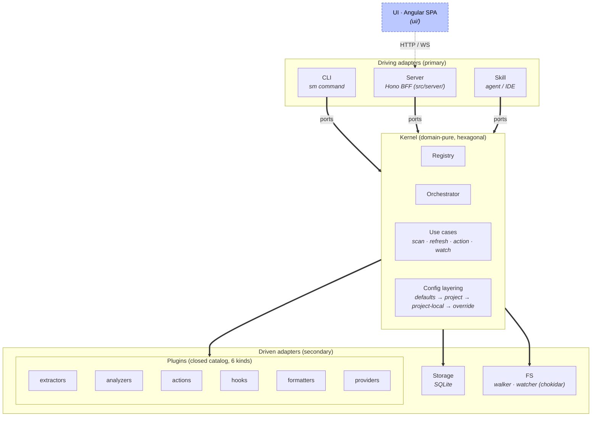

# Architecture

Normative description of skill-map's internal boundaries: the **kernel**, the **ports** it exposes, the **adapters** that drive and serve it, and the six **extension kinds** that live outside the kernel.

Any conforming implementation, reference or third-party, MUST respect these boundaries. The conformance suite under [`conformance/`](./conformance/README.md) enforces the kernel-agnostic invariants; per-Provider suites (e.g. `src/extensions/providers/claude/conformance/` for the reference impl's Claude Provider) enforce the kind-catalog cases. Both are driven via `sm conformance run`.

---

## Layering



The UI is **not** a driving adapter; it is an HTTP/WS client of the Server. Exactly one Provider is active per project (see §Active Provider Lens), and config layering is always project-scoped (see §Config layering).

- **Driving adapters** call into the kernel. The spec defines three: `CLI`, `Server`, `Skill`. A fourth driving adapter MAY be built by third parties (IDE extension, VSCode command palette, TUI) without spec changes.
- **Driven adapters** implement ports the kernel declares. An implementation MUST ship adapters for every port, no port may be left unimplemented at runtime.
- **Kernel** is domain-pure. It never imports a filesystem API, a database driver, or a subprocess spawner directly. All IO crosses a port.

---

## Active Provider Lens

A skill-map project sees its filesystem through exactly one **active provider lens** at any time. The lens is the provider whose extractors, classifiers, and resolution rules apply to the whole project during a scan. All other enabled providers stay registered but their provider-specific extractors are skipped.

The lens is project-scope state. It lives in `.skill-map/settings.json` as the `activeProvider` key (see [`project-config.schema.json`](./schemas/project-config.schema.json#/properties/activeProvider)). When absent, the kernel auto-detects on first scan from filesystem markers and persists the result; if the heuristic is ambiguous or yields no result, the CLI and UI prompt the user to pick one of the enabled providers. **The marker set is provider-owned**: each Provider declares its own detection markers in its manifest `detect.markers` block (see [`provider.schema.json`](./schemas/extensions/provider.schema.json#/properties/detect)), e.g. `claude` → `.claude/`, `openai` → `.codex/` or root `AGENTS.md`, `agent-skills` → `.agents/`. There is no central hardcoded detection table; the detectable set derives from the registered Providers, so adding a Provider with a marker makes it auto-detectable without touching the resolver. When several markers match, the resolver returns the full candidate list in Provider iteration order and the first match is the default suggestion. A Provider with no `detect` block is never auto-suggested but can still be selected manually, Google's Antigravity CLI (which replaced the retired Gemini CLI on 2026-05-19) adopted the open-standard `.agents/` rather than a vendor-specific marker, so a Google project auto-detects as the universal `agent-skills` lens and the `antigravity` lens is set manually via `sm config set activeProvider antigravity`.

### Consequence: one graph per project at a time

The persisted scan graph (`scan_*` zone) reflects the project as the active lens sees it. No cross-provider merging happens at storage time. A repo with both `.claude/` and `.codex/` does NOT show "everyone's nodes at once"; it shows the active lens's view.

### Consequence: lens change is destructive of the scan zone

Switching the active provider drops the `scan_*` zone atomically (nodes, links, issues, scan-result meta) and triggers a fresh scan under the new lens. The `state_*` zone (jobs, executions, summaries, enrichments, plugin KV, favorites) and the `config_*` zone survive untouched. Annotations (`.sm` sidecars on disk) are filesystem state and are also unaffected; the next scan re-derives the in-DB overlay from them.

This is a deliberate trade-off. Keeping two scan graphs simultaneously persisted (one per lens) would re-introduce the cross-provider coordination complexity the lens model exists to avoid. The drop+rescan UX is honest: changing lens means changing the world the graph represents, and the graph regenerates from the source of truth (the filesystem) under the new rules.

### Cross-provider read at the provider level

A provider plugin MAY declare it reads source files belonging to ANOTHER provider's territory. The canonical example: Cursor's runtime consumes `.claude/skills/` and `.codex/skills/` natively; a Cursor provider in skill-map can therefore claim those paths from its own classifier so that under the Cursor lens, those files appear as Cursor-managed nodes with Cursor's interpretation rules. This is provider-internal logic, not a kernel feature; the lens model neither encourages nor prevents it.

### Universal extractors and per-provider extractors

The lens does NOT gate the universal extractors that ship under `core/` (markdown links, code-region file paths, external URLs, sidecar annotations). Those run regardless of the active provider because their semantics are provider-agnostic. Provider-specific extractors (Claude's `@`-directive parser, Cursor's picker-derived references, the future Codex AGENTS.md walker, future Antigravity-specific parsers) declare `precondition: { provider: '<id>' }` on their manifest; the orchestrator invokes them on every node visited during the scan as long as the **active lens** is in the declared provider list, regardless of which provider's `classify()` claimed the node.

The gate is the active lens, not the node's provider. A `@handle` token in `CLAUDE.md` or `notes/todo.md` (files the `claude` provider disclaims to `core/markdown`) still gets parsed by `claude/at-directive` under the `claude` lens, because the runtime grammar is what the lens represents and the runtime reads markdown across the whole project, not only the files it owns. The earlier double-check ("node's provider matches AND the lens") silently dropped that surface; dropping the node side restores it. Cross-lens isolation is preserved by the lens half alone: under `openai`, claude extractors are silent on every node (including `.claude/*`), because the lens authorisation is missing. When `activeProvider` is `null` (no setting, no filesystem marker), provider-gated extractors are skipped uniformly.

### Active-lens scope for providers (classification gate)

The active lens also gates **classification**. Each Provider declares `gatedByActiveLens` on its manifest (`extensions/provider.schema.json#/properties/gatedByActiveLens`, mirrored at `IProvider.gatedByActiveLens`). Vendor providers (`claude`, `openai`, `antigravity`) set this to `true`; their `classify()` only runs (and the walker only iterates their territory) when `provider.id === activeProvider`. Universal providers (the open-standard `agent-skills`, the markdown fallback `core/markdown`, any future format-based fallback) leave the flag `false` (the default) and run on every scan.

Filtering happens in `walkAndExtract` (kernel, `src/kernel/orchestrator/walk.ts`) at the provider-iteration level: a gated-off Provider does NOT walk its territory at all, the cheap path. The predicate is: include the Provider when `!gatedByActiveLens || activeProvider === null || provider.id === activeProvider`. The `null` branch is intentional: an unlensed project (no marker, no setting) keeps the walker permissive so every Provider participates, mirroring the matching extractor-side fallback.

Consequence: under `activeProvider = 'claude'`, a `.codex/agents/foo.toml` file is not classified by the `openai` Provider (gated off); whether the file becomes a node depends on whether a universal Provider claims its extension. Today no universal claims `.toml`, so the file is silently absent from the graph, which matches the runtime reality (Claude Code never consumes `.codex/`). The same path under `activeProvider = 'openai'` becomes `openai/agent`. A `core/markdown` fallback continues to claim every unclaimed `.md` regardless of lens, so a `.claude/agents/foo.md` under `openai` lens reverts to `markdown` (no claude territory under that lens).

This gate affects **classification only**. Extractors keep filtering through their own `precondition.provider` allowlist (described in the previous section); a gated-off vendor Provider does not contribute classified nodes, but its bundled extractors still skip uniformly under the wrong lens via the extractor-side rule. The two gates are independent and complementary.

### Active-lens drift detection

The lens is sticky once set, the operator chose `activeProvider` deliberately, the runtime keeps using it until the operator explicitly runs `sm config set activeProvider <id>`. But projects grow: a repo that started under `claude` may later add `.codex/`, or a `.cursor/` directory disappears in a cleanup. Without a hint, the operator would silently keep scanning under the original lens long after the on-disk reality moved.

To surface this drift without being noisy, the runtime persists a snapshot of provider markers alongside `activeProvider`:

- **`activeProviderMarkers`** (`project-config.schema.json#/properties/activeProviderMarkers`): the set of provider ids whose filesystem markers were present on disk at the moment `activeProvider` was set. Written by the runtime in three places: (1) auto-detect on first scan when exactly one marker is found, (2) interactive prompt when multiple markers are found and the operator picks one, (3) `sm config set activeProvider <id>` (a manual switch refreshes the snapshot to match current reality).

At every subsequent scan entry, the bootstrap re-detects markers, diffs against the snapshot, and emits ONE soft warning when the diff is non-empty:

- **New markers in current but not in snapshot** → "New: <added>" (e.g. the operator added `.codex/` after the choice was made).
- **Markers in snapshot but no longer on disk** → "Removed: <removed>".
- **Both** → both lines, still ONE warn per scan.

The warn is informational and never blocks the scan; the run continues with the cached lens. The snapshot is NOT refreshed automatically when drift fires, the operator chooses whether to switch the lens (`sm config set activeProvider <id>` refreshes the snapshot and atomically drops `scan_*`) or accept the drift (re-running the auto-detect by deleting the `activeProvider` key resets the snapshot).

Legacy projects (an existing `activeProvider` without a snapshot) lazily backfill: the first scan after the project upgrades writes the current detected set as the snapshot and stays silent (there is nothing to compare against the first time), so the warn only fires when markers actually drift relative to a known-good snapshot. The bookkeeping is internal-state, not normally hand-edited.

---

## Ports

An implementation MUST expose these five ports. Each is an interface (TypeScript, in the reference impl; equivalent in other languages).

### `StoragePort`

Persistence for all kernel tables in all three zones (`scan_*`, `state_*`, `config_*`). Exposes typed repositories, not raw SQL. Implementations MAY back this with SQLite, Postgres, in-memory, or anything else, as long as:

- Transactional semantics for atomic claim (see [`job-lifecycle.md`](./job-lifecycle.md)).
- Migration application with `PRAGMA user_version`-equivalent tracking.
- Read isolation sufficient to avoid phantom reads across a single scan write.

The reference impl backs this with `node:sqlite` + Kysely + `CamelCasePlugin`. See [`db-schema.md`](./db-schema.md) for the full table catalog.

### `FilesystemPort`

Walks roots, reads node files, reports mtime/size. Abstracts away platform-specific path handling and test fixtures.

Operations: `walk(roots, ignore)`, `readNode(path)`, `stat(path)`, `writeJobFile(path, content)`, `ensureDir(path)`.

The reference impl uses real `node:fs` in production and an in-memory fixture in tests.

### `PluginLoaderPort`

Discovers plugin directories, reads `plugin.json`, checks `specCompat`, dynamically imports extension files, returns loaded extension descriptors ready to register.

Operations: `discover(scopes)`, `load(pluginPath)`, `validateManifest(json)`.

The loader enforces two id-uniqueness analyzers during discovery (see [`plugin-author-guide.md` §Plugin id uniqueness](./plugin-author-guide.md#plugin-id-uniqueness) for the author-facing summary):

1. **Directory name == manifest id.** A plugin lives at `<root>/<id>/plugin.json`. A mismatch surfaces as status `invalid-manifest`. This analyzer eliminates same-root collisions by construction.
2. **Cross-root id collision blocks both sides.** Two plugins reachable from different roots (e.g. the project default `<cwd>/.skill-map/plugins/` and any `--plugin-dir` combination) that declare the same `id` BOTH receive status `id-collision`. No precedence analyzer applies, coherent with §Boot invariant ("no extension is privileged"). The user resolves by renaming one of them.

In addition, the loader **qualifies every extension** with its owning plugin id before registering it. The registry stores extensions under the qualified id `<plugin-id>/<extension-id>` (e.g. `core/slash-command`, `core/reference-broken`, `my-plugin/my-extractor`). Authors continue to declare the short `id` in each extension manifest; the loader composes the qualified form from `manifest.id` at load time. Built-in extensions bundled with the reference impl declare their `pluginId` directly in `built-ins.ts`, `core/` for kernel-internal primitives (every analyzer, the formatter, the cross-vendor extractors `annotations` / `slash` / `at-directive` / `markdown-link` / `backtick-path` / `external-url-counter` / `stability`) and vendor-specific plugins such as `claude/` (the Claude provider) for Provider integrations whose territory is platform-bound. If a plugin author injects a `pluginId` field on an extension that disagrees with `plugin.json`'s `id`, the loader emits `invalid-manifest` with a directed reason.

Every extension (built-in or drop-in) is independently toggle-able by its qualified id `<plugin>/<ext-id>`. The plugin row is a presentational grouping; the granular toggle target is the extension, while toggling a bare plugin id is the **bundle** (aggregate) macro that fans across every extension. The loader's pre-import `resolveEnabled(pluginId)` short-circuit only fires when EVERY extension of the plugin is disabled (the plugin "starts as disabled"); partial enables let the imports proceed and the runtime composer (`composeScanExtensions` / `composeFormatters` in `src/core/runtime/plugin-runtime/composer.ts`) drops the per-extension disabled rows before they reach the orchestrator. The `core` plugin exercises the per-extension axis explicitly (every kernel built-in is removable, satisfying §Boot invariant: "no extension is privileged"); vendor Provider plugins (`claude`, `antigravity`, `openai`, `agent-skills`) currently have most operators leaving every extension enabled, but the same per-extension toggle surface applies. See [`plugin-author-guide.md` §Toggle model](./plugin-author-guide.md#toggle-model) for the author-facing summary.

### `RunnerPort`

Executes an action against rendered job content. Returns the produced report (or an error) plus runner-side metrics (duration, tokens, exit code).

Operations: `run(jobContent, options)` → `{ report, tokensIn, tokensOut, durationMs, exitCode } | Error`.

`jobContent` is a string: the kernel reads `state_job_contents` for the job and passes the content directly. There is no on-disk job file as part of the contract, runners that need an actual file (the `claude -p` subprocess, for example) materialize a temporary file inside `run()` and remove it after spawn. The temp file is operational, not normative.

`report` is the parsed JSON the runner produced; the kernel ingests it into `state_executions.report_json`. Path-based reporting is not part of the port contract.

Two reference implementations:
- `ClaudeCliRunner`, subprocess `claude -p` with the content piped into a temp file or stdin.
- `MockRunner`, deterministic fake for tests.

The **Skill agent** does NOT implement this port: it is a peer driving adapter (alongside CLI and Server) that runs inside an LLM session and consumes `sm job claim` + `sm record` as a kernel client. The name "Skill runner" is descriptive, not structural, only the `ClaudeCliRunner` (and its test fake) implement `RunnerPort`. See [`job-lifecycle.md`](./job-lifecycle.md).

### `ProgressEmitterPort`

Emits progress events during long operations (scans, job runs). Consumers: CLI pretty printer, `--json` ndjson, Server's WebSocket broadcaster.

Operations: `emit(event)`, `subscribe(listener)`. Events are defined in [`job-events.md`](./job-events.md).

---

## Kernel

The kernel is the only component that:
- Maintains the extension registry.
- Runs the scan orchestrator.
- Validates scan output against [`scan-result.schema.json`](./schemas/scan-result.schema.json).
- Applies the canonical prompt preamble to job files ([`prompt-preamble.md`](./prompt-preamble.md)).
- Enforces duplicate-prevention and atomic-claim invariants for jobs.
- Persists execution records.

The kernel is the only component that MAY:
- Import schemas.
- Call `validate(data, schema)`.
- Dispatch extension hooks.

The kernel MUST NOT:
- Know which Provider produced an event.
- Know which platform a node belongs to (that is the `Provider` extension's job).
- Contain any platform-specific branching (e.g., `if (platform === 'claude')`).

### Boot invariant

**With all extensions removed, the kernel MUST boot and return an empty graph.** This is enforced by the conformance suite case `kernel-empty-boot`.

No extension is privileged. The Claude Provider ships bundled with the reference impl but is removable, same as any third-party plugin.

---

## Execution modes

Every analytical extension in skill-map is one of two **modes**:

- **`deterministic`**, pure code. Same input → same output, every run.
- **`probabilistic`**, calls an LLM through the kernel's `RunnerPort`. Output may vary across runs; cost and latency are non-trivial.

Mode is a property of the extension as a whole, not of an individual call. **An extension is one mode or the other; it cannot switch at runtime.** If a plugin author needs both flavors of the same idea (regex-based AND LLM-based "find suspicious imports"), they ship two extensions with distinct ids.

### Which kinds support which modes

| Kind | Modes | How mode is set |
|---|---|---|
| **Extractor** | deterministic-only | implicit; `mode` field MUST NOT appear |
| **Analyzer** | deterministic / probabilistic | declared in manifest (`mode` field, optional; defaults to `deterministic`) |
| **Action** | deterministic / probabilistic | declared in manifest (`mode` field, **required**, no default) |
| **Hook** | deterministic / probabilistic | declared in manifest (`mode` field, optional; defaults to `deterministic`) |
| **Provider** | deterministic-only | implicit; `mode` field MUST NOT appear |
| **Formatter** | deterministic-only | implicit; `mode` field MUST NOT appear |

Provider, Extractor, and Formatter are locked to deterministic because they sit on the **deterministic scan path**. A Provider resolves `path → kind` during boot; probabilistic classification would make the boot phase slow, costly, and non-reproducible. An Extractor consumes a parsed node body inside `sm scan`'s synchronous loop; LLM-driven enrichment of a node is an Action concern (queued as a job and observed via the enrichment layer or sidecar writes), not an Extractor concern, the distinction matters because `sm scan` MUST be fast, free, and reproducible. A Formatter must produce diffable output (`sm scan` snapshots round-trip in CI). Probabilistic narrators of the graph are a valid product but they live in jobs and emit Findings or write to the enrichment layer through Actions, not through Extractors or Formatters.

> **Naming note, `Provider` vs hexagonal `adapter`.** A `Provider` is an **extension** authored by plugins (it recognises a platform and declares its kind catalog). The hexagonal-architecture term `adapter` refers to **port implementations** internal to the kernel package, `RunnerPort.adapter`, `StoragePort.adapter`, `FilesystemPort.adapter`, `PluginLoaderPort.adapter`, and lives under `kernel/adapters/`. The two concepts share an architectural lineage (both bridge two worlds) but live in deliberately disjoint namespaces so plugin authors and impl maintainers never confuse them.

### When each mode runs

- **Deterministic extensions** run synchronously inside the standard kernel pipelines (`sm scan`, `sm check`, `sm list`). Fast, free, reproducible. CI-safe.
- **Probabilistic extensions** never run during `sm scan`. They are dispatched as **jobs** via `sm job submit <kind>:<id>`. Jobs are async, queued, persisted under `state_jobs`, and resume on next boot. The same scan snapshot can be re-analyzed by probabilistic extensions on demand without re-walking the filesystem.

This separation is normative: a probabilistic extension cannot register a hook that fires from `sm scan`. The kernel rejects it at load time.

### How probabilistic extensions invoke the LLM

The kernel exposes the LLM through the `RunnerPort` (see §Ports above). Reference impl: `ClaudeCliRunner`. Tests: `MockRunner`. Other adapters (OpenAI, local Ollama, etc.) implement the same port without spec changes.

A probabilistic Action, Analyzer, or Hook receives the runner in its invocation context alongside `ctx.store` (Extractors are deterministic-only and never see the runner). The extension never imports a specific LLM SDK, the runner contract is what the spec normalizes; wire format and model selection are adapter concerns.

---

## Extension kinds

Six kinds, all first-class, all loaded through the same registry. Each kind has a JSON Schema describing its manifest shape under [`schemas/extensions/`](./schemas/extensions/). Implementations MUST validate every extension manifest against the schema for its declared kind at load time; validation failure → the extension is skipped with status `invalid-manifest`.

| Kind | Role | Input | Output |
|---|---|---|---|
| **Provider** | Recognizes a platform. The kind catalog lives on disk under `<plugin>/kinds/<kindName>/{schema.json, kind.json}` (structure-as-truth); the loader projects it onto the runtime descriptor. The Provider's walker hardcodes the paths it scans within the project (e.g. `.claude/`, `.codex/`); it does NOT extend the scan into the user's HOME. `Provider.roots` is enforcement-grade: a Provider with declared roots only sees matching files; a Provider without `roots` acts as the fallback. Deterministic-only. | Filesystem walk results, candidate path. | `{ kind, provider } \| null`. |
| **Extractor** | Extracts signals from a node body. Deterministic-only: runs synchronously inside `sm scan`. Output flows through context callbacks (no return value): `ctx.emitLink(link)` for the kernel's `links` table (validated against the global closed enum of link kinds; per-extractor allowlist was retired with the structure-as-truth refactor), `ctx.enrichNode(partial)` for the kernel's enrichment layer (separate from the author's frontmatter), `ctx.emitContribution(id, payload)` for view contributions, `ctx.store` for the plugin's own KV / dedicated tables. | Parsed node (frontmatter + body) + callbacks. | `void` (output via callbacks). |
| **Analyzer** | Evaluates the graph. Dual-mode: `deterministic` runs in `sm check`, `probabilistic` runs in jobs. The analyzer↔action relationship is declared from the Action side via `precondition.analyzerIds` (Modelo B). | Full graph (nodes + links). | `Issue[]`. |
| **Action** | Operates on one or more nodes. Two independent surfaces: **`invoke(input, ctx)`** is the on-demand executor (deterministic in-process code, or a probabilistic rendered prompt the runner executes); **`project(ctx)`** is an OPTIONAL, deterministic, side-effect-free scan-time method that runs in the contribution phase with read-only graph access (`ctx.nodes` / `ctx.links`) and emits the Action's OWN view contributions via `ctx.emitContribution(...)` (e.g. its `inspector.action.button`). `project()` is always deterministic even when `invoke` is probabilistic. Files-by-convention: every Action carries `<action-dir>/report.schema.json`; probabilistic Actions additionally carry `<action-dir>/prompt.md`. The retired `reportSchemaRef` / `promptTemplateRef` / `expectedTools` / `fanOutPolicy` manifest fields were replaced by these conventions and the simplified `precondition` block. | `project`: full graph. `invoke`: node(s) + optional args. | `project`: `void` (contributions via callback). `invoke`: deterministic report JSON or probabilistic rendered prompt. |
| **Formatter** | Serializes the graph. Deterministic-only. The `formatId` consumed by `sm graph --format <name>` comes from the formatter's folder name. | Graph + optional filter. | String (ASCII / Mermaid / DOT / JSON / user-defined). |
| **Hook** | Reacts declaratively to one of ten curated lifecycle events, eight pipeline-driven (`scan.started`, `scan.completed`, `extractor.completed`, `analyzer.completed`, `action.completed`, `job.spawning`, `job.completed`, `job.failed`) plus two CLI-process-driven (`boot` before verb routing, `shutdown` after the verb's exit code resolves). **Deterministic-only** since the structure-as-truth refactor: LLM-dependent reactions are modeled as a deterministic Hook that enqueues a probabilistic Action via `ctx.queue('<plugin>/<action>', payload)`. Hooks REACT to events; they cannot block, mutate, or steer the pipeline. | A curated event payload (run-scoped, scan-scoped, job-scoped, or process-scoped) plus an optional declarative `filter` map. | `void` (reactions are side effects). |

### IO discipline, extensions never write to the filesystem

Extensions (Provider / Extractor / Analyzer / Action / Formatter / Hook) are **pure**: they consume kernel-supplied context and emit data through return values or `ctx.*` callbacks. They MUST NOT perform filesystem writes directly, not via `fs.writeFile`, not via shell, not via a third-party library. Implementations MUST NOT expose any port that hands an extension a writable filesystem handle.

The materialisation of any kernel-managed artefact (the SQLite DB at `.skill-map/skill-map.db`, the `.sm` sidecars next to source files, the job ledger at `.skill-map/jobs/`, the `scan_extractor_runs` cache, the enrichment overlay rows) is the **kernel's** responsibility, gated through the relevant Port:

- Extractors persist via `ctx.emitLink` / `ctx.enrichNode` / `ctx.store`, never by writing files. `ctx.store` is plugin-scoped persistence routed through `StoragePort`; it cannot reach the project filesystem.
- Actions return either a deterministic report (JSON), a rendered prompt (probabilistic), or, for the small subset of actions that legitimately mutate persisted state, an explicit `TActionWrite` discriminated union the kernel interprets. The built-in `core/node-bump` is the only action that returns `{ kind: 'sidecar' }` today; the kernel routes that write through `SidecarStore.applyPatch`, which is the single gated chokepoint for all `.sm` writes (see §Annotation system · Write consent).
- Providers, Analyzers, Formatters, Hooks have no write surface at all.

This invariant is what makes the consent gate at the kernel boundary sufficient: no extension can bypass it because no extension has the means to write in the first place. Conformance: a third-party extension that imports `node:fs` write APIs (or equivalent in another language) is non-conforming.

### Provider · `kinds` catalog

Every `Provider` declares its kind catalog via the filesystem (structure-as-truth): each kind lives under `<plugin>/kinds/<kindName>/` and ships exactly two files:

- **`schema.json`**, the kind's frontmatter JSON Schema. MUST extend [`frontmatter/base.schema.json`](./schemas/frontmatter/base.schema.json) via `allOf` + `$ref` to base's `$id`. The kernel reads it once at boot, registers it with AJV, and validates every node's frontmatter against the entry matching its classified kind.
- **`kind.json`**, the per-kind metadata, today just `{ ui: { label, color, colorDark?, emoji?, icon? } }`. See §Provider · `ui` presentation below. Validated against [`schemas/extensions/provider-kind.schema.json`](./schemas/extensions/provider-kind.schema.json) at load time.

The loader's discovery (`discoverProviderKinds`) projects every `kinds/<kindName>/` directory into the runtime descriptor `instance.kinds[<kindName>] = { schema, schemaJson, ui }`. The `IProvider` runtime contract derives the kind set from `Object.keys(kinds)`; authors do not write the map by hand any more.

The retired manifest field `defaultRefreshAction` (the qualified action id the UI's `🧠 prob` button dispatched) was removed alongside the button. A replacement UX is TBD; until then, the kernel does not surface a Provider-declared "default refresh" path.

### Provider · `ui` presentation

Each `kinds[*].ui` entry declares how the UI renders nodes of that kind:

- **`label`**, short human name (e.g. `'Skill'`, `'Agent'`). Used in palette chips, list view, inspector header.
- **`color`**, base color (any CSS color string) for the kind. The UI derives bg / fg tints per theme via a deterministic helper, so the Provider declares one base color per theme rather than four hex values.
- **`colorDark?`**, optional dark-theme override. Defaults to `color` when omitted.
- **`emoji?`**, optional single-glyph emoji rendered alongside the label.
- **`icon?`**, optional discriminated union: either `{ kind: 'pi'; id: 'pi-…' }` (a PrimeIcons class id) or `{ kind: 'svg'; path: '…' }` (raw SVG path data wrapped by the UI in `viewBox="0 0 24 24"` and tinted with `currentColor`). The discriminator keeps UI dispatch exhaustive without string-sniffing; AJV validates each variant cleanly.

The `ui` block is required (not optional) by design: making it optional would force the UI to invent visuals for missing entries, silently collapsing unknown kinds to a default rendering and hiding manifest gaps. Forcing the Provider to declare presentation up-front means the UI never guesses.

The kernel ships every Provider's per-kind `ui` block to the BFF at boot; the BFF aggregates them into a `kindRegistry` map and embeds it in every payload-bearing REST envelope (see [`cli-contract.md` §Server](./cli-contract.md#server)). The UI consumes `kindRegistry` directly, built-in and user-plugin kinds render identically.

Each Provider ALSO declares a top-level `presentation` block (`provider.schema.json#/properties/presentation`: `label`, `color`, optional `colorDark` / `icon` / `emoji` / `hideChip`) describing the Provider's own identity, distinct from its kinds' visuals. (It is named `presentation`, not `ui`, because the shared extension `ui` key is the view-contributions map declared only by extractor / analyzer kinds.) The BFF aggregates these into a sibling `providerRegistry` map (keyed by Provider id) embedded on the same envelopes. The UI consumes `providerRegistry` to render the active-lens dropdown, the topbar lens chip, and the per-node provider chip on cards from the real registered-Provider set, never a hardcoded list. `hideChip: true` (set by the universal `markdown` fallback) suppresses only the per-card chip; the Provider still appears in the lens surfaces. Unlike kind colors (normalised across Providers so every `agent` paints the same), Provider colors are deliberately distinct so the chip tells the user at a glance which platform a node came from.

### Provider · dispatch order and the universal markdown fallback

`sm scan` iterates Providers in **registration order**, vendor-specific Providers first (built-in: `claude` → `antigravity` → `openai` → `agent-skills`; user-installed plugins follow in load order), then the built-in `core/markdown` Provider LAST. Each Provider's walker enumerates the full project tree for its declared `read.extensions`; for every emitted file, the orchestrator calls `provider.classify(path, frontmatter)`. The kernel maintains a per-scan `Set<path>` of already-classified files so each path is offered to AT MOST one Provider's `classify`: the first Provider whose `classify` returns non-null claims the file, and subsequent Providers see the path as taken and skip.

The dispatch contract has two consequences implementations MUST honour:

1. **First-claim-wins**. A vendor Provider that classifies a file inside its territory (e.g. claude's `.claude/agents/foo.md` → `agent`) is authoritative; later Providers cannot reclassify it to a different kind. This locks vendor ownership of vendor paths and removes the historical `provider-ambiguous` failure mode for non-overlapping territories.
2. **`core/markdown` is the universal fallback for unclaimed `.md` files**. The built-in `core/markdown` Provider's `classify` returns `'markdown'` unconditionally (it does NOT inspect the path). Combined with the dedup guarantee above and its terminal position in the iteration order, it picks up exactly the `.md` files no vendor Provider claimed, a `.md` at the project root, under `.claude/hooks/`, `notes/`, `CLAUDE.md`, `GEMINI.md`, or anywhere else outside a known vendor territory. The fallback is **not privileged kernel code**: it ships as a regular built-in Provider under the `core` plugin, so a user who explicitly does not want it can disable it via `sm plugins disable core/markdown` and the scan reverts to "vendor-only", orphan `.md` files become silently invisible, matching pre-spec-0.9.0 behaviour.

The fallback exists because the format-named generic kind `markdown` is provider-agnostic: no vendor owns the universal markdown format. Keeping the fallback as a Provider (rather than a kernel-level special case) preserves the boot invariant that no extension is privileged, when a future vendor Provider (Codex, Cursor, Roo) lands, it slots into the iteration order before `core/markdown` and the fallback semantics stay invariant.

### Provider · kind identifiers

Each entry in a Provider's `kinds` catalog MAY declare an optional `identifiers: TIdentifierSource[]` listing, in priority order, how the kernel derives the kind's canonical invocation handle(s) for the post-walk confidence-lift transform. Absent / empty = the kind is not name-resolvable (path-based resolution still applies independently).

The closed set of sources:

| `TIdentifierSource` | Reads | Typical kinds |
|---|---|---|
| `'frontmatter.name'` | `node.frontmatter.name` | every invocable kind whose schema declares `name` as required (agents, commands, skills); the canonical source when the author set it. |
| `'filename-basename'` | `basename(path)` with the extension stripped | Anthropic agents and commands, OpenAI Codex sub-agents, references at `<dir>/<name>.<ext>` resolve `@<name>` even when frontmatter is partial. |
| `'dirname'` | `basename(dirname(path))` | Anthropic / agent-skills (open standard, also adopted by Google Antigravity CLI), Anthropic explicitly documents that the directory between `skills/` and `/SKILL.md` is the invocation handle, with `frontmatter.name` as an optional override (https://code.claude.com/docs/en/skills.md). |

Sources MAY appear together; the resolver visits each declared source per node, normalises every yielded value with the §Extractor · trigger normalization pipeline, and contributes a presence entry to the cross-kind name index. Multiple sources that produce the same normalised name collapse into one bucket entry (the dual-source `['frontmatter.name', 'filename-basename']` on a `.claude/agents/foo.md` with `name: foo` yields a single `foo` entry, not two).

Implementations MUST treat an absent `identifiers` field exactly like `[]`: the kind contributes nothing to the name index and is reachable only via the path-match rule of §Provider · resolution rules.

### Provider · resolution rules

Each Provider MAY declare an optional `resolution: Record<linkKind, targetKind[]>` map listing, for each `link.kind` an Extractor in this Provider's plugin emits, the set of target `node.kind` values that count as a valid resolution for the post-walk confidence-lift transform. Absent = no link.kind bumps under this Provider via the name path (path-match always fires).

The transform runs after `dedupeLinks` and before the analyzer pipeline. For each link below `confidence: 1.0`:

1. **Path match (universal)**: if `link.target` equals some node's `path`, confidence is bumped to `1.0`. Applies to every link.kind, ignores the `resolution` map. Drives resolved markdown / at-directive references. `core/mcp-tools` synthetic edges path-match here too, but they hit the virtual-target exception below and keep their emit confidence rather than bumping.

2. **Name match (links carrying a `trigger.normalizedTrigger`)**: strip the leading `@` / `/` sigil, look up the resulting handle in the cross-kind name index built from every node's declared `identifiers` (see §Provider · kind identifiers). The lookup keys on the ACTIVE PROVIDER LENS: `resolution = providers[activeProvider].resolution`. If `resolution[link.kind]` exists AND any candidate node's kind appears in it, confidence is bumped to `1.0`.

**Virtual-target exception (applies to both bump rules above):** when the resolved target node carries `virtual: true` (a derived, in-memory entity reconstructed from frontmatter and never verified on disk, e.g. an `mcp://<server>` node emitted by `core/mcp-tools`), the link does NOT bump to `1.0`, it keeps its extractor-emitted confidence. `link.resolvedTarget` is still set (the edge points at a real graph node and stays navigable), but resolution to a fabricated, unverified node is not full certainty. Same principle as the reserved-target downgrade (§Provider · reservedNames): resolution alone is not certainty when the target is something the runtime may not actually act on. A virtual target is never "genuinely broken" either (it resolves), so rule 3 does not fire on it.

3. **Broken downgrade (universal)**: when neither rule above bumped the link AND the link is genuinely broken, its confidence is lowered to `BROKEN_TARGET_CONFIDENCE = 0.5` (a cap: the value is only lowered, never raised, so a link emitted below `0.5` keeps its lower value). "Genuinely broken" means `link.target` matches no node `path` AND the stripped `trigger.normalizedTrigger` matches no entry in the cross-kind name index, i.e. the same kind-agnostic notion of "the name exists nowhere" that `core/reference-broken` uses. The effect is uniform across link kinds: a dangling markdown reference (`[x](missing.md)`), a `@missing.md`, and a `/no-such-command` all render at `0.5`, visibly fainter than a resolved edge at `1.0`. A link that fails the strict kind/lens bump of rule 2 but DOES match a name in the index (the `not-broken` + `not-bumped` case documented below) is NOT broken: it keeps its extractor-emitted confidence, because it resolves to a real node, just not as a valid target for this `link.kind`. The downgrade sits ABOVE the reserved-target value (`0.1`, §Provider · reservedNames): a target that resolves to a real-but-runtime-ignored file is flagged more faintly than one that resolves to nothing, deliberately, the reserved shadow is the subtler trap.

The matrix is **per-link-kind, per-Provider**, strict: a `claude` Provider that declares `resolution: { mentions: ['agent'], invokes: ['command', 'skill'] }` does NOT bump a `/foo` slash matching an agent named `foo` (slash → agent is a kind mismatch surfaced by `link-conflict` / `kind-mismatch` analyzers, not silently treated as a resolution). The strictness is the load-bearing difference from the kind-agnostic `core/reference-broken` analyzer: `broken-ref`'s scope is "the name exists somewhere" (a name-only resolution is enough to clear the broken flag), the post-walk bump is "the name exists AS A VALID resolution for this link.kind". The `not-broken` + `not-bumped` combination is a documented edge case: the trigger resolves to a real node but the link's kind cannot legitimately point there.

The lookup uses the ACTIVE PROVIDER LENS deliberately, mirroring the extractor gate (§Universal extractors and per-provider extractors). The lens represents the runtime grammar the operator is authoring under, and that grammar applies across the project's surface, not only to files the matching `classify()` claimed. A `@handle` in `notes/todo.md` (classified by `core/markdown`) under the `claude` lens still parses as a claude mention (the extractor gate authorises it) and resolves against claude's `resolution.mentions` (the resolver gate now mirrors the same authority). The same body under the `openai` lens follows openai's resolution map, or short-circuits if openai declares no entry for that `link.kind`. When `activeProvider === null` (unlensed project: no setting, no filesystem signal), the name path short-circuits uniformly; the path-match rule still applies.

**Distinct from the Signal IR `resolverRules` (§Resolver phase).** `resolverRules` rank candidates INSIDE a Signal (Phase 3+, no Provider declares it today); `resolution` runs against the merged Link graph post-walk and is the contract Extractors EMITTING Links rely on. The two surfaces share no mechanism and intentionally do not compose; when a Signal IR materialises into a Link, the `resolution` matrix runs unchanged against the resulting Link.

### Provider · reservedNames

Each Provider MAY declare an optional `reservedNames: Record<kind, string[]>` map listing, for each `node.kind` the runtime owns, the set of invocation names the runtime itself consumes. Anthropic's Claude CLI reserves `/help`, `/clear`, `/init`, `/agents`, `/model`, `/cost`, `/compact`, `/login`, `/logout`, … under `command`, and `general-purpose`, `output-style-setup`, `statusline-setup` under `agent`; a user-authored `.claude/commands/help.md` is silently shadowed at runtime (the built-in runs, the file is ignored).

The kernel intersects each Provider's `reservedNames[kind]` catalog with the scanned graph at orchestrator time. For every node the post-walk pipeline derives its normalised identifiers via the §Provider · kind identifiers contract, then tests them against a reserved set resolved under **two scopes**:

1. **Self scope.** `reservedNames[node.kind]` of the node's OWN Provider (`node.provider`). The self-contained case: Claude classifies `.claude/commands/help.md` as `claude`/`command` and reserves `help` under `command`, so the file is flagged.
2. **Lens scope.** When a Provider is the active lens (`activeProvider === provider.id`) it ALSO lends its catalog to nodes that a *universal* (ungated) Provider classified, matched by `node.kind`. This is required by runtimes that adopt the open `.agents/skills/` standard instead of a vendor directory: their user invocables are owned by the neutral `agent-skills` Provider (`kind: skill`), not by the vendor Provider, so self scope alone would never reach them. Google's Antigravity is exactly this shape, it is metadata-only (classifies nothing) and reserves its `agy` built-in slash commands under `skill`; when `activeProvider === 'antigravity'`, a user `.agents/skills/goal/SKILL.md` is flagged because `/goal` is a built-in. Lens scope is skipped when `node.provider === activeProvider` (it would duplicate self scope) and when no lens is resolved (`activeProvider === null`).

A node's identifiers are always derived from its OWN kind contract; only the reserved-set lookup widens under the lens. A node landing in either scope's set joins a per-scan `Set<nodePath>` consumed by two surfaces:

1. **The `core/name-reserved` analyzer projects one `warn` issue per reserved-shadow node** (`severity: 'warn'`, message points at the offending file and suggests renaming). The analyzer is a pure projector, detection lives in the orchestrator so the same set drives the next surface.

2. **The post-walk confidence-lift transform downgrades any link that resolves to a reserved target** (by path OR by name match) to `RESERVED_TARGET_CONFIDENCE = 0.1` instead of bumping it to `1.0`. The visual weight in the graph drops well below the `0.5` / `0.8` extractor emit floors so the operator sees at a glance that the edge resolves to a file the runtime ignores. When the trigger has multiple candidates (name index collision) and the strict-kind filter accepts more than one, the resolver picks the first allowed candidate, if it is non-reserved, the link bumps to `1.0` normally; only when EVERY accepted candidate is reserved does the downgrade apply.

The lookup normalises both sides through the §Extractor · trigger normalization pipeline, so a literal `Init-Project` in the manifest still matches a user `name: init project` or filename `Init-Project.md`. The catalog is intentionally per-kind, not global: a name reserved for commands (`/help`) MAY legitimately appear as a skill (a "help" skill triggered through a non-command channel). Lens scope respects the same per-kind boundary: Antigravity declares its reserved names under `skill` (not `command`) precisely because the invocable they shadow is a skill file, so only `skill`-kind nodes are tested against it.

**Update policy.** Built-in catalogs drift as vendor runtimes evolve. Each catalog change ships as a kernel patch with a changeset entry; the catalog is considered API surface that users rely on the analyzer to reflect. User-installed Providers MAY declare their own `reservedNames` with the same shape; the analyzer and the downgrade run uniformly across built-in and user-installed Providers.

Default `undefined` ≡ empty map ≡ no reserved names. Path matches against non-reserved targets are unaffected (they continue to bump to `1.0` unconditionally), the downgrade only fires when the resolved target is in the reserved set.

### Extractor · output callbacks

The `Extractor` runtime contract is `extract(ctx) → void`. The extractor emits its work through three callbacks the kernel binds onto `ctx`:

- `ctx.emitLink(link)`, append a `Link` to the kernel's `links` table. The kernel validates `link.kind` against the **global closed enum** of link kinds (`invokes`, `references`, `mentions`, `supersedes`, `points`) before persistence; off-enum links are dropped and surface as `extension.error` events (the per-extractor `emitsLinkKinds` allowlist was retired with the structure-as-truth refactor; confidence is declared per emit, default `'medium'`). URL-shaped targets (`http(s)://…`) are partitioned out into `node.externalRefsCount` and never persisted.
- `ctx.enrichNode(partial)`, merge canonical, kernel-curated properties onto the current node's enrichment layer (persisted into [`node_enrichments`](./db-schema.md#node_enrichments)). **Strictly separate from the author-supplied frontmatter** (the latter remains immutable across scans). The enrichment layer is the right home for kernel-derived facts (computed titles, summaries, signals an Extractor inferred from the body) without polluting what the user wrote on disk. See §Enrichment layer below for the full lifecycle (per-extractor attribution, refresh verbs).
- `ctx.store`, plugin-scoped persistence. Optional, present only when the plugin declares `storage.mode` in `plugin.json`. Shape depends on the mode (`KvStore` for mode A, scoped `Database` for mode B). See [`plugin-kv-api.md`](./plugin-kv-api.md). The plugin author MAY opt into shape validation for their own writes by declaring `storage.schema` (Mode A) or `storage.schemas` (Mode B) in the manifest, JSON Schemas the kernel AJV-compiles at load time and runs against every `ctx.store.set(key, value)` / `ctx.store.write(table, row)` call. Absent = permissive (status quo). `emitLink` and `enrichNode` keep their universal validation against `link.schema.json` / `node.schema.json` regardless of this opt-in. See [`plugin-author-guide.md` §`outputSchema`](./plugin-author-guide.md#outputschema--opt-in-correctness-for-custom-storage-writes).

Extractors are deterministic-only; `ctx.runner` is NOT exposed on the Extractor context. LLM-driven enrichment of a node is an Action concern (queued as a job), not an Extractor concern.

### Extractor · Signal IR (opt-in)

In addition to the `emitLink` path, Extractors MAY emit **Signals** via `ctx.emitSignal(signal)`. A Signal is a candidate detection: one or many alternative interpretations of the same body or frontmatter location, each carrying its own kind, target, confidence, and rationale. See [`signal.schema.json`](./schemas/signal.schema.json) for the full contract. The Signal IR is opt-in; an extractor whose detection is unambiguous (sidecar `supersedes`, `[text](file.md)` markdown links, plain `https://…` URLs) is encouraged to keep emitting Links directly with `ctx.emitLink`. Signals exist for the cases the resolver actually helps: detections where a single body token can plausibly mean several things and the active provider's rules need to decide.

The kernel's **resolver phase** runs after extraction completes and before analysis starts. For each Signal, the resolver:

1. (Phase 4+, not yet wired) Filters candidates whose `extractorId` is disabled by a per-extension enable filter. The config surface that toggles individual extensions is not defined yet (the earlier `plugins.<id>.extensions.<extId>.enabled` placeholder was removed); it will be specified when this filter lands. When the filter empties every candidate, the Signal carries `resolution.outcome = 'rejected'` with `extractorDisabled = { extractorId }`.
2. Ranks the surviving candidates inside the Signal by the active Provider's `resolverRules.kindPriority` (when declared), then `confidence` DESC, then `range` length (`end - start`) DESC, then `extractorId` declaration order. The chosen index is recorded as `resolution.winnerIndex` and (provisionally) `resolution.outcome = 'materialised'`.
3. For body-scoped Signals with a `range`, the resolver builds overlap clusters per source (transitive closure of range intersection). Clusters of size 1 keep their winner. For clusters of size 2+, the resolver re-applies the same four-step tiebreak to each Signal's winning candidate to pick a cluster winner. Losers flip to `resolution.outcome = 'rejected'` with `rejectedBy = { source, range, extractorId, reason }`, where `reason` names the tiebreak step that decided it: `kind-priority`, `higher-confidence`, `longer-range`, or `earlier-declaration`. External pseudo-link clusters (every member targets `http://` / `https://`) skip cross-cluster ranking, every member materialises (URL-targeted Signals can never conflict with internal-target Signals or with each other because they leave the local graph).
4. Materialises every Signal whose final `outcome === 'materialised'` as a Link, identical in shape to a Link emitted directly via `emitLink`. The materialised Link's `sources[]` carries the winning candidate's `extractorId` so attribution survives the resolver.
5. (Phase 4+, not yet wired) Rejects a whole Signal when every candidate's `confidence` falls below the configured floor: `resolution.outcome = 'rejected'` with `belowFloor = { threshold }`. Today the resolver materialises every Signal that survives overlap regardless of confidence.

Both materialised and rejected Signals remain on `IAnalyzerContext.signals` post-resolver. The built-in `core/signal-collision` analyzer reads this buffer and emits one `warn` issue per rejected Signal so the operator sees WHICH extractor lost, against WHO, and WHY. Rejected Signals never enter the graph as Links, but their existence is visible end-to-end through the issue surface.

The Signal's `range` field (byte offsets in the source) powers two cross-extractor analyses no Link can support today: collision detection (two extractors emitting Signals with overlapping ranges, contract above) and fragmentation detection (an authored intent split across several adjacent Signals, deferred to Phase 5+). Both surface as analyzer issues, not silent merges.

### Extractor · code-region file references (`core/backtick-path`)

Every body extractor strips fenced code blocks and inline code spans before matching (the code-strip policy): invocation tokens (`@handle`, `/command`, URLs) inside backticks are literal payload the runtime never follows. **Relative file paths are the documented exception.** The Agent Skills open standard mandates that a skill references its bundled resources by relative path and that "agents load these on demand"; prose like ``Read `references/rules.md` `` is an instruction the consuming LLM runtime does follow. The `core/backtick-path` extractor exists to surface exactly that class of references, and ONLY inside code regions, the precise complement of the code-strip policy, so it can never collide with the prose-side extractors.

The contract:

- **Domain**: the extractor matches exclusively inside fenced code blocks and inline code spans, over the *inverse mask* of the code-strip transform: same-length text where code-region characters survive and everything else is blanked. Same-length masking keeps byte offsets and line numbers valid against the original body.
- **Token grammar** (pinned; implementations MUST match it exactly): `/(?<![\w/:.-])(?:\.{1,2}\/)?[\w][\w.-]*(?:\/[\w.-]+)*\.md\b(?![\w/])/g`. In words: an optional `./` or `../` prefix, a first segment that MUST start with a word character, zero or more `/` separators, a `.md` suffix at a word boundary. A bare filename (`algo4.md`) matches, the same way the consuming runtime follows it: a skill body's `lee el archivo: ` + "`algo4.md`" is an instruction the LLM resolves against the skill directory (verified empirically, every tested model reads the bare-referenced sibling), so the graph models the edge. The character classes and guards still reject, by construction: URL interiors (`https://example.com/docs/x.md` cannot match at any start position because of the lookbehind), template placeholders and globs (`{PROJECT}-x.md`, `*-S.md`, the leading `{` / `*` is outside the segment class AND the word-character anchor refuses the `-x.md` tail that would otherwise leak once the `/` separator became optional), near-miss suffixes (`.mdx`, `.md_var`), and absolute paths (a leading `/` fails the lookbehind). Slashless convention filenames (`SKILL.md`, `README.md`) now match too: a self-referential `SKILL.md` resolves to the node's own sibling and surfaces as a self-loop (excluded from card chips by `core/link-self-loop`), and any other unresolved bare filename is flagged by `core/reference-broken`, so the relaxed recall does not corrupt the graph.
- **Targets**: `.md` only. Markdown files are the one class with a guaranteed node on the scan side (the `core/markdown` fallback), so every resolvable token has a target to land on.
- **Resolution**: identical to `core/markdown-link`, POSIX-normalised against `dirname(node.path)`. Per-node dedup on the resolved target, first occurrence wins.
- **Emission**: one single-candidate Signal per distinct resolved target, `kind: 'points'` (the code-region path pointer kind, distinct from `references` so the two surfaces stay visually and semantically separable), confidence `0.85` (same value and rationale as a path-style at-directive: a strong file signal with one degree of inference, the author wrote a path but not an explicit link syntax). The candidate's `normalizedTrigger` is the resolved target so resolution and the confidence lift behave exactly like `markdown-link`. A prose `[x](references/a.md)` (`references`) and a backticked `` `references/a.md` `` (`points`) targeting the same file COEXIST as two Link rows: the post-resolver dedup keys on `kind`, so the rows never merge, and `core/link-conflict` excludes `points` from disagreement detection (two complementary authoring surfaces, not two detectors disputing one meaning).
- **Unresolved targets are NOT suppressed.** The extractor emits unconditionally, mirroring `markdown-link`; `core/reference-broken` flags targets that resolve to no node. This is deliberate: a backticked path pointing at a deleted or misspelled bundled doc is a real authoring bug (the standard's progressive disclosure breaks at runtime). Out-of-scope paths that the consuming runtime resolves against a different root (a target workspace, a generated tree) are silenced through the existing `scan.referencePaths` escape hatch, not by weakening the extractor.

A path written in prose without any wrapping (neither backticks nor markdown-link syntax) stays invisible in this revision; the code-region domain is the verified, bounded surface.

### Extractor · enrichment layer

`ctx.enrichNode(partial)` is the only writable surface the Extractor pipeline has on a node. The author's frontmatter on `scan_nodes.frontmatter_json` is read-only from any Extractor. Implementations MUST:

- Persist enrichments into a per-`(node, extractor)` table (the reference impl uses [`node_enrichments`](./db-schema.md#node_enrichments)) so attribution survives across scans.
- Preserve the author frontmatter byte-for-byte through every scan and refresh; the enrichment overlay is a SEPARATE store.
- Regenerate enrichments through the §Extractor · fine-grained scan cache contract: an unchanged body hash + same registered Extractor reuses the prior row; a changed body re-runs `extract()` and overwrites the row via the PRIMARY KEY conflict. Extractors are deterministic, so a stale-flag is unnecessary, re-running is free and reproducible.

> **Reserved columns**, `node_enrichments.is_probabilistic`, `body_hash_at_enrichment`, and `stale` are persisted but inert in this revision: every Extractor write sets `is_probabilistic = 0` and `stale = 0`, with `body_hash_at_enrichment` always equal to the current body hash. The columns are reserved for a future revision where Action-issued enrichments (queued probabilistic jobs writing back through the enrichment layer) will need stale tracking to preserve LLM cost across body changes. Until that revision lands, readers MAY assume `stale = 0` and the merge helper's `includeStale: true` flag is a no-op.

Read-side merge (`mergeNodeWithEnrichments` in the reference impl):

1. Filter to non-stale enrichments for the target node.
2. Sort by `enriched_at` ASC.
3. Spread-merge each `value` over the author frontmatter (last-write-wins per field).

Analyzers / `sm check` / `sm export` consume `node.frontmatter` directly (deterministic CI-safe baseline); enrichment consumption is opt-in by the caller.

Refresh verbs (`sm refresh <node>` and `sm refresh --stale`) re-run the Extractor pipeline against a node or the stale set and upsert fresh enrichment rows, see [`cli-contract.md` §Scan](./cli-contract.md#scan). With Extractors deterministic-only, `--stale` is a no-op today (no rows are stale-flagged); it remains in the contract for the future Action-prob enrichment revision noted above.

### Extractor · `precondition` filter

Extractors MAY declare an optional `precondition` block (`{ kind?: string[]; provider?: string[] }`, the same shape Analyzers and Actions share). When declared, the kernel filters fail-fast: `extract()` is invoked **only** for nodes that satisfy every declared sub-filter (`kind` lists qualified `<plugin>/<kindName>` ids; `provider` lists plugin ids; both apply as AND). The skip happens BEFORE the extractor context is built so the extractor wastes zero CPU on inapplicable nodes. Absent (`undefined`) is the default and means "applies to every kind"; there is no wildcard syntax. Unknown qualified kinds (no installed Provider declares them) are non-blocking: the extractor keeps `loaded` status and `sm plugins doctor` surfaces an informational `precondition-kind-unknown` warning so the author sees typos and missing-Provider cases, but the doctor's exit code is NOT promoted by this warning. See [`plugin-author-guide.md` §`precondition`](./plugin-author-guide.md#extractor--analyzer--action-precondition-narrow-the-pipeline) for the full author-side contract.

### Extractor · fine-grained scan cache

Implementations MAY maintain a per-`(node, extractor)` cache so that on `sm scan --changed` the orchestrator can skip rerunning an Extractor against an unchanged body when that specific Extractor already ran against the same body hash. The reference impl persists the cache in [`scan_extractor_runs`](./db-schema.md#scan_extractor_runs).

The contract the cache MUST satisfy (engine-agnostic):

- A node-level cache hit (body+frontmatter unchanged) is upgraded to a full skip ONLY when every currently-registered Extractor that applies to the node's kind has a recorded run against the prior body hash.
- A new Extractor registered between scans MUST run on the cached node, its absence from the cache is the canonical signal. The rest of the cache (existing Extractors against the same body) is preserved.
- An Extractor uninstalled between scans MUST have its cache rows removed and its sole-source links dropped. Links whose `sources` mix the uninstalled Extractor's short id with a still-cached Extractor's short id MUST be reshaped: the obsolete short id is stripped from the array and the link survives with the cached attribution intact. The persisted audit trail therefore never references a removed contributor.
- The cache key includes the canonical hash of `node.sidecar.annotations` alongside the body hash. A sidecar-only edit (`.sm` change without a `.md` change) invalidates the cached run for every Extractor that ran against that node. Universal invalidation is deliberate: an opt-in flag was considered and rejected because forgetting it produces a silent stale-data bug, while the cost of running every Extractor again on a `.sm` edit is negligible (sidecars change rarely, Extractors are pure-CPU). The hash uses a deterministic canonical form so a YAML re-format that does not change the annotation values does not invalidate the cache.
- The cache is otherwise transparent to plugin authors. An Extractor cannot opt out and cannot inspect the cache; its only obligation is to be deterministic for a given input (this is structural: every Extractor is deterministic-only, by spec).

The invariant exists to keep `sm scan --changed` cheap on real corpora: re-parsing a body that has not changed for an Extractor that has not changed is wasted work; the cache turns it into a one-row reuse. The same machinery is what will let a future Action-prob enrichment revision (see §Extractor · enrichment layer) reuse paid LLM output across unchanged bodies.

### Extractor · trigger normalization

Extractors that emit invocation-style links (slashes, at-directives, command names) populate the `link.trigger` block defined in [`schemas/link.schema.json`](./schemas/link.schema.json):

- `originalTrigger`, the exact source text the extractor saw, byte-for-byte. Used only for display.
- `normalizedTrigger`, the output of the pipeline below. Used for equality and collision detection, the built-in `trigger-collision` analyzer keys on this field.

Both fields MUST be present whenever `link.trigger` is non-null. Implementations MUST produce byte-identical `normalizedTrigger` output for byte-identical input across platforms and locales.

#### Normalization pipeline (normative)

Applied in exactly this order:

1. **Unicode NFD**, canonical decomposition (`String.prototype.normalize('NFD')` in JS).
2. **Strip diacritics**, remove every code point in Unicode category `Mn` (Nonspacing_Mark).
3. **Lowercase**, locale-independent Unicode lowercase.
4. **Separator unification**, replace every hyphen (`-`), underscore (`_`), and run of whitespace (space, tab, newline, NBSP, …) with a single ASCII space.
5. **Collapse whitespace**, runs of two or more spaces become one.
6. **Trim**, strip leading and trailing whitespace.

Characters outside the separator set that are not letters or digits (e.g. `/`, `@`, `:`, `.`) are **preserved**. Stripping them is the extractor's concern, not the normalizer's, the normalizer operates on whatever the extractor classifies as "the trigger text". This keeps namespaced invocations like `/skill-map:explore` or `@my-plugin/foo` comparable in their intended form.

#### Examples

| `originalTrigger` | `normalizedTrigger` |
|---|---|
| `Hacer Review` | `hacer review` |
| `hacer-review` | `hacer review` |
| `hacer_review` | `hacer review` |
| `  hacer   review  ` | `hacer review` |
| `Clúster` | `cluster` |
| `/MyCommand` | `/mycommand` |
| `@FooExtractor` | `@fooextractor` |
| `skill-map:explore` | `skill map:explore` |

### Analyzer ↔ Action relationship (Modelo B)

The "which Action resolves this analyzer's findings?" relationship is declared from the **Action** side, not the Analyzer side (the `Analyzer.recommendedActions` map was retired with the structure-as-truth refactor). An Action's `precondition.analyzerIds: string[]` lists the qualified ids of the analyzers whose findings it is intended to resolve. The UI joins on this field: when an analyzer emitted against the focused node, the inspector surfaces every Action whose `precondition.analyzerIds` includes that analyzer, under "Recommended for issues", alongside the always-applicable list driven by the rest of the Action's `precondition`.

The two surfaces stay distinct: the `kind` / `provider` sub-filters answer "which nodes does this Action apply to?" (evaluated continuously against the focused node); `analyzerIds` answers "when which analyzer fires is this Action the natural fix?" (surfaces only on nodes the named analyzer emitted against). Project-level cleanup verbs (orphan file prune, contribution relink) are CLI commands, not Actions, and are NOT linked through this field. Actions resolving deliberate user declarations rather than fixable problems omit `analyzerIds`.

### Hook · curated trigger set

Hooks subscribe declaratively to a curated set of kernel lifecycle events and react to them. Reaction-only by design: a hook cannot mutate the pipeline, block emission, or alter outputs. The hookable trigger set is intentionally small, ten events out of the full [`job-events.md`](./job-events.md) catalog. Eight are pipeline-driven (emitted from inside `runScan`); two (`boot`, `shutdown`) are CLI-process-driven (emitted by the driving binary before / after the verb runs, fire-and-forget so `process.exit` is never blocked). Other events (per-node `scan.progress`, `model.delta`, `run.*`, `job.claimed`, `job.callback.received`) are deliberately NOT hookable: too verbose for a reactive surface, internal to the runner, or covered elsewhere. Declaring a trigger outside the curated set yields `invalid-manifest` at load time.

| Trigger | When it fires | Payload (key fields) | Hook scope |
|---|---|---|---|
| `boot` | Once per CLI process invocation, BEFORE the verb routes. The dispatcher AWAITS subscribed hooks so anything they print lands above the verb's output (the `core/update-check` banner relies on this); a slow hook therefore delays the first verb paint. The dispatcher catches every hook error so a buggy hook never prevents the verb from running, it can only delay it. Use sparingly. | `argv: string[]` (the routed argv slice the CLI is about to parse). | Boot-time output that must appear above the verb (the `core/update-check` banner), pre-flight checks, telemetry warm-up. |
| `scan.started` | Once at the start of every `sm scan` invocation. | `roots: string[]`. | Pre-scan setup (cache warm-up, telemetry init). |
| `scan.completed` | Once at the end of every `sm scan` invocation. | `stats: { filesWalked, nodesCount, linksCount, issuesCount, durationMs }`. | Post-scan reaction (Slack notification, CI gate, summary). |
| `extractor.completed` | Once per registered Extractor, after the full walk completes. Aggregated, NOT per-node. | `extractorId: string` (qualified). | Per-Extractor metrics, audit. |
| `analyzer.completed` | Once per Analyzer, after every issue has been validated. | `analyzerId: string` (qualified). | Per-Analyzer alerting, downstream tooling. |
| `action.completed` | Once per Action invocation, after the report has been recorded. | `actionId: string` (qualified), `node`, `jobResult`. | Per-Action notification, integration glue. |
| `job.spawning` | Pre-spawn of a runner subprocess (job subsystem; Step 10). | `jobId`, `actionId`, spawn metadata. | Pre-flight checks, audit logging. |
| `job.completed` | Once per job that finishes successfully (job subsystem; Step 10). Same payload shape as the [`job-events.md`](./job-events.md) entry of the same name. | See [`job-events.md` §Event catalog](./job-events.md#event-catalog). | Most common Hook surface (notifications, retries, billing). |
| `job.failed` | Once per job that fails (job subsystem; Step 10). Same payload shape as the [`job-events.md`](./job-events.md) entry of the same name. | See [`job-events.md` §Event catalog](./job-events.md#event-catalog). | Alerting, retry triggers. |
| `shutdown` | Once per CLI process invocation, AFTER the verb returns its exit code and BEFORE `process.exit`. The dispatcher awaits subscribed hooks so they finish before the process terminates, but every hook MUST be fast (the user already saw the verb's output and is waiting for the prompt back). The dispatcher catches every hook error so a buggy hook never alters the verb's exit code; it can only delay the exit. | `exitCode: number` (the verb's resolved exit code, `0..5`). | Cleanup, post-run telemetry, the `core/update-check` banner. |

A hook MAY narrow further with an optional declarative `filter` map: keys are payload field paths (top-level only in v0.x); values are the literal expected match. The dispatcher walks `event.data` for each declared key and short-circuits the invocation when any value disagrees. Examples:

- `filter: { extractorId: 'core/external-url-counter' }`, invoke only when THIS extractor finishes.
- `filter: { actionId: 'claude/skill-summarizer' }`, invoke only for one Action.
- `filter: { reason: 'runner-error' }` (on `job.failed`), invoke only when the runner crashed.

#### Mode semantics

- **Deterministic** (default): the hook's `on(ctx)` runs in-process during the dispatch of the matching event, synchronously between the event's emission and the next pipeline step. Errors are caught by the dispatcher (logged through a synthetic `extension.error` event with kind `hook-error`) and NEVER block the main pipeline. A buggy hook degrades gracefully, the scan continues.
- **Probabilistic**: the hook is enqueued as a job. Until the job subsystem ships at Step 10, probabilistic hooks load but skip dispatch with a stderr advisory. The hook still surfaces in `sm plugins list` / `sm plugins doctor`; it just does not fire today.

#### Cross-extension impact

Hooks introduce no new persisted state and do NOT participate in the deterministic scan cache (A.9). A scan that re-runs against an unchanged corpus dispatches `scan.started` / `scan.completed` exactly as before; subscribed hooks fire on every scan regardless of cache hit / miss. Hooks that need cache-aware behaviour MUST inspect their own state via `ctx.store` (declared in their plugin's manifest).

### Contract analyzers

1. An extension declares its kind in its module export and its manifest. Kind mismatch → load-error.
2. An extension MAY declare `preconditions`, predicates that must be satisfied for the extension to be offered (e.g., `action.requires: ["kind=skill"]`).
3. An extension MUST NOT retain state across invocations. Scoped persistence goes through `ctx.store` (storage mode `kv`) or the plugin's dedicated tables (`dedicated`). See [`plugin-kv-api.md`](./plugin-kv-api.md).
4. An extension MUST NOT import another extension directly. Cross-extension communication goes through the kernel's registry lookup.
5. An extension MUST provide a sibling test file. The reference impl treats a missing test as a contract-check failure; other impls MAY relax this to a warning.

### Locality

- **Drop-in**: extensions live inside plugins, discovered at boot from `<cwd>/.skill-map/plugins/<id>/` only. The `--plugin-dir <path>` escape hatch on the `sm plugins …` verb family loads a custom directory per invocation when the user explicitly opts in.
- **Built-in**: the reference impl bundles a default extension set (one Provider, four extractors, five analyzers, one formatter, one hook). The fifth analyzer, `core/schema-violation`, replays every scanned node and link through the authoritative spec schemas via AJV, the kernel-side guard against persisting non-conforming graph rows. The first built-in Hook is `core/update-check`, which subscribes to `shutdown` and runs the once-per-day "update available" probe + banner that lived on the CLI entry path before the Hook kind had concrete consumers. These are loaded from `src/extensions/` and are indistinguishable from plugin-supplied extensions from the kernel's point of view.

---

## Dependency analyzers

The following imports are NORMATIVELY FORBIDDEN:

- `kernel/*` → any `adapters/*` module.
- `kernel/*` → `node:fs`, `node:sqlite`, `node:child_process`, or equivalent IO libraries.
- Any extension → another extension.
- Any extension → `adapters/*`.
- `cli/*` or `server/*` → `adapters/*`. Driving adapters wire adapters into the kernel at startup; they do not import adapters directly in their command code.

The following imports are permitted:

- `kernel/*` → `spec/schemas/*` (type imports, JSON Schema files at runtime).
- `adapters/*` → `kernel/*` (ports are declared in the kernel and implemented in adapters).
- `cli/*`, `server/*`, extensions → `kernel/*` (consuming kernel APIs).

---

## Testability consequences

Because the kernel depends only on ports:

- Unit tests inject `InMemoryStorageAdapter`, `FixtureFilesystemAdapter`, `MockRunner`.
- Integration tests wire real adapters.
- Conformance tests exercise the kernel directly, bypassing the CLI entirely.
- A driving adapter (CLI/Server/Skill) can be tested by asserting the kernel calls it makes, with all ports mocked.

This collapses cleanly onto the test pyramid mandated by `CLAUDE.md`: contract tests exercise kind schemas; unit tests exercise the kernel in isolation; integration tests exercise adapter pairs; CLI tests spawn the binary.

---

## Package layout (reference impl)

The spec does not prescribe package layout. The reference impl uses a single npm package with multiple `exports` entries:

```
src/
├── kernel/              Registry, Orchestrator, domain types, use cases, port interfaces
├── cli/                 Clipanion commands, thin wrappers over kernel
├── server/              Hono + WebSocket, thin wrapper over kernel
└── adapters/
    ├── sqlite/          node:sqlite + Kysely + CamelCasePlugin (StoragePort)
    ├── filesystem/      real fs (FilesystemPort)
    ├── plugin-loader/   drop-in discovery (PluginLoaderPort)
    └── runner/          claude -p subprocess (RunnerPort)
```

Alternative implementations MAY use workspaces, separate packages, or a compiled monolith. The spec has no opinion.

---

## Driving-adapter peer analyzer

The CLI, Server, and Skill driving adapters are **peers**. None depends on another.

- The Server MUST NOT call the CLI (no `child_process.spawn('sm', ...)`).
- The Skill agent MUST NOT depend on the Server (it can be used offline).
- The CLI MUST NOT embed HTTP logic.

All three consume the same kernel API. Any use case a driving adapter needs MUST be available as a kernel function, if it isn't, the gap is a kernel bug, not a driving-adapter workaround.

This is what makes "CLI-first" a coherent analyzer: every CLI verb is a kernel function call. The UI does not reimplement business logic; it calls the same functions.

---

## Config layering

`.skill-map/settings.json` (and its `.local.json` partner) are loaded through a layered hierarchy. Implementations MUST evaluate the six layers in order (low → high precedence) and deep-merge per key:

| # | Layer | Source | Audience |
|---|---|---|---|
| 1 | `defaults` | Bundled `defaults.json` (ships in the CLI binary). | Every install. |
| 2 | `project` | `<cwd>/.skill-map/settings.json` | **Committed to the repo**, values are shared with every collaborator and CI. |
| 3 | `project-local` | `<cwd>/.skill-map/settings.local.json` | **Gitignored**, values are per-checkout, never travel via the repo. |
| 4 | `override` | Caller-supplied (env vars, CLI flags). | Process-scoped, ephemeral. |

The merge is per dot-path: a value declared at a higher layer replaces the value at lower layers; objects recurse, arrays replace. The loader records which layer last wrote each key in a `sources` map so `sm config show --source` can attribute every effective value.

Only layer 2 (`project`) travels via the shared repo, so values landing in `project` are part of the contract every collaborator inherits. Layers 1, 3, 4 carry **per-machine / per-checkout state** that never leaves the project.

Skill-map deliberately has **no user-scope config layer**: there is no merge of `$HOME` state on top of the project. The CLI honours the principle "never read `$HOME` by default" (see `cli-contract.md` §Scope is always project-local). The narrow exception, `~/.skill-map/settings.json`, holds genuinely per-machine preferences (the update-check toggle + its throttle bookkeeping today; future locale / theme) but is **NOT** part of the config layer system: it is read directly by the module that owns the feature, never merged into the project layers above. See `cli-contract.md` §User-settings file for the contract.

### Per-key locality

One locality class constrains which layers a given key MAY live in. It is enforced in code (reference impl: `core/config/helper.ts`), not in the JSON Schema, the schema stays additive so older settings files keep validating even when a key is reclassified.

- **`PROJECT_LOCAL_ONLY_KEYS`**, keys describing per-user-per-project preferences. Valid in layers 1, 3, 4. **Stripped (with a warning) from layer 2 (`project`)** because the value is inherently per-user and must not be shared via the committed repo. Writes target `project-local` (`<cwd>/.skill-map/settings.local.json`); `sm config set` rejects writes to `project` for these keys with a directed error.

  Members:
  - `allowEditSmFiles`, per-project consent to create / modify `.sm` sidecars.
  - `scan.referencePaths`, additional link-validation paths.

  Both describe disk access the local operator opted into; sharing them via the repo would silently expand every collaborator's scan surface to paths that only make sense on the original author's machine.

Adding a new entry is a behaviour change for older installs that wrote the key into a committed file, the value gets stripped at read time. The changeset that adds the entry MUST document the migration.

---

## Annotation system

Skill-map's own metadata layer (versioning, supersession, provenance, taxonomy, docs) lives in **co-located YAML sidecars** with extension `.sm`, in the same directory as the markdown node they annotate. Vendor files (`.claude/agents/foo.md`, `.cursor/analyzers/bar.mdc`, …) stay untouched; the sidecar (`foo.sm` / `bar.sm`) IS skill-map's "annotations file" for that node, every key under it is, conceptually, an annotation. The YAML root organizes those annotations into structural blocks (identity, the curated annotations catalog, audit timestamps, settings, plugin namespaces); the file as a whole is the annotation surface.

Two schemas describe the wire shape:

- [`schemas/sidecar.schema.json`](./schemas/sidecar.schema.json), root shape with reserved blocks `identity` (anchor + drift hashes), `annotations` (the conventional catalog), `settings` (reserved), `audit` (write trail), plus opt-in `<plugin-id>:` namespacing.
- [`schemas/annotations.schema.json`](./schemas/annotations.schema.json), curated 10-field catalog: versioning + supersession (`version`, `stability`, `supersedes`, `supersededBy`), provenance (`authors`, `license`, `source`, `sourceVersion`), taxonomy (`tags`), docs (`docsUrl`). The activity timestamp lives in the reserved `audit:` block (`audit.lastBumpedAt`), not in `annotations:`. `additionalProperties: true` so plugins or users add custom keys without coordination; the built-in `unknown-field` analyzer warns on truly unrecognized keys (typo guard).

### Identity and drift

`identity` carries `path` (scope-root-relative, matches the canonical Node identifier in [`schemas/node.schema.json`](./schemas/node.schema.json)) plus `bodyHash` and `frontmatterHash`. Both hashes are sha256 over the kernel's canonical form of the markdown body (post-frontmatter bytes) and frontmatter (YAML re-emitted via `js-yaml dump` with `sortKeys: true`, `lineWidth: -1`, `noRefs: true`, `noCompatMode: true`); each sidecar captures the values the kernel saw at the moment it was last written.

At scan time the kernel re-computes the live hashes and compares against the stored ones. Mismatch in either is **drift**, surfaced via the built-in `annotation-stale` analyzer (severity `info`, never blocking, soft mode by design: drift is informational, the footer chip is a neutral clock). A `.sm` whose `identity.path` no longer points at an existing `.md` is **orphan**, surfaced via the built-in `annotation-orphan` analyzer (also `warning`). Drift state is **derived**, never stored, pure function over existing data, no flag to drift between flag and reality.

### Bump model

The deterministic built-in `core/node-bump` Action produces a sidecar patch:

- Increments `annotations.version` by 1 (or sets to `1` if missing, single integer monotonic, orthogonal to `stability`; major bumps are not a concept, the convention for breaking changes is "create a new node, supersede the old").
- Refreshes `identity.bodyHash` and `identity.frontmatterHash` to the live values.
- Stamps `audit.lastBumpedAt` (ISO 8601 datetime) and `audit.lastBumpedBy` (the Git author name from `git config user.name` when the project is a Git repo; otherwise the channel literal `'cli'`, `'ui'`, or `'plugin:<id>'`).
- On first-time creation also stamps `audit.createdAt` and `audit.createdBy` (set once, stable thereafter).

The Action stays pure (no IO). The kernel materializes the patch through the `SidecarStore` port, a path-keyed read-modify-write critical section that deep-merges the patch into the on-disk file (arrays REPLACE, objects RECURSE, `null` DELETES) and writes atomically via `<path>.tmp` + POSIX rename. Concurrent bumps on the same path serialize through the lock; both patches' effects survive (no lost write).

### Triggers

- **Manual**, single-node: `sm bump <node>` (CLI) or `POST /api/sidecar/bump` (BFF, drives the same Action / Store).
- **Manual**, batch: `sm bump --pending [--staged]` walks every node whose sidecar reports drift (or whose `.sm` is missing) and bumps each in `node.path` ASC order. `--staged` runs `git add` on each updated `.sm` so the new content lands in the same commit.
- **Opt-in pre-commit hook**: `sm hooks install pre-commit-bump` writes a `.git/hooks/pre-commit` block that calls `sm bump --pending --staged --force` on commit. Idempotent reinstall via sentinel markers.
- **Watch mode**: never auto-bumps. Computes "stale" state on demand from hash comparison.

### Write consent

Every `.sm` write, scaffold (`sm sidecar annotate`), hash-only update (`sm sidecar refresh`), bump (`sm bump`, `POST /api/sidecar/bump`), action dispatch (`POST /api/actions/:id` for any `.sm`-writing Action), or any future write surface, passes through `SidecarStore.applyPatch` (or, where the verb writes a fresh sidecar, the equivalent kernel-managed entry point). That single chokepoint MUST consult `allowEditSmFiles` (see §Config layering) before touching disk. Every write asks unless `allowEditSmFiles === true`; the dispatch / bump body carries two orthogonal consent fields, `confirm` (one-shot grant) and `always` (persist the grant):

- `allowEditSmFiles === true` → write proceeds, no prompt (consent already persisted).
- `allowEditSmFiles === false` AND the caller passes `always: true` → the kernel persists `allowEditSmFiles: true` to `<cwd>/.skill-map/settings.local.json` (layer `project-local`) and then performs the write. `always` **implies** `confirm`: the grant authorises this write too, so a body carrying `always: true` need not also set `confirm`.
- `allowEditSmFiles === false` AND `confirm: true` (without `always`) → a **one-shot** grant. The kernel performs this write but persists **nothing**; the next write re-asks. Use this for "yes, just this once".
- `allowEditSmFiles === false` AND both `confirm` and `always` missing / false → the kernel raises `EConsentRequiredError`. The driving adapter MUST translate it into a surface-appropriate prompt:
  - **CLI on a TTY**: interactive `confirm()` prompt offering "just this once" (re-invokes with `confirm: true`) vs. "always for this project" (re-invokes with `always: true`). Decline aborts without persisting the rejection.
  - **CLI without a TTY** (CI, scripts): exit with the standard "user input required" code and a message hinting `--yes`.
  - **BFF**: 412 `confirm-required` envelope (`{ ok: false, error: { code: 'confirm-required', message, details: { key: 'allowEditSmFiles' } } }`). The UI catches it, opens a confirm dialog with the same two choices, and on accept retries the original request with `{ confirm: true }` or `{ always: true }`.

Declining the prompt persists **nothing**, neither a grant nor a rejection. It aborts the current operation but the next attempt re-asks. This is deliberate: a "no" today should not foreclose a "yes" tomorrow without the user having to hand-edit the settings file, and a one-shot `confirm` never silently enrols the project into unconditional writes.

The flag lives in `project-local` (gitignored) so each collaborator consents independently; a single contributor's `always` never enrols their teammates without their knowledge.

### Plugin contributions

Plugins extend the annotation surface via the optional `annotation` block on an extension manifest (`{ schema, ownership?, location? }`, inline JSON Schema, no `$ref` to external files). It is a **single** declaration per extension and **the contributed key is the extension's id** (its folder name); an extension that needs several keys splits into several extensions, one per key. Two location modes:

- `location: 'namespaced'` (default), writes go to the plugin's `<plugin-id>:` block at the sidecar root. Default `ownership: 'shared'`. Plugins write to their own namespace without coordination; AJV validates the contributed value against the extension's declared schema.
- `location: 'root'`, writes go to a top-level key of the sidecar (alongside `identity` / `annotations` / `settings` / `audit`). Requires `ownership: 'exclusive'` (claiming a root key is elevated trust). Two plugins claiming the same root key with `exclusive` is a **hard fatal** at orchestrator startup, the kernel refuses to boot rather than route writes ambiguously.

The kernel exposes a runtime catalog (`Kernel.getRegisteredAnnotationKeys()`) listing every plugin-contributed key with its `pluginId`, `location`, `ownership`, and `schema`, consumed by the BFF (`GET /api/annotations/registered`) for UI autocomplete.

### Read path (denormalization)

Two columns on `scan_nodes` source from the sidecar's `annotations:` block when present (hard cut, no fallback to the legacy `frontmatter.metadata.*` shape):

- `scan_nodes.stability` ← `annotations.stability`
- `scan_nodes.version` ← `annotations.version` (integer)

A `scan_nodes.annotations_json` column carries the full parsed `annotations:` block; `sidecar_present` and `sidecar_status` carry the drift-detection state. The full sidecar overlay (parsed `annotations`, `status`, `present`) is exposed on `Node.sidecar` so REST and UI consumers see it as part of the canonical wire shape.

### Tags

Tags are a **skill-map concept**, not a vendor field: no agent format (Claude, Cursor, Obsidian, the Agent Skills open standard, …) carries `tags` in its frontmatter, so skill-map keeps them where it owns the surface, the `.sm` sidecar.

- **Tags** live in `sidecar.annotations.tags` (in the `.sm`). Curated annotation field declared on [`schemas/annotations.schema.json`](./schemas/annotations.schema.json). These are the tags whoever curates the project assigned to the node from their sidecar.

Search and listings (`sm list --tag <name>`, UI faceted search) match this field: a hit returns the node. The UI renders them as chips on the node card and in the inspector.

Persistence layer projects rows into a normalized [`scan_node_tags`](./db-schema.md#scan_node_tags) table at write time, one row per `(node_path, tag)` pair, so SQL queries can index on `(tag)` for `O(log n)` lookup. Replace-all per scan keeps the table in sync with the live sidecar state; deleting a tag from a sidecar removes its row on the next scan.

The wire shape (`/api/nodes` and `/api/nodes/:pathB64`) projects `node.tags = string[]`. The kernel `Node` interface (TypeScript) does NOT carry `tags`, consumers that walk the canonical source read `node.sidecar.annotations.tags` directly (consistent with the post-decision-#2 posture of "no Node-level denormalisations").

### Stability

The **layout decision** (co-located `.sm`, not mirror tree under `.skill-map/`) is stable as of spec v1.0.0. Moving the home is a major bump.

The **format** (YAML, extension `.sm`, not `.md.sm`) is stable as of spec v1.0.0. Switching format or extension is a major bump.

The **reserved block names** (`for`, `annotations`, `settings`, `audit`) are stable as of spec v1.0.0. Adding a new reserved block is a minor bump; renaming or removing one is a major bump.

The **identity contract** (`identity.path` + `identity.bodyHash` + `identity.frontmatterHash`, with `resolvedAs` optional) is stable as of spec v1.0.0. Changing the hash algorithm or canonicalization analyzer is a major bump.

The **bump field set** (the four `audit` fields `lastBumpedAt` / `lastBumpedBy` / `createdAt` / `createdBy`) is stable as of spec v1.0.0. Adding new audit fields is a minor bump; removing or renaming is a major bump. The audit block is `additionalProperties: true` so plugins or future Actions MAY ride additional keys opaquely.

The **annotations catalog** is stable as of spec v1.0.0 *for the listed conventional keys*. Adding a new conventional key (with documentation) is a minor bump; removing or renaming a conventional key is a major bump. Plugin-contributed keys ride on `additionalProperties: true` and are NOT covered by this clause, their stability is the contributing plugin's responsibility.

The **`null`-as-delete sentinel** in `SidecarStore.applyPatch` is an internal contract between the kernel and Action authors that return sidecar writes; it is not user-visible (persisted sidecars never carry literal `null`s on schema-typed properties). Documented here so future Action authors can rely on it.

---

## View contribution system

Sibling system to the annotation contributions above. Both let plugins extend the surface the kernel exposes; the difference is **where the data lives and what it drives**.

| | Annotation contributions | View contributions |
|---|---|---|
| **Data lives in** | the user-facing sidecar `.sm` file | the kernel-managed `scan_contributions` table |
| **Author intent** | extend the metadata catalog | surface per-node data in the UI |
| **Plugin author writes** | inline JSON Schema for the value | `slot` name from a closed catalog |
| **Validation** | AJV at sidecar-write time | AJV at `ctx.emitContribution(...)` time |
| **Lifecycle** | persists across scans (file-on-disk) | re-emitted on every scan (table cleared per node) |
| **Surfaces in** | sidecar consumers + `<sm-plugin-contributions>` panel | fixed renderer per slot, mounted at exactly the slot the author declared |

Two schemas describe the wire shape:

- [`schemas/view-slots.schema.json`](./schemas/view-slots.schema.json), closed catalog: 14 slot names + the `IViewContribution` manifest declaration shape + per-slot payload schemas (in `$defs/payloads`) the kernel uses to validate emit-time payloads.
- [`schemas/input-types.schema.json`](./schemas/input-types.schema.json), closed catalog: 10 input-type names + the `ISettingDeclaration` manifest declaration shape (discriminated by `type`).

### Identity

Each view contribution is identified by the qualified id `<pluginId>/<extensionId>/<contributionId>`. The plugin author declares contributions in the extension manifest under `ui: Record<string, IViewContribution>` (renamed from `viewContributions` with the structure-as-truth refactor); the loader composes the qualified id from the plugin id, the extension id, and the Record key. The runtime catalog aggregated by `Kernel.getRegisteredViewContributions()` keeps the original `viewContributions` name, only the manifest-side field changed.

### Manifest

Each entry picks a `slot` name from the closed catalog and supplies presentation tuning. The slot fixes both the renderer and the payload shape, there is no separate "contract" abstraction:

```jsonc
{
  "ui": {
    "breakdown": {
      "slot": "inspector.body.panel.breakdown",
      "label": "Keyword hits",
      "emptyText": "No matches."
    },
    "total": {
      "slot": "card.footer.left",
      "icon": "🔍",
      "label": "kw",
      "emitWhenEmpty": false
    }
  }
}
```

The plugin author picks ONE slot per contribution; that single decision determines where the data renders, what payload shape `ctx.emitContribution(...)` must produce, and which Angular component draws it. Seven manifest fields per contribution (`slot`, `label?`, `tooltip?`, `icon?`, `emptyText?`, `emitWhenEmpty?`, `priority?`) + the slot catalog page is the entire mental model. See [`plugin-author-guide.md`](./plugin-author-guide.md) §View contributions for worked examples.

The six `inspector.body.panel.*` slots render grouped **one collapsible section per plugin** in the inspector body (titled by the trusted `pluginId`, collapsed by default); a plugin's bricks never land in another plugin's section. Two optional inspector-only ordering hints drive layout: a plugin-level `order` in `plugin.json` sorts the sections, an extension-level `order` (base extension manifest) sorts the bricks within a section. Both default to 100 and never affect execution order. They are denormalised onto each `contributionsRegistry` entry (`pluginOrder` / `extensionOrder`) so the UI applies them without a second round-trip.

### Settings

Plugin user-configurable settings live **on each extension's manifest** (structure-as-truth) in `settings: Record<string, ISettingDeclaration>` (see [`schemas/extensions/base.schema.json`](./schemas/extensions/base.schema.json) and [`schemas/input-types.schema.json`](./schemas/input-types.schema.json)). Each setting picks an input-type from the closed catalog (`string-list`, `single-string`, `boolean-flag`, `integer`, `enum-pick`, `enum-multipick`, `path-glob`, `regex`, `secret`, `key-value-list`). The kernel exposes resolved settings via `ctx.settings.<settingId>` to the extension's runtime methods (`extract`, `evaluate`, `invoke`, etc.); the UI generates a form per declaration; the CLI's `sm plugins config <plugin>/<extension>` exposes the same surface. Plugin-level settings are no longer supported; the field was moved from `plugin.json` to each extension that consumes it.

Settings are read once at extension invocation; changing a setting requires `sm scan` to re-emit affected contributions. The UI surfaces a "settings changed, rescan needed" indicator when the manifest detects mismatch; live re-emission is explicitly out of scope (rescan-required is a stability decision per `ROADMAP.md` §UI contribution system D4).

### Runtime catalog

The kernel exposes a runtime catalog (`Kernel.getRegisteredViewContributions()`) listing every plugin-contributed view contribution with its `pluginId`, `extensionId`, `contributionId`, `slot`, and the manifest-declared `label` / `tooltip` / `icon` / `emptyText` / `emitWhenEmpty`. The catalog is built once at boot from every loaded extension's `ui` map (renamed from `viewContributions` with the structure-as-truth refactor), AJV-validated, and frozen, same lifecycle as `getRegisteredAnnotationKeys()`.

Analyzers see the catalog through `IAnalyzerContext.viewContributions` so cross-cutting checks (`core/unknown-slot`, `core/contribution-orphan`) can reason about emissions.

### Emit path

Extensions emit per-node payloads via context callbacks:

```ts
// Extractors (per-node walk)
ctx.emitContribution(contributionId, payload);

// Analyzers (post-merge graph), same payload contract, explicit nodePath
// because the analyzer sees every node at once
ctx.emitContribution(nodePath, contributionId, payload);
```

Parallel to `ctx.emitLink(link)`. The kernel buffers the emission, validates the payload against the slot's payload schema in `$defs/payloads/<slot>` (AJV-compiled at boot), and persists the row to `scan_contributions` during `persistScanResult`. Off-shape payloads emit an `extension.error` event and drop silently, same posture as `emitLink` rejecting off-enum link kinds. Both Extractor and Analyzer emissions land in the same `scan_contributions` rows; the row's `extension_id` records which kind of extension produced it.

The Extractor-emit signature binds `nodePath` implicitly (the extractor runs per-node, with `ctx.node.path` available as the only sensible target). The Analyzer-emit signature requires the analyzer to declare the target node explicitly because Analyzers see the full graph at once and may emit for any subset of nodes, the canonical use case is a analyzer that derives per-node values from cross-graph aggregations (`core/link-counter` projects `linksOutCount` / `linksInCount` this way).

Analyzers MAY also emit scope-level contributions via `IAnalyzerContext.emitScopeContribution(contributionId, payload)` (only slots whose schema permits scope-level emission, today only `topbar.nav.start`). That signature is reserved in the spec; the runtime callback lands when the first scope-level adopter arrives.

### Persistence

A new table `scan_contributions` (see [`db-schema.md`](./db-schema.md) §scan_contributions when shipped) carries per-node emissions:

| Column | Type | Notes |
|---|---|---|
| `plugin_id` | TEXT | qualified plugin id |
| `extension_id` | TEXT | extension id within the plugin |
| `node_path` | TEXT | scope-relative path |
| `contribution_id` | TEXT | manifest Record key |
| `slot` | TEXT | denormalized slot name (`view-slots.schema.json#/$defs/SlotName`) |
| `payload_json` | TEXT | JSON-serialized payload (already validated against the slot's payload schema) |
| `emitted_at` | INTEGER | unix epoch ms |

PK `(plugin_id, extension_id, node_path, contribution_id)` so re-emission upserts. Index on `node_path` (inspector lazy-fetch + orphan sweep) and on `plugin_id` (catalog sweep + `purgeByPlugin`).

**NOT pure replace-all** (the way `scan_links` / `scan_issues` are). The watcher's cached pass leaves the contributions buffer empty for cached nodes, the orchestrator skips `extract()` when the per-(node, extractor) cache hits, so no `emitContribution` fires. A naive wipe-all would silently drop the prior valid rows on every watcher boot. The persist runs four passes inside the same transaction:

1. **Orphan sweep**, drops every row whose `node_path` is NOT in the current live node set. Disappeared nodes lose their contributions.
2. **Catalog sweep**, drops every row whose qualified id `(pluginId, extensionId, contributionId)` is NOT in the registered runtime catalog (uninstalled-on-disk plugins, removed contributions). Disabled plugins are normally purged eagerly by `sm plugins disable` (see `StoragePort.contributions.purgeByPlugin`); the catalog sweep here is the fallback for the rare "config flipped between scans without going through the CLI" case.
3. **Per-tuple sweep**, for every `(pluginId, extensionId, nodePath)` tuple where the extension actually RAN against that node in this scan (extractor cache miss, OR analyzer, analyzers always run), drop any row carrying that triple whose `contribution_id` is NOT present in the buffer for that triple. This catches the "extractor used to emit, now does not" case (e.g. a node body change that removes the trigger). Cached-extractor tuples are NOT in the set, so their rows survive untouched.
4. **Upsert**, `INSERT ... ON CONFLICT DO UPDATE SET payload_json = excluded.payload_json, slot = excluded.slot` for every row in the buffer. PK conflict refreshes payload + `slot` + `emitted_at`.

Cached nodes' rows survive untouched (still in the live set, still in the catalog, the (plugin, extension, node) tuple is not in the freshly-run set, no buffer hit). The next time the body changes, the orchestrator re-runs the extractor, the tuple lands in the freshly-run set, and either the upsert refreshes the row OR the per-tuple sweep drops it (when the extractor no longer emits for that node).

Empty buffer + non-empty live set = the cached-pass case (no-op). Empty buffer + empty live set = legacy fallback to wipe-all (cold start). Three `IPersistOptions` fields control which sweeps activate, absent values fall back to legacy behaviour (sweep skipped) so older callers keep working:

- `livePaths?: ReadonlySet<string>`, gates the orphan sweep (1).
- `registeredContributionKeys?: ReadonlySet<string>`, gates the catalog sweep (2). Element format: qualified id `<pluginId>/<extensionId>/<contributionId>`.
- `freshlyRunTuples?: ReadonlySet<string>`, gates the per-tuple sweep (3). Element format: `<pluginId>/<extensionId>/<nodePath>` (no contribution-id segment, the sweep operates at the (plugin, extension, node) level and inspects the buffer to decide which contribution-ids survive).

Cold-start posture: the BFF endpoints below return empty arrays when the table is missing (mirror of the `tryWithSqlite` graceful-null pattern used by `routes/nodes.ts`); never a 500.

### BFF surface

Endpoints under `/api/contributions/*`:

- `GET /api/contributions/registered`, runtime catalog. Mirror of `/api/annotations/registered`. Envelope variant `kind: 'contributions.registered'` (see [`schemas/api/rest-envelope.schema.json`](./schemas/api/rest-envelope.schema.json)).
- `GET /api/contributions/:pluginId/:extensionId/:contributionId?path=...`, lazy per-node fetch for inspector slots. **Three URL segments** mirror the qualified id `<pluginId>/<extensionId>/<contributionId>`. Filters by qualified id + node path; the BFF enforces `pluginId` ↔ namespace at the route level, no cross-plugin reads via this endpoint.

The `inspector.action.button` contribution is **self-projected by the dispatching Action's own `project(ctx)`** (scan-time, deterministic), not by a separate projector Analyzer. The Action computes the per-node `enabled` / `disabledReason` and the prompt `options` / `defaultValue` from the live graph it receives, emits the button, and is itself the dispatch target. (This reverses the earlier "an Analyzer projects the button" shape; the projector Analyzers `core/supersede` and `core/tags` were removed and `core/annotation-stale` keeps only its badge + issue.) The slot dispatches to a generic Action endpoint, sibling of the single-node `POST /api/sidecar/bump`:

- `POST /api/actions/:id`, dispatch a kernel Action by qualified id (`:id` is the `<plugin>/<action>` from the button payload's `actionId`). Body carries the target `nodePath`, the optional reserved `input` object (Steps 2+), and the consent fields `confirm` / `always` (see §Annotation system → Write consent) for `.sm`-writing Actions. The kernel resolves the Action in its registry (unknown id → 404), runs it against the node, and answers the action-result envelope `kind: 'action.applied'` (`{ value: { actionId, nodePath, report }, elapsedMs }`, see [`schemas/api/rest-envelope.schema.json`](./schemas/api/rest-envelope.schema.json)). `POST /api/sidecar/bump` remains the dedicated single-purpose route for `core/node-bump` (`kind: 'sidecar.bumped'`); the generic dispatch route shares the same action-result envelope variant.

Plus catalog embedding into every payload-bearing envelope:

- `kindRegistry`, `providerRegistry`, and `contributionsRegistry` are siblings on the envelope (see schema). Built once per server boot, embedded into list (`nodes` / `links` / `issues` / `plugins`), single (`node`), and value (`config`) envelopes. Sentinel envelopes (`health` / `scan` / `graph`) and action-result envelopes (`sidecar.bumped`) and the catalog envelopes themselves (`annotations.registered` / `contributions.registered`) carry none of them. `providerRegistry` is the static boot catalog of registered Providers' identity; the dynamic active lens (current value + filesystem-detected candidates + the enabled `selectable` set) is served separately by `GET /api/active-provider`.

Plus per-node embedding on node responses:

- `GET /api/nodes/:pathB64`, single-node `item.contributions[]` carries every emission for that node, regardless of `bff.maxBulkContributions`.
- `GET /api/nodes` (bulk list), `items[].contributions[]` carries emissions for the page slice **only when** `limit ≤ bff.maxBulkContributions` (default and hard upper bound 200). When the page exceeds the cap, `items[].contributions` is omitted and `meta.contributionsOmitted: true` is set so the UI can lazy-fetch per node. The cap is documented but not promoted; tuning above 200 is unsupported.
- `GET /api/scan`, the SPA's `CollectionLoaderService` hydrates from this endpoint on F5 / cold boot (single-fetch ScanResult); it MUST embed `contributions[]` per node alongside the standard fields, otherwise the inspector / card slot hosts have nothing to render until the next per-node fetch. Decoration is a single bulk `port.contributions.listForPaths(...)` round-trip after `scans.load()`, sibling of the per-node `isFavorite` decoration on the same route.

### Isolation

View contributions extend the existing plugin-isolation model (see [`plugin-kv-api.md`](./plugin-kv-api.md) §Honest note on isolation) with six analyzers specific to UI rendering:

1. **No raw DOM from plugin**, contributions are typed data only; the UI renders them via a closed catalog of Angular components mapped from slot id.
2. **CSS scoping by Angular view encapsulation**, plugin does not write CSS; per-plugin tinting is sourced from a kernel-managed palette derived from `pluginId`.
3. **Data path namespaced and BFF-enforced**, `GET /api/contributions/:pluginId/:extensionId/:contributionId?path=...` rejects cross-plugin reads at the route level (the qualified id triple is the URL shape).
4. **Click actions are typed kernel verb dispatches**, a button rendered from a contribution invokes a kernel verb by qualified id; no arbitrary URLs / effects.
5. **AJV at three layers**, manifest at load (rejects unknown `slot` names with `invalid-manifest`), payload at emit (rejects off-shape payloads with `extension.error`), envelope at BFF response.
6. **Renderer attr-sanitization**, the UI's renderer components MUST NOT bind contribution data to `[innerHTML]`, `[style]`, `[src]`, `[href]`, or any DomSanitizer DANGEROUS_ATTR. Lint-enforced in the UI workspace; documented in [`context/view-slots.md`](../context/view-slots.md).

Same honest-note posture as [`plugin-kv-api.md`](./plugin-kv-api.md): isolated against accidents, not hostile code, until worker-thread / iframe sandbox post-v1.0.

### Soft-warning analyzers

Two built-ins ship with the system to cover catalog evolution and rename edge cases:

- **`core/unknown-slot`**, walks every loaded plugin's `ui[*].slot`; emits an `Issue` of severity `warn` for any slot not in the current kernel catalog. Parallel to `core/annotation-field-unknown` for annotations. Note: AJV at manifest load already rejects unknown slots as `invalid-manifest`; this analyzer covers the soft-warning path when a plugin remains loaded across a catalog version bump.
- **`core/contribution-orphan`**, joins `scan_contributions` against the live `scan_nodes` set; emits an `Issue` of severity `warn` for emissions whose `node_path` no longer exists (post-rename heuristic miss).

### Catalog versioning

The catalog of slots and input-types evolves on its own cadence, independent of the spec version. Plugin manifests carry an optional `catalogCompat: string` (semver range) field at the root, parallel to `specCompat`. The kernel checks `semver.satisfies(catalogVersion, plugin.catalogCompat)` at load. Mismatch surfaces as `incompatible-catalog` plugin status (new entry in the load-status enum). Resolution: `sm plugins upgrade <id>` runs registered migrations from a closed kernel-side registry of `{ from, to, transform }` triples; auto-migration impossible → CLI exit ≠ 0 + UI dialog naming the offending slot / input-type.

Pre-1.0 versioning analyzer (per [`AGENTS.md`](../AGENTS.md)): catalog breaking changes ship as minor bumps while in `0.y.z`; the first `1.0.0` is a deliberate stabilization moment, not a side-effect.

### Stability

The **closed catalog of view slots** is stable as of the v1 of this system: adding a new slot is a minor bump; renaming or removing one is a catalog-major bump and triggers `sm plugins upgrade` migration of every dependent plugin.

The **`IViewContribution` manifest shape** (seven fields: `slot`, `label?`, `tooltip?`, `icon?`, `emptyText?`, `emitWhenEmpty?`, `priority?`) is stable. Adding a new optional field is a minor bump; making a field required or removing one is a catalog-major bump.

The **closed catalog of input-types** is stable on the same model: adding minor, renaming/removing major.

The **`ctx.emitContribution(id, payload)` signature** is stable. Adding new context callbacks (e.g. `ctx.emitScopeContribution`) is additive and minor.

The **persistence shape** (`scan_contributions` columns) is stable; column additions are minor bumps. Renames or removals trigger a kernel migration.

The **slot catalog ownership** is now spec-level (kernel + spec own the catalog jointly); the UI implementation may rearrange visual placement WITHOUT renaming a slot, the slot id is the public handle, the visual surface beneath it can evolve. Different driving adapters (UI, future TUI, `sm show --json`) MUST honour the same slot vocabulary; surface-level rendering policy stays adapter-specific (e.g. a TUI may render `card.title.right` as a prefix glyph instead of a right-side marker).

The **isolation honest-note** (accidents, not hostile code) is the same posture as [`plugin-kv-api.md`](./plugin-kv-api.md) and migrates together when worker-thread / iframe sandbox lands post-v1.0.

---

## See also

- [`cli-contract.md`](./cli-contract.md), verb surface of the CLI driving adapter.
- [`db-schema.md`](./db-schema.md), table catalog backing `StoragePort`.
- [`job-lifecycle.md`](./job-lifecycle.md), state machine for jobs, atomic claim, TTL/reap.
- [`job-events.md`](./job-events.md), event stream emitted through `ProgressEmitterPort`.
- [`prompt-preamble.md`](./prompt-preamble.md), canonical injection-mitigation preamble for job files.
- [`plugin-kv-api.md`](./plugin-kv-api.md), `ctx.store` contract for extension persistence.
- [`versioning.md`](./versioning.md), spec/impl version independence and semver policy.
- [`interfaces/security-scanner.md`](./interfaces/security-scanner.md), convention over the Action kind for security scanners.

---

## Stability

The **port list** is stable as of spec v1.0.0. Adding a sixth port is a major bump.

The **extension kind list** (6 kinds: Provider, Extractor, Analyzer, Action, Formatter, Hook) is stable as of spec v1.0.0. Adding a seventh kind is a major bump. Removing or renaming a kind is a major bump.

The **Hook curated trigger set** (ten events: `boot`, `scan.started`, `scan.completed`, `extractor.completed`, `analyzer.completed`, `action.completed`, `job.spawning`, `job.completed`, `job.failed`, `shutdown`) is stable as of spec v1.0.0. Adding an eleventh trigger is a minor bump; removing or renaming any of the ten is a major bump.

The **execution modes** (`deterministic` / `probabilistic`) and the per-kind mode capability matrix above are stable as of spec v1.0.0. Adding a third mode is a major bump. Renaming or repurposing the mode enum values is a major bump. Pre-1.0, narrowing a kind from dual-mode to single-mode is permitted as a minor bump (Extractor went from `deterministic / probabilistic` to `deterministic-only` in 0.X.0); post-1.0 the same change would be major.

The **dependency analyzers** above are stable as of spec v1.0.0. Relaxing any is a major bump; tightening (forbidding an allowed import) is a minor bump.

The **Extractor · trigger normalization** pipeline (six steps, in order) is stable from the next spec release. Adding a new step at the end is a minor bump; reordering, removing, or changing any existing step (including the character classes in step 4) is a major bump. Implementations that produce different `normalizedTrigger` output for equivalent input are non-conforming.
